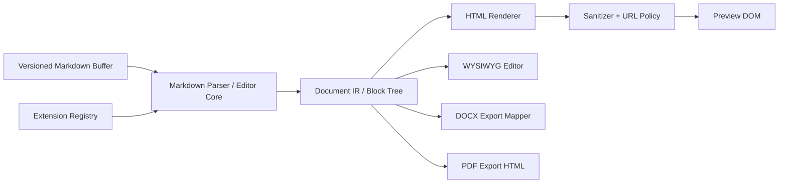

# MarkHere System Overview

**Document:** 01-system-overview.md  
**Product:** MarkHere  
**Status:** Proposed architecture baseline  
**Date:** 2026-09-11  
**Primary platform for v1:** Windows 11 x64, followed by Windows 11 ARM64  
**Architecture style:** Local-first Electron desktop application with a sandboxed renderer, typed preload boundary, versioned Markdown document buffer, reusable editor core, and isolated export workers

---

## 1. Purpose

This document defines the top-level architecture for **MarkHere**, a desktop Markdown reading, editing, previewing, and conversion application. MarkHere is intended to feel familiar to users of MarkText while being implemented as a distinct application with its own product identity, application shell, module boundaries, APIs, test strategy, storage model, release process, and Windows integration.

MarkHere is **not** intended to be a renamed copy of the MarkText desktop application. The implementation strategy is selective reuse:

1. reuse or adapt code from MarkText where it materially reduces risk, especially its MIT-licensed Markdown editing technology and proven feature behavior;
2. preserve all required copyright and MIT license notices for reused MarkText code;
3. build the Electron shell, preload contract, application state model, preview-mode architecture, split-view coordination, exporter abstraction, DOCX exporter, storage layer, conflict handling, and release pipeline as MarkHere-owned modules;
4. improve areas where MarkText's historical architecture is not a good fit for MarkHere, rather than reproducing them mechanically.

The current MarkText codebase reviewed for this architecture is the active 0.20-era `develop` branch. It is a pnpm monorepo with separate desktop, Muya, MuyaJS, and website packages. The desktop package is organized into main, preload, renderer, common/shared, and type areas. MarkText's own architecture documentation describes the same main/renderer/editor-core split and notes that Muya provides WYSIWYG Markdown editing while source-code editing is a separate renderer feature.

---

## 2. Product vision

MarkHere should be the application a Windows user expects to see when double-clicking a Markdown document.

The core user journey is:

```text
Double-click README.md
        |
        v
MarkHere opens the document
        |
        +--> Preview: read without Markdown syntax noise
        +--> WYSIWYG: edit the rendered document directly
        +--> Source: edit exact Markdown text
        +--> Split: source and preview side by side
        |
        v
Save the original Markdown
        |
        +--> Export HTML
        +--> Export PDF
        +--> Export Microsoft Word (.docx)
        +--> Print
```

The Markdown file remains the durable source of truth. MarkHere does not require conversion into a proprietary project format before editing.

---

## 3. Architectural principles

### 3.1 Markdown remains canonical

A document's authoritative user content is Markdown text. Editor widgets, parsed block trees, preview DOM, syntax-highlighted tokens, and export representations are derived states.

The application therefore maintains a **versioned document buffer** and does not allow WYSIWYG state, source-editor state, and preview HTML to become independent competing copies.

### 3.2 Local-first by default

Opening, reading, editing, searching, previewing, saving, and normal exporting must work without an account and without Internet access.

User Markdown is never uploaded by core editing functionality. Optional remote resources such as HTTPS images are treated as untrusted external content and are subject to an explicit network/resource policy.

### 3.3 The renderer is not trusted with operating-system authority

The Vue renderer is a Chromium web application. It must not have unrestricted Node.js, filesystem, shell, process-spawning, or Electron API access.

Privileged actions are performed by the main process or dedicated utility processes and exposed through small, typed methods in preload. There is no `window.require`, no generic `window.ipc.send(channel, ...)`, and no raw `ipcRenderer` exposure.

### 3.4 Security is part of the document pipeline

A Markdown document is untrusted input even when it is local. Raw HTML, SVG, links, images, diagram syntax, file paths, and pasted content can all cross trust boundaries.

Rendering is therefore a parse -> transform -> sanitize -> render pipeline. Local-resource access is mediated through a custom protocol and document-scoped capabilities instead of giving HTML unrestricted `file://` access.

### 3.5 Expensive work must not block typing

The Electron main process must remain responsive, and the renderer's interaction path must not synchronously perform long file operations, exports, repository search, large diagram rendering, or document conversion.

CPU-heavy or failure-prone tasks are candidates for Electron Utility Processes. PDF generation may additionally use a purpose-built hidden print renderer because Chromium's print-to-PDF capability depends on web contents.

### 3.6 Feature parity is behavioral, not structural

MarkHere may implement the same user-visible capability with a cleaner design. MarkText is a feature and implementation reference, not a requirement to preserve every internal class, directory, event name, or technical debt item.

### 3.7 Windows is a first-class platform

The first production release targets Windows 11 and deliberately tests file associations, long paths, UNC paths, non-ASCII paths, OneDrive-managed folders, Explorer drag-and-drop, installed/portable modes, x64/ARM64, dark mode, high-DPI displays, and installer upgrades.

Cross-platform abstractions are retained so macOS and Linux can follow without rewriting the editor core.

---

## 4. Product capability map

### 4.1 Core document capabilities

MarkHere v1 shall support:

- create Markdown documents;
- open one or multiple Markdown documents;
- open a directory/workspace;
- tabbed documents;
- Preview mode;
- WYSIWYG mode using a Muya-derived editor core;
- Source mode using a dedicated source-code editor;
- Split mode with source and live preview;
- save and Save As;
- preserve line-ending preference;
- external-file-change detection;
- recovery snapshots for unsaved work;
- find and replace;
- document outline/table of contents;
- word, character, line, and selection statistics;
- undo/redo within editor-mode constraints;
- drag/drop and clipboard image workflows;
- spellchecking;
- configurable keyboard shortcuts;
- light/dark/system application appearance;
- document/editor themes;
- export to HTML, PDF, and DOCX;
- printing;
- recent documents/workspaces;
- Windows Explorer integration and registered Markdown file types.

### 4.2 Markdown dialect baseline

The compatibility baseline is:

1. **CommonMark 0.31.2** semantics for the core Markdown language;
2. **GitHub Flavored Markdown** behavior for tables, task-list items, strikethrough, and extended autolinks where supported by the reused parser/editor core;
3. MarkText-compatible extensions required for feature parity, including front matter, math, diagrams, emoji, and raw HTML handling;
4. explicit MarkHere extension flags so non-standard syntax is never accidentally described as CommonMark.

### 4.3 Rich extension capabilities

Planned compatibility includes:

- fenced code blocks and syntax highlighting;
- KaTeX-based math rendering;
- Mermaid diagrams;
- MarkText-compatible flowchart/diagram forms retained where practical;
- Vega-based visualization support where inherited behavior is safe and maintainable;
- YAML front matter display/editing;
- emoji shortcodes where enabled;
- raw HTML rendered only after sanitization;
- relative/local images;
- remote HTTPS images subject to user settings and security policy.

### 4.4 Reading and editing modes

| Mode | Primary purpose | Editable | Canonical input | Derived output |
|---|---|---:|---|---|
| Preview | Read a Markdown file as a document | No | Document buffer | Sanitized preview DOM |
| WYSIWYG | Direct visual editing | Yes | Document buffer + editor-core block state | Markdown transactions |
| Source | Exact Markdown editing | Yes | Document buffer | Syntax-highlighted text |
| Split | Source editing with continuous preview | Yes, source pane | Document buffer | Sanitized live preview |

Preview mode is deliberately separate from WYSIWYG mode. A user who only wants to read a README should not accidentally edit it by typing.

---

## 5. Technology baseline

The initial dependency baseline intentionally stays close enough to MarkText 0.20-era technology to make selective reuse practical while allowing MarkHere to modernize individual pieces.

| Concern | MarkHere baseline | Rationale |
|---|---|---|
| Desktop runtime | Electron 42.x baseline | Matches reviewed MarkText generation; modern Chromium/Node foundation |
| Language | TypeScript | Typed contracts across processes and packages |
| Renderer framework | Vue 3 | Aligns with reusable MarkText UI/editor integration knowledge |
| Renderer state | Pinia | Small, explicit application stores |
| Build | Vite / electron-vite | Fast renderer/main/preload builds; compatible with reviewed MarkText toolchain |
| Package manager | pnpm workspaces | Monorepo isolation and workspace dependencies |
| WYSIWYG editor | Fork/adaptation of MarkText Muya/MuyaJS | Reuses mature block editing and Markdown conversion logic under MIT |
| Source editor | CodeMirror 6 | New MarkHere implementation; avoids inheriting legacy source-mode constraints |
| Markdown sanitization | DOMPurify plus MarkHere URL/resource policy | Treat rendered HTML as untrusted |
| Diagrams | Mermaid 11.x, strict security mode | MarkText feature parity with safer defaults |
| Math | KaTeX | MarkText feature parity |
| Syntax highlight | Prism or editor-core-compatible highlighter | Export/preview parity |
| File watching | chokidar | Proven cross-platform watcher layer |
| Atomic writes | write-file-atomic or equivalent audited implementation | Reduce partial/corrupt saves |
| Settings | electron-store or a thin versioned JSON store | Local settings with schema/migrations |
| Logging | electron-log behind MarkHere logging facade | Process-aware rolling logs |
| Updates | electron-updater if electron-builder is retained | Consistent with chosen packaging stack |
| Packaging | electron-builder + NSIS + ZIP | Maximizes reuse of MarkText's Windows packaging knowledge |
| DOCX | `docx` JavaScript/TypeScript library | Generates OOXML without requiring Microsoft Word or Pandoc |
| E2E | Playwright Electron automation | End-to-end coverage across renderer and main process |

Versions are pinned in lockfiles and updated through a deliberate dependency-management process. The architecture documents describe capability contracts rather than assuming a dependency will remain forever.

---

## 6. Proposed repository structure

```text
markhere/
├─ apps/
│  └─ desktop/
│     ├─ build/
│     │  ├─ icons/
│     │  ├─ windows/
│     │  └─ installer.nsh
│     ├─ src/
│     │  ├─ main/
│     │  │  ├─ app/
│     │  │  ├─ windows/
│     │  │  ├─ ipc/
│     │  │  ├─ filesystem/
│     │  │  ├─ workspace/
│     │  │  ├─ recovery/
│     │  │  ├─ export/
│     │  │  ├─ update/
│     │  │  ├─ security/
│     │  │  ├─ protocol/
│     │  │  ├─ logging/
│     │  │  └─ index.ts
│     │  ├─ preload/
│     │  │  ├─ bridge.ts
│     │  │  └─ index.ts
│     │  └─ renderer/
│     │     ├─ app/
│     │     ├─ components/
│     │     ├─ editor/
│     │     │  ├─ wysiwyg/
│     │     │  ├─ source/
│     │     │  ├─ preview/
│     │     │  └─ split/
│     │     ├─ stores/
│     │     ├─ commands/
│     │     ├─ services/
│     │     ├─ themes/
│     │     └─ main.ts
│     └─ electron-builder.yml
│
├─ packages/
│  ├─ editor-core/              # MarkHere-maintained Muya-derived package
│  ├─ markdown-engine/          # parsing/export adapters and extension registry
│  ├─ document-model/           # process-neutral document/session types
│  ├─ export-core/              # exporter contracts and shared export model
│  ├─ export-html/
│  ├─ export-docx/
│  ├─ export-pdf/               # coordinator; Chromium print renderer lives in app
│  ├─ ipc-contract/             # channel-free public bridge types + internal IPC schemas
│  ├─ security-core/            # URL/path/resource policy, sanitizer config
│  ├─ shared/                   # pure TypeScript utilities
│  └─ test-fixtures/            # Markdown corpus and malicious-content fixtures
│
├─ docs/
│  └─ architecture/
│     ├─ 01-system-overview.md
│     └─ ...
├─ scripts/
├─ .github/workflows/
├─ LICENSE
├─ THIRD_PARTY_NOTICES.md
├─ package.json
├─ pnpm-lock.yaml
└─ pnpm-workspace.yaml
```

### 6.1 Dependency direction

The desired dependency direction is inward toward process-neutral packages:

```text
Electron Main -----------+
                         |
Electron Preload --------+--> ipc-contract --> document-model --> shared
                         |
Vue Renderer ------------+
     |                         
     +--> editor-core --------> markdown-engine
     +--> export UI ----------> export-core

Main Export Coordinator --> export-html / export-docx / export-pdf
```

Rules:

- `document-model`, `shared`, and core Markdown packages must not import Electron;
- `editor-core` must not import Electron or Node filesystem APIs;
- renderer packages must not import Node built-ins;
- preload imports only the small Electron surface available to sandboxed preload plus pure contract code;
- main may depend on Node/Electron and process-neutral packages;
- exporter implementations do not manipulate Vue components;
- filesystem access belongs to main/utility code, never to editor-core.

---

## 7. Runtime process model

### 7.1 Main process

The Electron main process owns operating-system capabilities:

- application lifecycle;
- BrowserWindow creation and state;
- secure protocol handlers;
- native dialogs;
- filesystem reads/writes;
- workspace scanning and file watching;
- recent documents;
- recovery snapshot persistence;
- shell integration;
- native menus;
- printer/PDF coordination;
- update checking/install coordination;
- logging bootstrap;
- utility-process lifecycle;
- Windows single-instance and open-file events.

The main process must not parse/render entire large documents synchronously on latency-sensitive paths.

### 7.2 Preload process boundary

The preload script exposes a narrow `window.markhere` capability object. Example shape:

```ts
interface MarkHereDesktopApi {
  app: AppApi
  window: WindowApi
  dialogs: DialogApi
  files: FileApi
  workspaces: WorkspaceApi
  settings: SettingsApi
  recovery: RecoveryApi
  exports: ExportApi
  shell: ShellApi
  updates: UpdateApi
  events: AppEventApi
}
```

Each function maps to one documented action and validates input. The renderer never chooses arbitrary IPC channel names.

### 7.3 Renderer process

Each normal editor window has a renderer process responsible for:

- Vue application shell;
- tabs and selection state;
- editor-mode presentation;
- keyboard commands;
- Muya-derived WYSIWYG host;
- CodeMirror source host;
- preview DOM;
- split-pane synchronization;
- non-privileged UI preferences;
- temporary selection/cursor/scroll state;
- status bar, outline, search UI, export dialogs.

A renderer must be reconstructible after a crash from main-process persisted recovery/session state.

### 7.4 Utility processes

Utility processes are used for tasks that may be CPU-heavy or failure-prone, for example:

- DOCX generation;
- large HTML export transformation;
- document indexing/search orchestration when not delegated to a trusted bundled binary;
- future image conversion;
- large-dataset transformation.

The utility process receives explicit jobs and produces explicit results. It does not get a blanket path to the user's entire home directory.

### 7.5 PDF print renderer

PDF export has a special path because Chromium's `webContents.printToPDF` works on rendered web content. MarkHere creates a hidden, security-hardened export BrowserWindow/WebContents that receives sanitized standalone export HTML, waits for fonts/images/diagrams to settle, prints to PDF, then is destroyed.

This print renderer is not a general-purpose browser and has no privileged preload API.

---

## 8. Document-state architecture

### 8.1 Canonical session buffer

For each open document, MarkHere maintains:

```ts
interface DocumentBuffer {
  documentId: string
  markdown: string
  revision: number
  persistedRevision: number
  diskFingerprint?: FileFingerprint
  textFormat: TextFormatMetadata
  dirty: boolean
}
```

Every accepted edit increments `revision`. A successful save makes `persistedRevision === revision` and records the resulting disk fingerprint.

### 8.2 Editor adapters

Each editor mode is an adapter over the same session:

- **WYSIWYG adapter:** translates Muya/editor-core mutations into buffer transactions; can hold a block tree as an optimization;
- **Source adapter:** edits the exact Markdown string and commits transactions;
- **Preview adapter:** renders a read-only view from a specific buffer revision;
- **Split adapter:** composes source + preview; preview rendering is debounced and tagged with the input revision so stale renders are discarded.

### 8.3 Revision rule

No asynchronous renderer or exporter may overwrite state based on an older revision without an explicit conflict check.

Example:

```text
revision 41 -> preview render starts
revision 42 -> user types
revision 43 -> user types
render for revision 41 completes
              |
              +--> discarded as stale
render for revision 43 completes
              |
              +--> applied
```

### 8.4 Save rule

A save request includes the document ID, expected buffer revision, and expected disk fingerprint. The main process validates that the target is still the intended document and performs an atomic write. If the disk fingerprint changed externally, the save is blocked and the user enters conflict resolution instead of silently overwriting another program's changes.

---

## 9. Markdown rendering pipeline



Not every reused Muya pathway must literally expose a single public AST on day one. The architectural requirement is that dialect behavior and extension decisions are centralized rather than implemented independently by Preview, WYSIWYG, PDF, HTML, and DOCX.

---

## 10. Local resource model

Markdown commonly references sibling assets:

```md

```

MarkHere does not give preview HTML unrestricted `file://` access. Instead:

1. the document session establishes an approved base directory;
2. relative resource paths are normalized by main-process policy;
3. path traversal outside the approved scope is rejected unless the user explicitly chose that file;
4. the renderer receives an opaque MarkHere resource URL, such as `markhere-resource://document/<session>/<resource>`;
5. the custom protocol maps the opaque resource identifier to an approved file and returns it with a constrained MIME type;
6. resource tokens are invalidated when the document closes.

This model also gives MarkHere one place to implement image cache invalidation, moved-file handling, MIME validation, and future workspace trust settings.

---

## 11. Export architecture

All export formats implement a shared conceptual interface:

```ts
interface DocumentExporter<TOptions> {
  readonly format: ExportFormat
  export(input: ExportInput, options: TOptions, signal: AbortSignal): Promise<ExportArtifact>
}
```

`ExportInput` is a snapshot at a specific document revision. Export never reads mutable renderer state halfway through conversion.

### 11.1 HTML

- transform the Markdown/document IR into standalone HTML;
- sanitize it;
- optionally inline or copy local assets;
- include a selected export stylesheet;
- preserve heading anchors and links;
- emit UTF-8 HTML.

### 11.2 PDF

- build sanitized standalone export HTML;
- load into isolated hidden web contents;
- resolve diagrams, math, fonts, and images;
- call `printToPDF` with validated page options;
- atomically write the resulting bytes.

### 11.3 DOCX

- map document blocks/runs into OOXML using the `docx` TypeScript library;
- headings become Word heading styles;
- lists become numbering definitions;
- Markdown tables become native Word tables;
- code becomes styled paragraphs/runs;
- images are embedded;
- Mermaid/math may be converted to image/SVG representations in v1 where native Word equivalents are impractical;
- write the final package atomically.

---

## 12. Workspace architecture

A workspace is simply a user-selected filesystem directory plus ephemeral/persistent UI state. MarkHere does not create a required hidden project database inside the user's repository.

Workspace services provide:

- tree listing;
- filtered Markdown discovery;
- file creation/rename/move/delete;
- recursive text search;
- watcher events;
- recent-workspace metadata;
- path capability boundaries.

A `.markhere/` directory is **not** required in v1. Project-specific configuration may be introduced later only if users explicitly opt in.

---

## 13. Persistence architecture

MarkHere persists application metadata under Electron's `userData` path and keeps Chromium cache/session data separate where practical.

Conceptual layout:

```text
%APPDATA%/MarkHere/
├─ app/
│  ├─ settings.json
│  ├─ recent.json
│  ├─ keybindings.json
│  ├─ dictionaries/
│  └─ state-schema.json
├─ sessions/
│  ├─ windows.json
│  └─ recovery/
│     └─ <document-id>.json
├─ logs/
│  └─ markhere.log
└─ diagnostics/
```

Caches that may grow large should be redirected to `sessionData` or a dedicated cache path rather than mixed with settings/recovery data.

User documents stay where the user put them.

---

## 14. Security architecture summary

Production BrowserWindow defaults are explicitly specified, even when Electron currently defaults them safely:

```ts
webPreferences: {
  preload: PRELOAD_PATH,
  nodeIntegration: false,
  nodeIntegrationInWorker: false,
  nodeIntegrationInSubFrames: false,
  contextIsolation: true,
  sandbox: true,
  webviewTag: false
}
```

Additional controls:

- app UI loaded through a custom secure scheme rather than unrestricted `file://`;
- restrictive Content Security Policy;
- navigation blocked except approved app URLs;
- `window.open` denied by default;
- external links opened only after URL validation;
- `shell.openExternal` never receives an unchecked arbitrary string;
- IPC sender/window identity validation;
- runtime schema validation for IPC input;
- resource capabilities instead of renderer filesystem access;
- sanitized raw HTML;
- Mermaid `securityLevel: 'strict'` by default;
- remote content over HTTPS only when enabled;
- dependency review and current Electron releases;
- production Electron fuses hardened before code signing.

See `06-security-design.md` for the complete threat model.

---

## 15. Windows integration

### 15.1 File types

Candidate Markdown file types:

- `.md`
- `.markdown`
- `.mdown`
- `.mmd`
- `.mdtext`
- `.mdtxt`
- optionally `.mdx` as text/source-only unless MDX execution is explicitly unsupported

MarkHere registers itself as a handler. It must not claim to execute MDX JavaScript.

### 15.2 Default-app behavior

Windows protects user default-app choices. MarkHere should register a ProgID and application capabilities so it appears in **Open with** and **Default apps**, but it must not silently take over `.md` after installation.

An onboarding action may open the appropriate Windows settings experience/instructions and explain how to make MarkHere the default.

### 15.3 Single-instance behavior

The installed application uses Electron's single-instance lock. A second launch with file arguments forwards normalized open requests to the existing instance, which decides whether to reuse the active window or create a new one according to preferences.

---

## 16. Licensing and provenance strategy

MarkText is MIT licensed. The license permits use, modification, distribution, sublicensing, and sale subject to retaining its copyright and permission notice in copies or substantial portions of the software.

MarkHere therefore maintains provenance at file/package level:

```text
packages/editor-core/
└─ NOTICE.md
   - upstream project: MarkText / Muya
   - upstream repository
   - upstream commit/tag used
   - copied/modified paths
   - MarkText MIT license text location
   - MarkHere modification history
```

The repository also contains:

- MarkHere's own `LICENSE` decision;
- `THIRD_PARTY_NOTICES.md`;
- dependency license inventory generated in CI;
- source headers/NOTICE files where needed;
- no suggestion that MarkHere is an official MarkText product.

This architecture is technical planning, not legal advice; release owners should review branding and third-party license obligations before distribution.

---

## 17. Quality-attribute targets

These are engineering targets measured on an agreed Windows 11 reference machine rather than unconditional guarantees for all hardware.

| Attribute | Initial target |
|---|---|
| Cold startup | first usable window within 2.5 s on reference machine |
| Warm startup | first usable window within 1.5 s |
| Typing latency | no visible blocking; p95 input-to-paint under 50 ms for ordinary documents |
| Split-preview refresh | normally <= 250 ms after edit debounce for ordinary documents |
| Open 1 MB Markdown | <= 1 s target |
| Open 5 MB Markdown | <= 2.5 s target; progressive UI allowed |
| Save | atomic and non-blocking from UI perspective |
| Recovery | no more than configured recovery interval of unsnapshotted edits after process loss |
| Offline | all core editing and local export features work without network |
| Crash isolation | exporter failure must not normally terminate editor window |
| Security | sandbox/context isolation enabled in production; no raw IPC bridge |
| Accessibility | complete keyboard operation for core document workflow |

Performance tests define exact hardware, fixtures, percentile calculation, and acceptable regressions in `10-testing-strategy.md`.

---

## 18. Observability and privacy

MarkHere creates local operational logs but does not transmit document content or telemetry by default.

Logs should record identifiers and measurements, not Markdown bodies:

```json
{
  "ts": "2026-09-11T12:30:00.000Z",
  "level": "info",
  "event": "document.save.completed",
  "documentId": "4f...",
  "durationMs": 18,
  "bytes": 42183,
  "result": "ok"
}
```

A user may explicitly create a diagnostic bundle after reviewing a disclosure describing what it contains. Remote crash/telemetry submission is an opt-in future capability, not a v1 assumption.

---

## 19. Major architectural risks

| Risk | Consequence | Mitigation |
|---|---|---|
| Reused Muya code is tightly coupled to MarkText behavior | difficult upgrades | isolate in `editor-core`, maintain upstream provenance, write adapter/conformance tests |
| WYSIWYG/source round-trip changes Markdown | data loss or noisy diffs | golden round-trip corpus, canonical buffer rules, explicit lossy-operation tests |
| Large documents block renderer | poor usability | debounce, incremental rendering where possible, worker/utility offloading, performance gates |
| Malicious raw HTML/SVG | local data exposure or code execution | sanitization, custom resource protocol, sandbox, CSP, URL allowlists |
| External editor modifies file | silent overwrite | fingerprint + watcher + conflict state |
| Export differs from preview | distrust | shared document model/render functions and cross-format golden fixtures |
| DOCX semantic gaps | poor Word output | native structures first; image fallback for complex constructs; documented compatibility matrix |
| File association breaks on Windows | original use case fails | installer and clean-VM association tests; register capabilities; user-controlled defaults |
| Electron dependency vulnerabilities | high desktop impact | current Electron policy, automated alerts, regular update cadence, security gates |

---

## 20. Phased implementation roadmap

### Phase 0 - legal/provenance and repository bootstrap

- create MarkHere repository and branding;
- copy only selected MarkText/Muya sources required for reuse;
- retain upstream MIT notices;
- create third-party inventory;
- pin upstream source commit;
- establish pnpm workspace and CI.

### Phase 1 - secure Electron shell

- main/preload/renderer boot;
- custom app protocol;
- sandbox + context isolation;
- typed bridge;
- window controls;
- application menu;
- local logging;
- Windows packaging smoke test.

### Phase 2 - document lifecycle

- open/save/save-as;
- versioned buffer;
- tabs;
- recent files;
- line endings/encoding baseline;
- watcher and conflicts;
- recovery snapshots.

### Phase 3 - editing modes

- Preview;
- WYSIWYG adapter;
- CodeMirror 6 Source;
- Split mode;
- mode switching and round-trip tests;
- find/replace and outline.

### Phase 4 - feature parity

- tables/tasks/strikethrough;
- code highlighting;
- math;
- Mermaid;
- front matter;
- images/paste;
- spellcheck;
- themes;
- focus/typewriter behaviors.

### Phase 5 - exports

- HTML;
- PDF;
- DOCX;
- export options and progress;
- cancellation;
- export golden tests.

### Phase 6 - Windows productization

- NSIS installer and portable ZIP;
- x64 + ARM64;
- file registration/default-app onboarding;
- code signing;
- auto-update;
- upgrade/uninstall tests;
- final security and performance gates.

---

## 21. Definition of architectural success

The architecture succeeds when MarkHere can satisfy all of the following without bypasses:

1. a normal `.md` file can be opened from Windows Explorer;
2. the same document can move among Preview, WYSIWYG, Source, and Split without creating independent unsynchronized versions;
3. filesystem and shell operations remain outside the untrusted renderer;
4. malicious Markdown cannot directly obtain Node/Electron privileges;
5. saving cannot silently overwrite a known external change;
6. a renderer or export failure has a recovery path for unsaved text;
7. PDF, HTML, and DOCX export use shared document semantics;
8. MarkText-derived code is clearly traceable and license-compliant;
9. the app can be built, tested, signed, installed, updated, and uninstalled repeatably;
10. adding a future exporter or platform does not require rewriting the editor core.

---

## 22. Research and implementation references

Primary sources used to establish this baseline:

- MarkText repository: https://github.com/marktext/marktext
- MarkText architecture: https://marktext.me/docs/dev/architecture
- MarkText MIT license: https://github.com/marktext/marktext/blob/develop/LICENSE
- Electron process model: https://www.electronjs.org/docs/latest/tutorial/process-model
- Electron IPC guide: https://www.electronjs.org/docs/latest/tutorial/ipc
- Electron context isolation: https://www.electronjs.org/docs/latest/tutorial/context-isolation
- Electron security checklist: https://www.electronjs.org/docs/latest/tutorial/security
- Electron process sandboxing: https://www.electronjs.org/docs/latest/tutorial/sandbox
- Electron custom protocols: https://www.electronjs.org/docs/latest/api/protocol
- Electron UtilityProcess: https://www.electronjs.org/docs/latest/api/utility-process
- Electron app paths: https://www.electronjs.org/docs/latest/api/app
- CommonMark 0.31.2: https://spec.commonmark.org/0.31.2/
- GitHub Flavored Markdown spec: https://github.github.com/gfm/
- Mermaid security configuration: https://mermaid.js.org/config/schema-docs/config-properties-securitylevel.html
- electron-builder NSIS: https://www.electron.build/nsis/
- electron-builder file association API: https://www.electron.build/docs/api/app-builder-lib.interface.fileassociation/
- Microsoft Default Programs registration: https://learn.microsoft.com/en-us/windows/win32/shell/default-programs
- `docx` TypeScript library: https://github.com/dolanmiu/docx

---

## 23. Related MarkHere architecture documents

- `02-requirements-and-scope.md`
- `03-c4-diagrams.md`
- `04-data-model.md`
- `05-api-design.md`
- `06-security-design.md`
- `07-storage-and-sync-strategy.md`
- `08-error-handling-and-logging.md`
- `09-deployment-strategy.md`
- `10-testing-strategy.md`
- `11-architecture-decision-record.md`
