# MarkHere C4 Diagrams

**Document:** 03-c4-diagrams.md  
**Product:** MarkHere  
**Status:** Proposed architecture views  
**Date:** 2026-09-11

---

## 1. Purpose and notation

This document describes MarkHere's architecture using C4-style views. Mermaid flowcharts are used instead of relying exclusively on Mermaid's experimental C4 syntax so the diagrams remain renderable in a wider set of Markdown tools, including the MarkHere/MarkText-style Mermaid pipeline.

C4 levels used here:

- **Level 1 - System Context:** MarkHere and the people/external systems around it;
- **Level 2 - Containers:** executable/process and major deployable boundaries;
- **Level 3 - Components:** major modules inside each MarkHere process/package;
- **Dynamic views:** important sequences crossing the boundaries;
- **Deployment view:** Windows packaging/runtime placement.

A "container" in C4 does not mean a Docker container; in this desktop architecture it generally means a process, application, or separately meaningful runtime subsystem.

---

# 2. C4 Level 1 - System Context

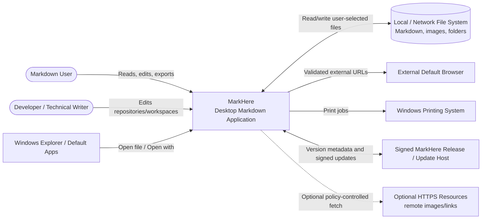

## 2.1 Context responsibilities

### MarkHere

Owns document state while documents are open, local editing, rendering, conversion, recovery, and desktop integration.

### Local/network filesystem

Is the durable source of user documents. MarkHere does not require a server-side canonical copy. Files may also live in OneDrive/Dropbox/Git worktrees/network shares; those services are external to MarkHere and appear to it as filesystem changes.

### Windows Explorer/default-app infrastructure

Launches MarkHere with files and presents MarkHere as a possible Markdown handler. Windows remains authoritative over user default-app choices.

### External browser

Receives explicitly validated HTTP(S)/mailto links. Web pages are not loaded into the privileged editor renderer.

### Update host

Contains release metadata and signed binaries. It never receives Markdown document content as part of normal update checks.

### Optional HTTPS resources

A Markdown document may refer to a remote image. Access is disabled or restricted according to the user's resource policy and the security design.

---

# 3. Trust-boundary context view

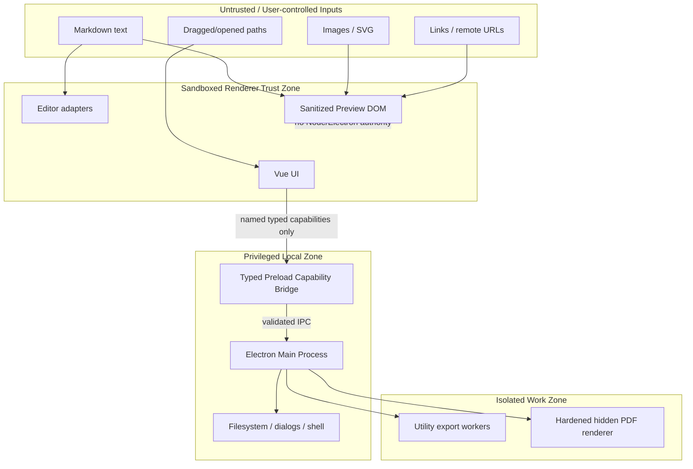

The most important security boundary is not "Internet vs desktop". It is **document/renderer input vs privileged main-process capabilities**.

---

# 4. C4 Level 2 - Runtime containers/processes

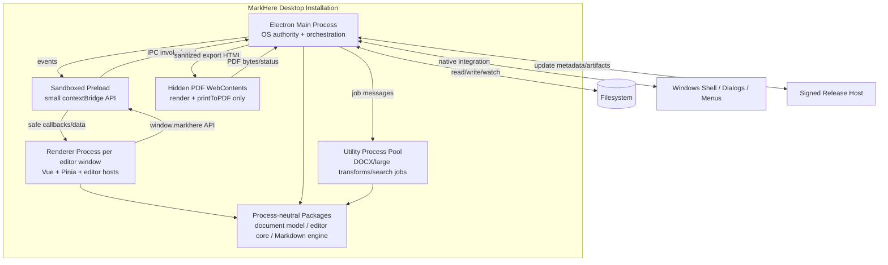

## 4.1 Container: Electron Main Process

**Responsibilities**

- application/single-instance lifecycle;
- window lifecycle;
- secure custom protocol handlers;
- filesystem gateway;
- native dialogs/menus;
- shell/external-link gateway;
- workspace file watcher;
- recovery persistence;
- app settings persistence;
- recent files/workspaces;
- exporter orchestration;
- update service;
- process crash monitoring;
- local logging.

**Must not**

- expose arbitrary filesystem calls to renderer;
- synchronously render large Markdown documents on the main event loop;
- trust renderer-supplied paths/URLs simply because they arrived over IPC.

## 4.2 Container: Preload

**Responsibilities**

- map strongly typed methods to fixed IPC actions;
- unwrap safe event payloads;
- perform minimal cheap value checks;
- expose safe web-file path acquisition when required using Electron `webUtils`;
- hide Electron event objects from renderer callbacks.

**Must not**

- expose `ipcRenderer`;
- expose general Node `fs`, `path`, `child_process`, `process.env`, or `shell` objects;
- contain business logic or mutable document state.

## 4.3 Container: Renderer

**Responsibilities**

- application UI;
- tab/session presentation;
- Preview/WYSIWYG/Source/Split modes;
- local ephemeral selection/scroll state;
- commands/keybindings;
- non-privileged parsing/render adapters;
- user notifications and conflict UI;
- export dialog and progress UI.

## 4.4 Container: Utility Process

**Responsibilities**

- execute isolated jobs with explicit input snapshots;
- emit progress;
- honor cancellation;
- fail independently;
- return bytes or temporary-artifact metadata to main.

**Example jobs**

- DOCX generation;
- high-cost Markdown transformation;
- image conversion;
- large text indexing/search coordination.

## 4.5 Container: PDF WebContents

**Responsibilities**

- display export-only sanitized HTML;
- wait for deterministic render completion;
- invoke Chromium PDF printing;
- terminate after result.

It has no user browsing surface and no filesystem capability bridge.

---

# 5. C4 Level 3 - Main process components

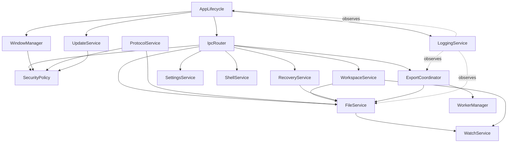

### 5.1 `AppLifecycle`

Owns startup ordering, single-instance lock, command-line/open-file normalization, graceful quit, and crash-safe shutdown.

### 5.2 `WindowManager`

Creates hardened BrowserWindows, restores/clamps window geometry, routes app commands to the correct window, and verifies renderer identity.

### 5.3 `IpcRouter`

Registers one handler per documented operation. Each handler:

1. validates sender;
2. validates request schema;
3. resolves capabilities/document identity;
4. invokes a service;
5. maps expected errors to an API result;
6. records safe structured diagnostics.

### 5.4 `SecurityPolicy`

Centralizes URL schemes, external-navigation rules, filesystem scope/capabilities, MIME allowlists, CSP-related settings, and resource-token validation.

### 5.5 `ProtocolService`

Registers `markhere://` app content and `markhere-resource://` resource handling. It never maps an arbitrary renderer-supplied URL path directly to the host filesystem.

### 5.6 `FileService`

Canonical filesystem gateway for read, stat, atomic write, rename/move/trash, file identity, line endings, encoding, and fingerprint calculation.

### 5.7 `WatchService`

Wraps chokidar/OS events, de-duplicates noisy events, and converts them into semantic file-change events containing enough fingerprint data for conflict decisions.

### 5.8 `WorkspaceService`

Lists directory trees, creates files/folders, searches, and owns workspace-scoped capabilities.

### 5.9 `RecoveryService`

Stores/retrieves dirty document snapshots independently from the user's original files.

### 5.10 `SettingsService`

Loads schema-versioned settings, applies migrations, validates updates, and writes atomically.

### 5.11 `ShellService`

Handles approved `openExternal`, reveal-in-folder, and OS integration. It validates URLs/paths and never exposes the raw Electron shell object.

### 5.12 `ExportCoordinator`

Snapshots a document revision, starts a worker or PDF web contents, streams progress, handles cancellation, and moves a completed temporary artifact into the selected final path atomically.

### 5.13 `WorkerManager`

Creates/reuses Utility Processes, attaches correlation IDs and cancellation signals, enforces job limits, and treats worker exit as a recoverable export/search failure when possible.

---

# 6. C4 Level 3 - Renderer components

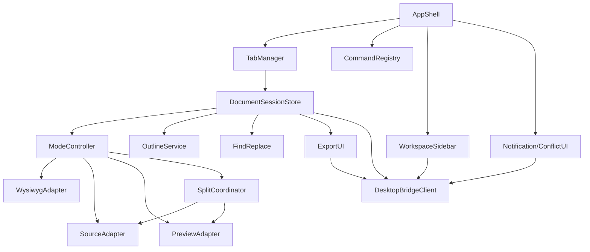

## 6.1 `DocumentSessionStore`

Owns renderer-side document metadata and the canonical current Markdown buffer/revision for each open tab. It receives save/external-change/recovery events from the desktop bridge.

It must distinguish:

- content revision;
- persisted revision;
- disk fingerprint;
- visual editor state;
- view mode;
- conflict state.

## 6.2 `ModeController`

Performs safe transitions among Preview, WYSIWYG, Source, and Split. Before detaching an editor adapter it flushes pending editor transactions into the document buffer.

## 6.3 `WysiwygAdapter`

Wraps the MarkHere-maintained Muya-derived editor core. The rest of the renderer depends on the adapter interface, not on Muya internals.

## 6.4 `SourceAdapter`

Wraps CodeMirror 6. It is configured as a text editor for Markdown and emits text transactions to the same `DocumentSessionStore`.

## 6.5 `PreviewAdapter`

Renders a specified revision and returns a structural map of headings/block anchors for navigation and scroll sync.

## 6.6 `SplitCoordinator`

Debounces preview updates, rejects stale results, maps source positions to structural anchors, and prevents feedback loops during programmatic scroll synchronization.

---

# 7. C4 Level 3 - Process-neutral packages

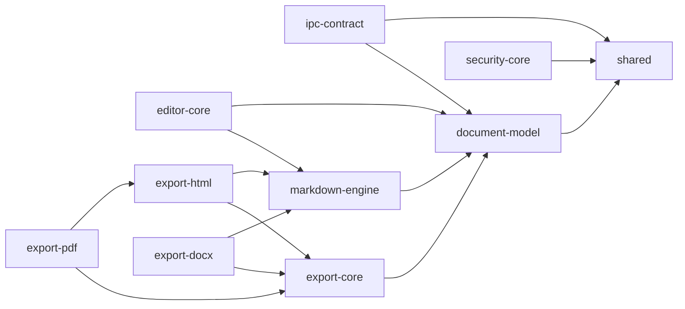

### Package constraints

- none of these packages may import Vue unless explicitly marked UI-only;
- core data packages must be runnable in Node tests without Electron;
- `editor-core` may use browser DOM APIs because the visual editor is browser-based, but must not use Electron/Node authority;
- export model types stay serializable by structured clone unless a worker-local representation is clearly isolated.

---

# 8. Dynamic view - opening a Markdown file

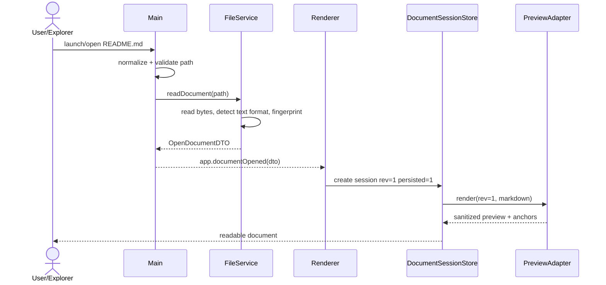

Security note: renderer receives document text because it must edit/render it; it does not receive general filesystem permission.

---

# 9. Dynamic view - WYSIWYG edit and mode switch

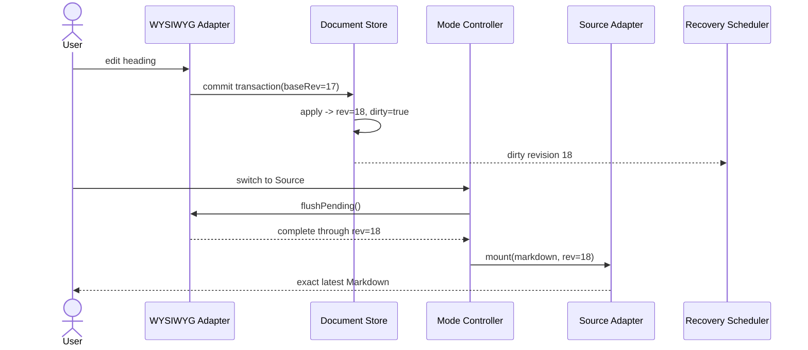

No source editor is allowed to mount using a stale snapshot that predates the flush.

---

# 10. Dynamic view - atomic save

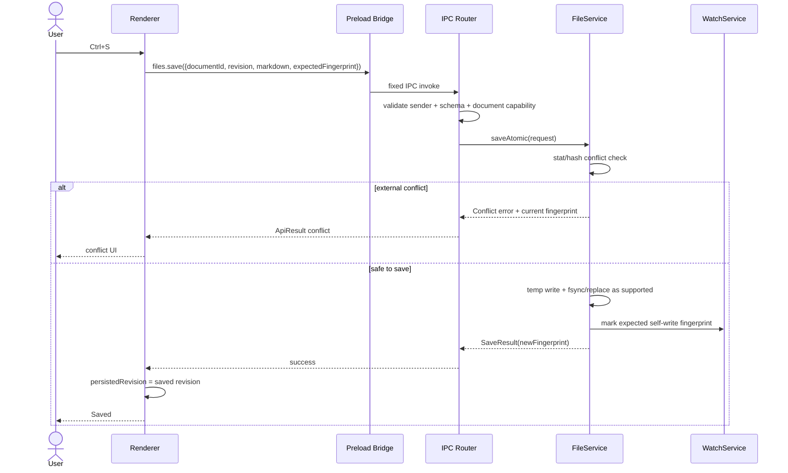

---

# 11. Dynamic view - external modification

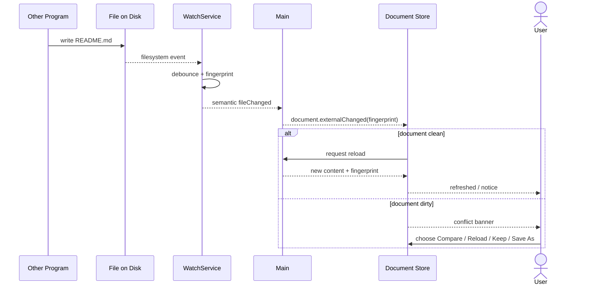

---

# 12. Dynamic view - split preview and stale render rejection

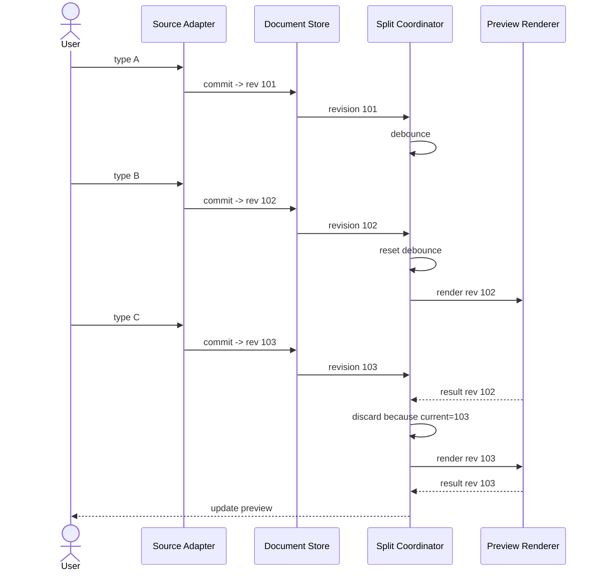

---

# 13. Dynamic view - DOCX export

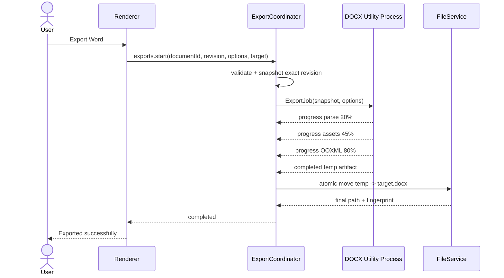

The utility process never reads the user's mutable editor state directly. It receives a snapshot and explicit resource capabilities/bytes.

---

# 14. Dynamic view - PDF export

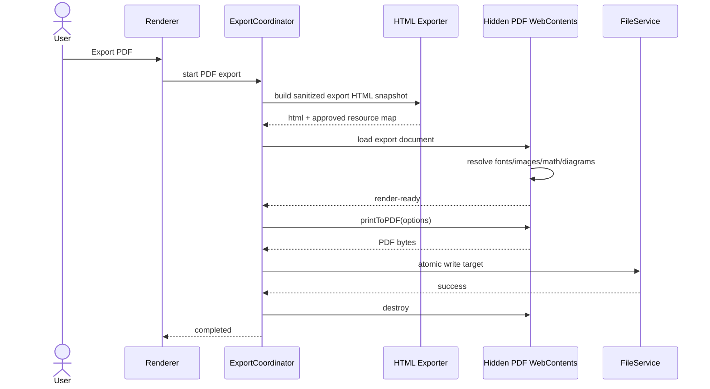

---

# 15. Dynamic view - recovery after renderer crash

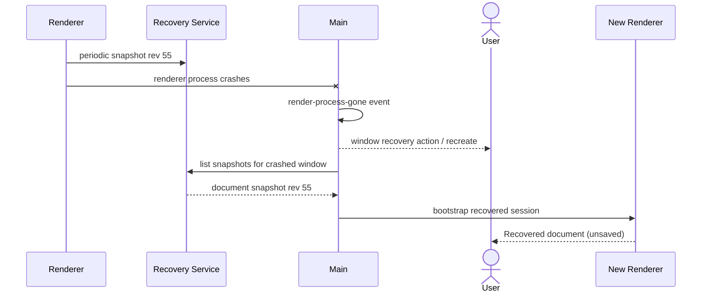

Recovery does not imply the filesystem copy was overwritten.

---

# 16. Dynamic view - validated external link

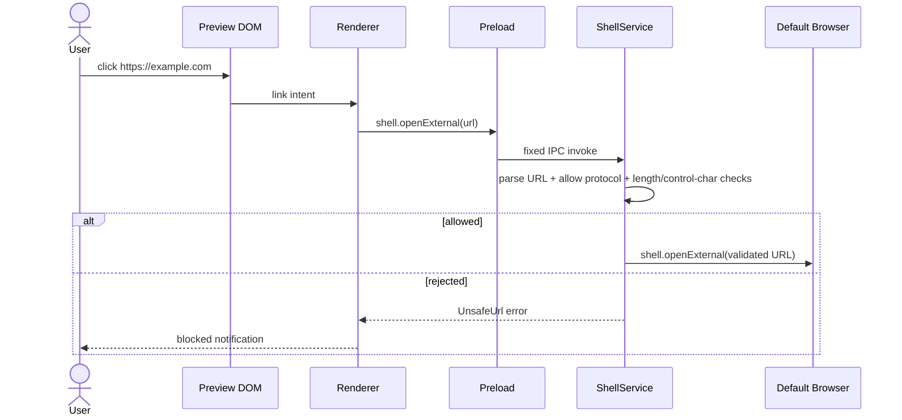

---

# 17. Deployment view - Windows installed build

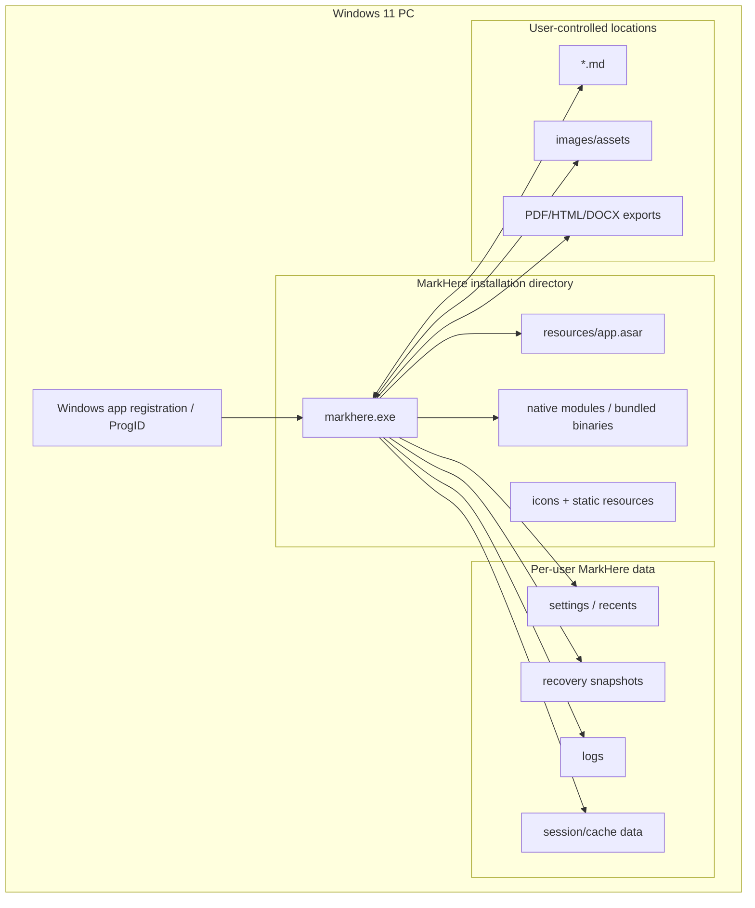

For a portable ZIP build, installation registry integration and automatic updates may be intentionally reduced/disabled.

---

# 18. Deployment view - CI/release pipeline

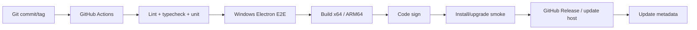

No stable channel points to an unsigned artifact.

---

# 19. Data-flow overlay

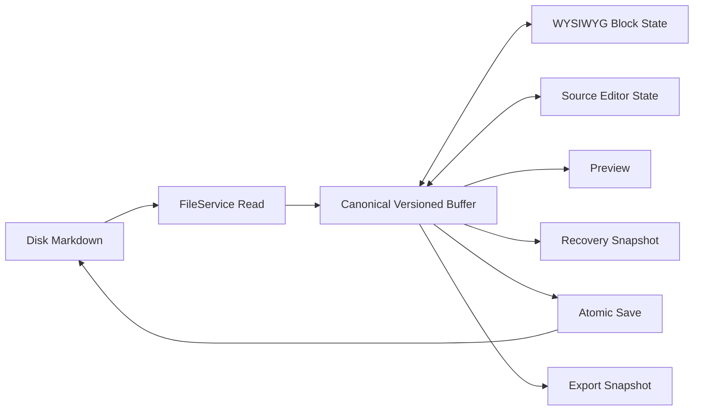

The arrows from WYSIWYG/Source back to the buffer are **transactions**, not independent persistence paths.

---

# 20. Architecture invariants visible in the diagrams

1. **No renderer -> filesystem direct edge.** Every privileged I/O crosses preload/main.
2. **No preview DOM -> Electron raw API edge.** Preview is untrusted content inside a sandboxed renderer.
3. **No exporter -> live mutable editor edge.** Exporters consume revision snapshots.
4. **No update host -> renderer code execution edge.** Updates are installed through the signed release mechanism, not downloaded scripts.
5. **No external browser embedded in the editor trust zone.** External links leave the app.
6. **No cloud database is required.** Disk is the durable document system of record.
7. **Every mode shares one document buffer.** Split is composition, not duplication.

---

# 21. C4-to-code traceability

| C4 element | Planned code area |
|---|---|
| AppLifecycle | `apps/desktop/src/main/app/` |
| WindowManager | `apps/desktop/src/main/windows/` |
| IpcRouter | `apps/desktop/src/main/ipc/` |
| SecurityPolicy | `apps/desktop/src/main/security/`, `packages/security-core/` |
| ProtocolService | `apps/desktop/src/main/protocol/` |
| FileService | `apps/desktop/src/main/filesystem/` |
| WatchService | `apps/desktop/src/main/filesystem/watch/` |
| WorkspaceService | `apps/desktop/src/main/workspace/` |
| RecoveryService | `apps/desktop/src/main/recovery/` |
| ExportCoordinator | `apps/desktop/src/main/export/` |
| DocumentSessionStore | `apps/desktop/src/renderer/stores/documents.ts` |
| ModeController | `apps/desktop/src/renderer/editor/mode-controller.ts` |
| WysiwygAdapter | `apps/desktop/src/renderer/editor/wysiwyg/` |
| SourceAdapter | `apps/desktop/src/renderer/editor/source/` |
| PreviewAdapter | `apps/desktop/src/renderer/editor/preview/` |
| SplitCoordinator | `apps/desktop/src/renderer/editor/split/` |
| Document model | `packages/document-model/` |
| IPC contract | `packages/ipc-contract/` |
| Muya-derived editor | `packages/editor-core/` |
| DOCX exporter | `packages/export-docx/` |

Actual filenames can evolve; boundary ownership should not drift casually.

---

# 22. Research references

- C4 model concepts: https://c4model.com/
- Electron process model: https://www.electronjs.org/docs/latest/tutorial/process-model
- Electron IPC: https://www.electronjs.org/docs/latest/tutorial/ipc
- Electron context isolation: https://www.electronjs.org/docs/latest/tutorial/context-isolation
- Electron sandbox: https://www.electronjs.org/docs/latest/tutorial/sandbox
- Electron UtilityProcess: https://www.electronjs.org/docs/latest/api/utility-process
- Electron custom protocol: https://www.electronjs.org/docs/latest/api/protocol
- MarkText architecture: https://marktext.me/docs/dev/architecture
- MarkText repository structure: https://github.com/marktext/marktext

---

# 23. Related documents

The diagrams are normative only at the architectural-boundary level. Detailed object schemas are in `04-data-model.md`; exact capability contracts are in `05-api-design.md`; security controls/trust analysis are in `06-security-design.md`; deployment details are in `09-deployment-strategy.md`.
