# MarkHere Data Model

**Document:** 04-data-model.md  
**Product:** MarkHere  
**Status:** Proposed logical and persistence model  
**Date:** 2026-09-11

---

## 1. Purpose

MarkHere is a local-first editor, so its data model is primarily an **in-memory document/session model plus versioned JSON application metadata**, not a relational database model. The most important purpose of the model is to prevent loss or ambiguity while the same Markdown document is represented simultaneously by source text, a WYSIWYG block tree, a preview, recovery snapshots, file watcher state, and export jobs.

The governing rule is:

> The durable user artifact is the Markdown file; the authoritative open-session content is a versioned Markdown buffer; all other document representations are derived views or snapshots.

This document defines conceptual entities, TypeScript DTOs, invariants, state machines, persistence shapes, identifiers, and migration rules.

---

## 2. Modeling conventions

### 2.1 Identifiers

Use opaque IDs instead of raw paths as the primary identity inside renderer state and IPC after a document has been opened.

Recommended aliases:

```ts
type DocumentId = string
type WindowId = string
type WorkspaceId = string
type ExportJobId = string
type RecoverySnapshotId = string
type ResourceCapabilityId = string
type CorrelationId = string
```

Generate IDs with `crypto.randomUUID()` or an equivalent cryptographically strong UUID implementation.

### 2.2 Revisions

A `revision` is a monotonically increasing integer within an open document session. It is not a Git commit, timestamp, or filesystem version.

```ts
type DocumentRevision = number
```

Rules:

- starts at 1 for the initial loaded buffer;
- increments for every committed content transaction;
- does not decrement on undo; undo is itself a new committed transaction that produces a new revision;
- is process/session scoped and is not expected to survive as the same sequence after app restart;
- export and recovery snapshots carry the revision they represent.

### 2.3 Timestamps

Persist timestamps as ISO 8601 UTC strings. Runtime code may use `Date`/epoch values, but IPC/persistent DTOs should be unambiguous strings or integer epoch milliseconds.

### 2.4 Paths

Paths are privileged values. Renderer state may display paths for user-selected documents, but path-to-capability mapping is owned by main.

Paths must never be compared with simple lowercase string equality alone. Path identity service handles:

- normalization;
- drive letters;
- case sensitivity/case preservation;
- UNC paths;
- symlink/realpath policy where necessary;
- separators;
- Unicode normalization issues;
- file IDs/inodes if used as supplemental evidence.

---

# 3. Core aggregate: Document Session

```ts
interface DocumentSession {
  id: DocumentId
  title: string
  file: FileBinding | null
  buffer: DocumentBuffer
  view: DocumentViewState
  selection: SelectionState | null
  conflict: DocumentConflict | null
  recovery: RecoveryState
  resourceScope: ResourceScopeSummary
  lifecycle: DocumentLifecycleState
  openedAt: string
  lastActivatedAt: string
}
```

A `DocumentSession` exists once per logical open tab. A future duplicate-view feature may allow multiple view instances over one document buffer, but v1 should avoid that complexity.

## 3.1 Untitled document

For an untitled document:

```ts
file: null
buffer.diskFingerprint: null
buffer.persistedRevision: 0
buffer.dirty: true
```

The first successful Save As creates the `FileBinding`.

---

# 4. DocumentBuffer

```ts
interface DocumentBuffer {
  markdown: string
  revision: DocumentRevision
  persistedRevision: DocumentRevision | 0
  dirty: boolean
  textFormat: TextFormatMetadata
  diskFingerprint: FileFingerprint | null
  lastMutation: MutationMetadata | null
}
```

## 4.1 Invariants

```text
buffer.dirty === (buffer.revision !== buffer.persistedRevision)
```

A special caveat exists when a save of revision `r` completes after the buffer has already advanced to `r+1`:

```text
revision = 43
save snapshot revision = 42
save succeeds
persistedRevision = 42
dirty = true
```

The application must **not** simply set `dirty=false` when any save completes.

## 4.2 Mutation metadata

```ts
interface MutationMetadata {
  source: 'wysiwyg' | 'source' | 'command' | 'reload' | 'recovery' | 'system'
  transactionId: string
  createdAt: string
  baseRevision: number
  resultingRevision: number
  summary?: string
}
```

`summary` is for diagnostics such as `"toggle-task"` or `"source-edit"`; it must not contain document text.

---

# 5. FileBinding

```ts
interface FileBinding {
  displayPath: string
  capabilityId: string
  basename: string
  extension: string
  parentDisplayPath: string
  openedVia: 'dialog' | 'explorer' | 'cli' | 'workspace' | 'recent' | 'link' | 'recovery'
  writable: boolean
}
```

`displayPath` is for UI. `capabilityId` is the preferred privileged identifier for subsequent save/stat/resource operations.

A malicious renderer should not be able to replace `displayPath` and thereby gain permission to write an arbitrary path; main resolves the capability independently.

---

# 6. FileFingerprint

A fingerprint helps determine whether the disk file still corresponds to the version MarkHere loaded/saved.

```ts
interface FileFingerprint {
  size: number
  mtimeMs: number
  ctimeMs?: number
  sha256?: string
  platformFileId?: string
}
```

## 6.1 Fingerprint tiers

### Fast tier

`size + mtimeMs` for frequent watcher comparisons.

### Strong tier

SHA-256 content hash when:

- a potential conflict is detected;
- mtime granularity is insufficient;
- a save is about to overwrite a dirty externally modified file;
- a network/cloud-synced folder produces ambiguous watcher events.

### Platform file identity

Windows file IDs may later help detect rename/move operations, but v1 must not depend on them for correctness because network filesystems and permissions can vary.

---

# 7. TextFormatMetadata

```ts
type LineEnding = 'LF' | 'CRLF' | 'CR'
type TextEncoding =
  | 'utf8'
  | 'utf8-bom'
  | 'utf16le'
  | 'utf16be'
  | 'other-detected'

interface TextFormatMetadata {
  encoding: TextEncoding
  detectedEncodingName?: string
  lineEnding: LineEnding
  finalNewline: boolean
  bom: boolean
}
```

### Save behavior

MarkHere should preserve line endings and final-newline state unless the user changes them. UTF-8 is the default for new files. When a source encoding cannot be safely preserved, saving requires an explicit conversion policy/warning rather than silent corruption.

---

# 8. Document lifecycle state machine

```mermaid
stateDiagram-v2
    [*] --> Loading
    Loading --> Ready: open succeeded
    Loading --> Failed: open failed

    Ready --> Dirty: edit
    Dirty --> Saving: save requested
    Ready --> Saving: explicit save allowed
    Saving --> Ready: saved latest revision
    Saving --> Dirty: saved older snapshot; newer edit exists
    Saving --> Conflict: disk changed
    Saving --> Dirty: save failed

    Ready --> Conflict: external change requiring decision
    Dirty --> Conflict: external change
    Conflict --> Ready: reload disk
    Conflict --> Dirty: keep local / merge
    Conflict --> Dirty: restore recovery

    Ready --> Closing: close
    Dirty --> Closing: save/discard flow resolved
    Conflict --> Closing: explicit resolution/discard
    Closing --> [*]

    Failed --> [*]
```



A session cannot transition directly from Dirty to closed without an explicit policy decision.

---

# 9. View model

```ts
type EditorMode = 'preview' | 'wysiwyg' | 'source' | 'split'

interface DocumentViewState {
  mode: EditorMode
  source: SourceViewState
  wysiwyg: WysiwygViewState
  preview: PreviewViewState
  split: SplitViewState
}

interface SourceViewState {
  cursor?: TextPosition
  selection?: TextRange
  scrollTop?: number
  wrap: boolean
}

interface WysiwygViewState {
  selectionBookmark?: unknown
  scrollAnchor?: StructuralAnchor
  focusMode: boolean
  typewriterMode: boolean
}

interface PreviewViewState {
  renderedRevision: number | null
  scrollAnchor?: StructuralAnchor
  renderStatus: 'idle' | 'rendering' | 'ready' | 'error'
}

interface SplitViewState {
  ratio: number
  syncScroll: boolean
  sourceSide: 'left' | 'right'
  pendingPreviewRevision?: number
}
```

View state is not part of the Markdown and does not mark a document dirty.

---

# 10. Structural anchors

Pixel offsets are fragile across source/preview/WYSIWYG because layout heights differ. MarkHere uses structural anchors:

```ts
interface StructuralAnchor {
  blockId?: string
  headingSlug?: string
  sourceLine?: number
  sourceOffset?: number
  intraBlockRatio?: number
}
```

A preview-render result may return:

```ts
interface PreviewStructureMap {
  revision: number
  blocks: Array<{
    blockId: string
    sourceStart: number
    sourceEnd: number
    headingSlug?: string
  }>
}
```

Split scroll sync maps source position -> nearest structural block -> preview element -> relative offset.

---

# 11. Parsed document / intermediate representation

MarkHere should not require a single perfect universal AST before shipping, because reused Muya code already has a block model. However exporters and preview need a stable semantic representation.

Conceptual normalized model:

```ts
type DocumentNode =
  | DocumentRootNode
  | HeadingNode
  | ParagraphNode
  | BlockQuoteNode
  | ListNode
  | ListItemNode
  | TaskItemNode
  | TableNode
  | CodeBlockNode
  | DiagramBlockNode
  | MathBlockNode
  | HtmlBlockNode
  | ThematicBreakNode

interface BaseNode {
  id: string
  type: string
  sourceRange?: SourceRange
}

interface InlineRun {
  kind: 'text' | 'emphasis' | 'strong' | 'strike' | 'code' | 'link' | 'image' | 'html' | 'math'
  text?: string
  children?: InlineRun[]
  href?: string
  src?: string
  title?: string
}
```

The actual adapter may wrap Muya's block tree. Exporters should depend on a stable `ExportDocument` interface rather than directly reaching into editor DOM nodes.

---

# 12. Markdown capability profile

```ts
interface MarkdownCapabilityProfile {
  commonMarkVersion: '0.31.2'
  gfm: {
    tables: boolean
    taskListItems: boolean
    strikethrough: boolean
    extendedAutolinks: boolean
    disallowedRawHtml: boolean
  }
  extensions: {
    frontMatter: boolean
    math: boolean
    mermaid: boolean
    flowchart: boolean
    vega: boolean
    emoji: boolean
    rawHtml: boolean
  }
}
```

This object can be attached to export metadata and test fixtures so behavior does not silently change after parser upgrades.

---

# 13. Workspace model

```ts
interface Workspace {
  id: WorkspaceId
  rootCapabilityId: string
  displayRootPath: string
  name: string
  openedAt: string
  lastActivatedAt: string
  settings: WorkspaceEphemeralSettings
}

interface WorkspaceEphemeralSettings {
  expandedRelativePaths: string[]
  sidebarWidth?: number
  searchQuery?: string
  includeGlobs?: string[]
  excludeGlobs?: string[]
}
```

No persistent workspace database is stored inside the workspace by default.

## 13.1 File tree DTO

```ts
interface WorkspaceEntry {
  id: string
  name: string
  relativePath: string
  kind: 'file' | 'directory' | 'symlink' | 'other'
  markdown: boolean
  childrenLoaded: boolean
  children?: WorkspaceEntry[]
}
```

The renderer works with relative paths under an already approved workspace capability.

---

# 14. Search model

```ts
interface SearchRequest {
  workspaceId: WorkspaceId
  query: string
  caseSensitive: boolean
  wholeWord: boolean
  regex: boolean
  includeGlobs: string[]
  excludeGlobs: string[]
  maxResults: number
}

interface SearchMatch {
  relativePath: string
  line: number
  column: number
  preview: string
  ranges: Array<{ start: number; end: number }>
}

interface SearchJob {
  id: string
  status: 'queued' | 'running' | 'completed' | 'cancelled' | 'failed'
  resultCount: number
  truncated: boolean
}
```

Search previews are user document snippets and therefore must not be written to routine diagnostic logs.

---

# 15. Resource scope and capabilities

```ts
interface ResourceScopeSummary {
  documentResourceScopeId: string | null
  workspaceId: string | null
  remoteImages: 'block' | 'ask' | 'allow-https'
}

interface ResourceCapabilityRecord {
  id: ResourceCapabilityId
  ownerDocumentId: DocumentId
  kind: 'document-relative' | 'workspace-relative' | 'user-selected'
  canonicalPath: string
  allowedOperations: Array<'read'>
  allowedMimeClasses: Array<'image' | 'text' | 'font'>
  expiresAt?: string
}
```

Resource capability records live only in main-process memory or a controlled cache. The renderer receives an opaque ID/URL.

---

# 16. External change/conflict model

```ts
type ConflictReason =
  | 'external-modification'
  | 'external-deletion'
  | 'external-rename'
  | 'save-precondition-failed'

interface DocumentConflict {
  reason: ConflictReason
  detectedAt: string
  localRevision: number
  expectedDiskFingerprint: FileFingerprint | null
  actualDiskFingerprint: FileFingerprint | null
  externalPreview?: ExternalContentSummary
}

interface ExternalContentSummary {
  bytes: number
  detectedEncoding?: string
  changedAt?: string
  diffAvailable: boolean
}
```

Document body is loaded for comparison only when necessary and is not embedded in logs/error DTOs.

---

# 17. Recovery model

```ts
interface RecoverySnapshot {
  schemaVersion: 1
  id: RecoverySnapshotId
  documentId: DocumentId
  windowId: WindowId
  createdAt: string
  revision: number
  markdown: string
  originalFile: RecoveryFileReference | null
  textFormat: TextFormatMetadata
  baseDiskFingerprint: FileFingerprint | null
  appVersion: string
}

interface RecoveryFileReference {
  displayPath: string
  stableHintHash?: string
}

interface RecoveryState {
  latestSnapshotId: string | null
  latestSnapshotRevision: number | null
  lastSnapshotAt: string | null
  pending: boolean
}
```

Recovery files contain document content and must be treated as sensitive local user data. They should have restrictive OS permissions as far as the platform naturally allows and must never be included in general diagnostic bundles by default.

---

# 18. Window/session persistence

```ts
interface PersistedWindowState {
  schemaVersion: 1
  id: WindowId
  bounds: {
    x?: number
    y?: number
    width: number
    height: number
    maximized: boolean
    fullscreen: boolean
  }
  sidebar: {
    visible: boolean
    width: number
    activePanel: 'files' | 'outline' | 'search'
  }
  tabs: PersistedTabReference[]
  activeDocumentId?: string
}

interface PersistedTabReference {
  displayPath?: string
  recoverySnapshotId?: string
  mode: EditorMode
  pinned?: boolean
}
```

On startup, persisted geometry is clamped to current displays. Path references are reopened through main-process validation rather than trusted because they appeared in MarkHere's own JSON.

---

# 19. Settings model

```ts
interface MarkHereSettings {
  schemaVersion: 1
  appearance: AppearanceSettings
  editor: EditorSettings
  files: FileSettings
  preview: PreviewSettings
  export: ExportSettings
  security: SecuritySettings
  updates: UpdateSettings
  accessibility: AccessibilitySettings
}
```

Example:

```json
{
  "schemaVersion": 1,
  "appearance": {
    "theme": "system"
  },
  "editor": {
    "defaultMode": "preview",
    "sourceWordWrap": true,
    "sourceLineNumbers": true,
    "autosave": {
      "enabled": false,
      "delayMs": 2000
    }
  },
  "preview": {
    "syncScroll": true,
    "remoteImages": "ask"
  },
  "security": {
    "allowRawHtml": true,
    "sanitizeRawHtml": true
  },
  "updates": {
    "channel": "stable",
    "autoCheck": true,
    "autoDownload": false
  }
}
```

## 19.1 Settings invariants

- `sanitizeRawHtml` cannot be disabled in stable v1 builds merely because `allowRawHtml=true`;
- remote `http:` resources remain blocked regardless of normal remote-image preference;
- setting numeric bounds are validated;
- unknown future settings are either preserved by the store or migrated explicitly, not silently interpreted.

---

# 20. Recent item model

```ts
type RecentItem = RecentFile | RecentWorkspace

interface RecentFile {
  kind: 'file'
  displayPath: string
  lastOpenedAt: string
  lastMode: EditorMode
}

interface RecentWorkspace {
  kind: 'workspace'
  displayPath: string
  lastOpenedAt: string
}
```

Recents are convenience metadata, not permissions. Reopening always performs filesystem checks again.

---

# 21. Export model

```ts
type ExportFormat = 'html' | 'pdf' | 'docx'

type ExportStatus =
  | 'queued'
  | 'preparing'
  | 'resolving-assets'
  | 'rendering'
  | 'writing'
  | 'completed'
  | 'cancelled'
  | 'failed'

interface ExportJob {
  id: ExportJobId
  documentId: DocumentId
  sourceRevision: number
  format: ExportFormat
  status: ExportStatus
  startedAt: string
  completedAt?: string
  progress?: ExportProgress
  targetDisplayPath: string
  correlationId: CorrelationId
}

interface ExportProgress {
  phase: string
  completed: number
  total?: number
  percent?: number
  messageKey?: string
}
```

## 21.1 Export snapshot

```ts
interface ExportInput {
  documentId: DocumentId
  revision: number
  markdown: string
  baseDirectoryCapabilityId?: string
  title: string
  textFormat: TextFormatMetadata
  capabilityProfile: MarkdownCapabilityProfile
}
```

The exporter does not request "whatever text is currently in tab X" after starting.

---

# 22. Export options

```ts
interface CommonExportOptions {
  documentTitle?: string
  themeId: string
  includeFrontMatter: boolean
  includeTableOfContents: boolean
}

interface PdfExportOptions extends CommonExportOptions {
  pageSize: 'A4' | 'A3' | 'Letter' | 'Legal' | 'custom'
  orientation: 'portrait' | 'landscape'
  marginsMm: { top: number; right: number; bottom: number; left: number }
  printBackground: boolean
  displayHeaderFooter: boolean
  headerTemplate?: string
  footerTemplate?: string
}

interface DocxExportOptions extends CommonExportOptions {
  pageSize: 'A4' | 'Letter'
  orientation: 'portrait' | 'landscape'
  includePageNumbers: boolean
  codeStyle: 'shaded' | 'plain'
  diagramMode: 'svg-if-compatible' | 'png'
  mathMode: 'image' | 'text-fallback'
}
```

Templates and reference DOCX files are deliberately deferred until the baseline exporter is stable.

---

# 23. Application command model

Main menus, keyboard shortcuts, and command palette should invoke the same command identifiers:

```ts
type CommandId =
  | 'file.new'
  | 'file.open'
  | 'file.openFolder'
  | 'file.save'
  | 'file.saveAs'
  | 'file.export.html'
  | 'file.export.pdf'
  | 'file.export.docx'
  | 'view.mode.preview'
  | 'view.mode.wysiwyg'
  | 'view.mode.source'
  | 'view.mode.split'
  | 'edit.find'
  | 'edit.replace'
  | 'app.settings'
```

```ts
interface CommandDefinition {
  id: CommandId
  titleKey: string
  defaultShortcut?: string
  when?: string
  enabled?: boolean
}
```

This prevents native menu handling from becoming a separate behavior system.

---

# 24. Typed API result and error DTO

Expected operational failures use an explicit result envelope:

```ts
type ApiResult<T> =
  | { ok: true; data: T }
  | { ok: false; error: ErrorDTO }

interface ErrorDTO {
  code: string
  category: 'validation' | 'filesystem' | 'conflict' | 'security' | 'export' | 'update' | 'internal'
  messageKey: string
  recoverable: boolean
  correlationId: string
  details?: Record<string, string | number | boolean | null>
}
```

`details` may contain safe things such as an error number or export phase. It must not contain Markdown bodies, secrets, raw stack traces, or arbitrary environment dumps.

---

# 25. Persistence layout

Recommended Windows conceptual layout:

```text
<userData>/app/
  settings.json
  recent.json
  keybindings.json
  state-schema.json

<userData>/sessions/
  windows.json
  recovery/
    <snapshot-id>.json
  recovery-index.json

<logs>/
  markhere-main.log
  markhere-renderer.log
  markhere-worker.log

<sessionData>/
  Cache/
  GPUCache/
  network state generated by Chromium

<temp>/MarkHere/
  exports/<job-id>/
  resource-cache/<session-id>/
```

Electron documents `userData` as the conventional configuration location and recommends avoiding large cache-like files there; `sessionData` can be separated for Chromium data. MarkHere follows that distinction.

---

# 26. Persistence schema migration

Every independent persistent JSON root has `schemaVersion`.

Migration contract:

```ts
interface Migration<TIn, TOut> {
  from: number
  to: number
  apply(input: TIn): TOut
}
```

Startup algorithm:

1. read bytes;
2. parse JSON defensively;
3. detect schema version;
4. back up the file before a destructive migration if warranted;
5. apply sequential migrations;
6. validate final schema;
7. write atomically;
8. on unrecoverable corruption, quarantine the file and fall back to safe defaults **without deleting recovery snapshots or user documents**.

---

# 27. Document buffer state transition examples

## 27.1 Normal edit/save

```text
Open disk
revision=1 persisted=1 dirty=false

Edit
revision=2 persisted=1 dirty=true

Edit
revision=3 persisted=1 dirty=true

Save snapshot r3 succeeds
revision=3 persisted=3 dirty=false
```

## 27.2 Edit while save is running

```text
revision=10 persisted=8 dirty=true
Save starts for r10
User edits -> revision=11
Disk successfully stores r10
persistedRevision=10
revision=11
DIRTY REMAINS TRUE
```

## 27.3 External change while clean

```text
rev=20 persisted=20 dirty=false
watcher says disk fingerprint changed
load new disk content
commit system reload -> rev=21
persistedRevision=21
dirty=false
```

## 27.4 External change while dirty

```text
rev=20 persisted=18 dirty=true
watcher says disk changed
conflict != null
DO NOT mutate local Markdown buffer
DO NOT save over disk automatically
```

---

# 28. WYSIWYG round-trip rules

The Muya-derived editor may normalize some Markdown. MarkHere must classify transformations:

### Semantically and textually safe

Examples include editor transactions intentionally created by the user.

### Semantically safe but textually normalizing

Examples might include list-marker style or blank-line changes produced by the editor core. These must be minimized, covered by fixtures, and documented because they create Git diffs.

### Potentially lossy

Unknown syntax, unsupported raw HTML, custom directives, or non-standard extensions. The visual editor should preserve opaque source blocks or refuse destructive transformation rather than silently rewrite them.

A fixture metadata record may declare:

```ts
interface RoundTripExpectation {
  fixture: string
  semanticEqual: boolean
  textualEqual: boolean
  expectedNormalization?: string[]
}
```

---

# 29. Data ownership matrix

| Data | Owner | Persisted | Contains user content? |
|---|---|---:|---:|
| Markdown buffer | renderer document store | recovery only until Save | Yes |
| User Markdown file | FileService/user filesystem | Yes | Yes |
| Muya block state | WYSIWYG adapter | No | Yes |
| CodeMirror editor state | Source adapter | mostly No | Yes |
| Preview DOM | Preview adapter | No | Yes |
| Disk fingerprint | FileService/document session | session/recovery metadata | No |
| Settings | SettingsService | Yes | No |
| Recents | Settings/Recent service | Yes | Paths only |
| Recovery snapshot | RecoveryService | Yes temporarily | **Yes** |
| Logs | LoggingService | Yes rolling | Should not |
| Export snapshot | ExportCoordinator/worker | temporary | Yes |
| Final export | user filesystem | Yes | Yes |
| Resource capability map | main Security/Protocol service | memory | Paths/metadata |

---

# 30. Data retention

- normal user documents: never deleted by retention policy;
- recovery snapshots: delete after clean close/save plus grace period; cap stale retention by age/count while protecting the latest unresolved crash state;
- logs: rolling files, conservative size/count limit;
- temp export directories: delete after job completion/failure; clean stale directories on startup;
- resource cache: document/session scoped and disposable;
- recents: retained until user clears or bounded list evicts oldest entries;
- crash dumps: local only unless explicit future opt-in upload policy.

---

# 31. Data-model security rules

1. A display path is not an authorization token.
2. A `DocumentId` alone is not enough to write a file; it must resolve to a main-owned file capability.
3. Resource URLs use opaque IDs, not arbitrary absolute path URL parameters.
4. Persisted JSON is treated as untrusted/corruptible input during next launch.
5. Recovery text is sensitive and excluded from logs.
6. IPC DTOs contain plain structured-clone-safe values; no Electron objects or Node streams cross the bridge.
7. Error DTOs do not serialize raw `Error` causes to the renderer.

---

# 32. References

- Electron app/userData/sessionData paths: https://www.electronjs.org/docs/latest/api/app
- Electron IPC structured-clone model: https://www.electronjs.org/docs/latest/tutorial/ipc
- MarkText architecture and block/editor concepts: https://marktext.me/docs/dev/architecture
- CommonMark 0.31.2: https://spec.commonmark.org/0.31.2/
- GitHub Flavored Markdown: https://github.github.com/gfm/
- MarkText source repository: https://github.com/marktext/marktext

---

# 33. Related documents

- `01-system-overview.md` - ownership and process architecture
- `05-api-design.md` - DTO transport and capabilities
- `07-storage-and-sync-strategy.md` - persistence, watcher, conflict algorithms
- `08-error-handling-and-logging.md` - `ErrorDTO` semantics
- `10-testing-strategy.md` - state-machine and fault-injection tests
