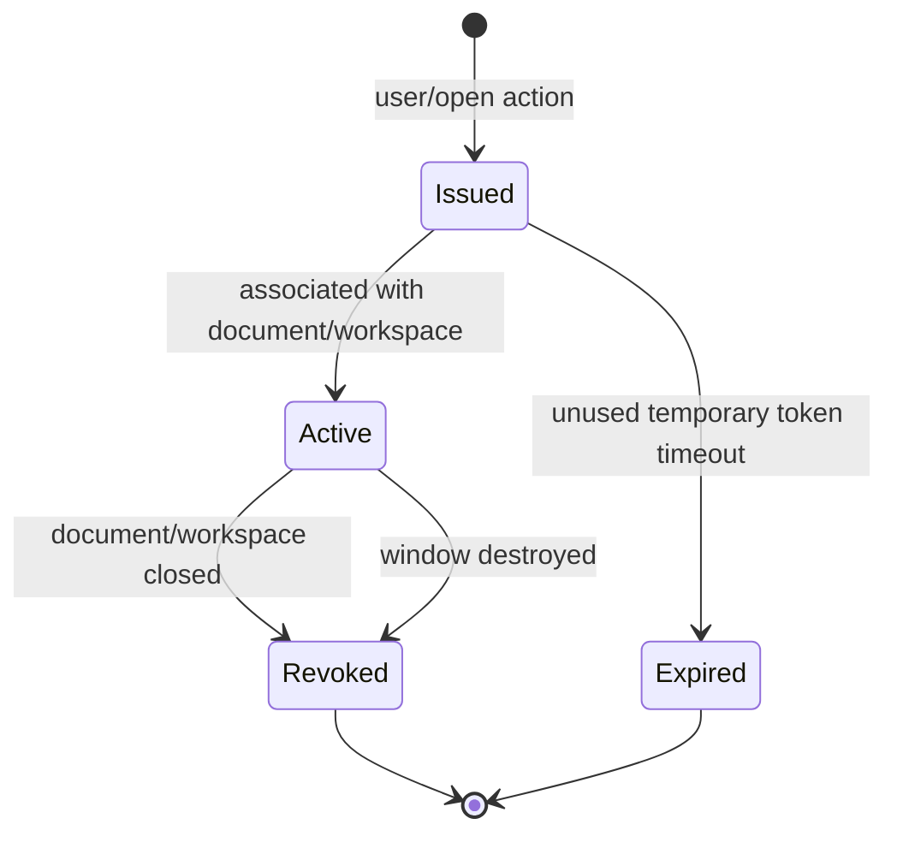

# MarkHere API Design

**Document:** 05-api-design.md  
**Product:** MarkHere  
**Status:** Proposed internal desktop API contract  
**Date:** 2026-09-11

---

## 1. Purpose

MarkHere is a desktop application, not a client/server SaaS product. Its most security-critical API is therefore the **renderer-to-main capability bridge** across Electron's context isolation boundary.

This document defines:

- renderer-facing `window.markhere` API design;
- typed IPC transport rules;
- event contracts;
- validation and authorization;
- cancellation/progress patterns;
- file and export APIs;
- command-line interface;
- compatibility/versioning rules;
- what is explicitly *not* exposed.

Electron's official guidance recommends exposing one method per privileged action through `contextBridge` instead of exposing `ipcRenderer` itself. Current Electron also prevents sending `ipcRenderer` over `contextBridge`. MarkHere adopts the narrowest version of that pattern.

---

# 2. API principles

## 2.1 Capability-oriented, not transport-oriented

Bad renderer API:

```ts
window.electron.ipc.invoke('anything', payload)
```

Good renderer API:

```ts
await window.markhere.files.saveDocument(request)
```

The renderer knows **what** it may request, not how IPC is routed.

## 2.2 Main process revalidates everything

TypeScript types are developer tooling, not a security boundary. Main performs runtime validation of:

- sender/window;
- DTO shape;
- enum values;
- string length/control characters;
- URLs/protocols;
- document/workspace/resource capability IDs;
- path containment;
- export options;
- expected revisions/fingerprints.

## 2.3 No authority smuggling

APIs shall not return objects that let renderer regain general authority:

- no `ipcRenderer`;
- no Electron `event` object passed to callbacks;
- no Node `fs` handle;
- no raw `shell`;
- no arbitrary `child_process` execution;
- no unrestricted environment variables;
- no `BrowserWindow`/`webContents` references;
- no arbitrary custom-protocol registration.

## 2.4 Plain data contracts

IPC uses structured-clone-safe DTOs:

- strings;
- numbers;
- booleans;
- null;
- arrays/plain records;
- `Uint8Array` only when necessary and bounded;
- no custom prototypes or Electron/Node objects.

## 2.5 Expected errors are data

Expected operational failures return `ApiResult<T>`. Programming/invariant failures may reject and are caught by global error boundaries.

---

# 3. Renderer-facing API

Proposed global:

```ts
declare global {
  interface Window {
    markhere: MarkHereDesktopApi
  }
}

interface MarkHereDesktopApi {
  version: 1
  app: AppApi
  window: WindowApi
  dialogs: DialogApi
  files: FileApi
  workspaces: WorkspaceApi
  resources: ResourceApi
  settings: SettingsApi
  recovery: RecoveryApi
  exports: ExportApi
  shell: ShellApi
  clipboard: ClipboardApi
  updates: UpdateApi
  events: EventApi
}
```

The API version is a bridge contract version, not the MarkHere product version.

---

# 4. Common result types

```ts
type ApiResult<T> =
  | { ok: true; data: T }
  | { ok: false; error: ErrorDTO }

interface ErrorDTO {
  code: string
  category:
    | 'validation'
    | 'filesystem'
    | 'conflict'
    | 'security'
    | 'export'
    | 'update'
    | 'cancelled'
    | 'internal'
  messageKey: string
  recoverable: boolean
  correlationId: string
  details?: Record<string, string | number | boolean | null>
}
```

Example renderer use:

```ts
const result = await window.markhere.files.saveDocument(request)
if (!result.ok) {
  showError(result.error)
  return
}
applySaveResult(result.data)
```

---

# 5. `app` API

```ts
interface AppApi {
  getInfo(): Promise<ApiResult<AppInfo>>
  getPlatformInfo(): Promise<ApiResult<PlatformInfo>>
  requestQuit(): Promise<ApiResult<void>>
  openAbout(): Promise<ApiResult<void>>
  openSettings(section?: SettingsSection): Promise<ApiResult<void>>
}

interface AppInfo {
  name: 'MarkHere'
  version: string
  channel: 'dev' | 'alpha' | 'beta' | 'stable'
  electron: string
  chromium: string
  node: string
  bridgeVersion: 1
}
```

The renderer does not receive all of `process.env`.

---

# 6. `window` API

```ts
interface WindowApi {
  minimize(): void
  toggleMaximize(): void
  close(): void
  toggleFullScreen(): void
  isMaximized(): Promise<ApiResult<boolean>>
  isFullScreen(): Promise<ApiResult<boolean>>
  setAlwaysOnTop(enabled: boolean): Promise<ApiResult<void>>
}
```

Main derives the window from IPC sender; the renderer should not pass arbitrary numeric window IDs to privileged window actions.

---

# 7. `dialogs` API

```ts
interface DialogApi {
  openDocuments(options?: OpenDocumentDialogOptions): Promise<ApiResult<SelectedPath[]>>
  openWorkspace(): Promise<ApiResult<SelectedPath | null>>
  chooseSaveDocument(defaultName?: string): Promise<ApiResult<SelectedPath | null>>
  chooseExportTarget(request: ExportTargetDialogRequest): Promise<ApiResult<SelectedPath | null>>
  confirm(request: ConfirmDialogRequest): Promise<ApiResult<ConfirmDialogResult>>
}

interface SelectedPath {
  displayPath: string
  selectionToken: string
}
```

A `selectionToken` can be exchanged for a file/workspace capability in a subsequent main action. It expires quickly and cannot be forged from a path string.

---

# 8. `files` API

## 8.1 Open

```ts
interface FileApi {
  openSelected(selectionToken: string): Promise<ApiResult<OpenDocumentDTO>>
  reopenRecent(recentId: string): Promise<ApiResult<OpenDocumentDTO>>
  saveDocument(request: SaveDocumentRequest): Promise<ApiResult<SaveDocumentResult>>
  saveDocumentAs(request: SaveDocumentAsRequest): Promise<ApiResult<SaveDocumentResult>>
  statDocument(documentId: string): Promise<ApiResult<DocumentStatDTO>>
  reloadDocument(documentId: string): Promise<ApiResult<OpenDocumentDTO>>
  revealDocument(documentId: string): Promise<ApiResult<void>>
  trashDocument(documentId: string): Promise<ApiResult<void>>
  renameDocument(request: RenameDocumentRequest): Promise<ApiResult<FileMutationResult>>
  copyImportedImage(request: CopyImportedImageRequest): Promise<ApiResult<ImportedImageResult>>
}
```

### OpenDocumentDTO

```ts
interface OpenDocumentDTO {
  documentId: string
  displayPath: string
  basename: string
  markdown: string
  revision: 1
  persistedRevision: 1
  fingerprint: FileFingerprint
  textFormat: TextFormatMetadata
  writable: boolean
  resourceScopeId: string
}
```

The renderer receives Markdown and a display path because the user is editing that specific file. It still does not receive general file APIs.

## 8.2 Save request

```ts
interface SaveDocumentRequest {
  documentId: string
  revision: number
  markdown: string
  expectedDiskFingerprint: FileFingerprint | null
  textFormat: TextFormatMetadata
}
```

Main ignores any renderer attempt to substitute an arbitrary target path. Target comes from the main-owned document binding.

### Save result

```ts
interface SaveDocumentResult {
  documentId: string
  savedRevision: number
  displayPath: string
  fingerprint: FileFingerprint
  textFormat: TextFormatMetadata
}
```

## 8.3 Save As

```ts
interface SaveDocumentAsRequest {
  documentId: string
  revision: number
  markdown: string
  targetSelectionToken: string
  textFormat: TextFormatMetadata
}
```

A failed Save As does not mutate the existing main-owned document binding.

---

# 9. Workspace API

```ts
interface WorkspaceApi {
  open(selectionToken: string): Promise<ApiResult<WorkspaceDTO>>
  close(workspaceId: string): Promise<ApiResult<void>>
  list(request: ListWorkspaceRequest): Promise<ApiResult<WorkspaceEntry[]>>
  createFile(request: CreateWorkspaceFileRequest): Promise<ApiResult<FileMutationResult>>
  createDirectory(request: CreateWorkspaceDirectoryRequest): Promise<ApiResult<FileMutationResult>>
  rename(request: RenameWorkspaceEntryRequest): Promise<ApiResult<FileMutationResult>>
  move(request: MoveWorkspaceEntryRequest): Promise<ApiResult<FileMutationResult>>
  trash(request: TrashWorkspaceEntryRequest): Promise<ApiResult<void>>
  openEntry(request: OpenWorkspaceEntryRequest): Promise<ApiResult<OpenDocumentDTO>>
  search(request: SearchRequest): Promise<ApiResult<{ searchId: string }>>
  cancelSearch(searchId: string): void
}
```

All workspace mutation paths are **relative paths** resolved beneath a main-owned workspace root. Requests containing absolute paths, `..` escape, device paths, malformed separators, or invalid capability ownership are rejected.

---

# 10. Resource API

Normally preview resources load through `markhere-resource://` without renderer invoking an API for every image. Explicit operations may use:

```ts
interface ResourceApi {
  resolveLink(request: ResolveDocumentLinkRequest): Promise<ApiResult<ResolvedDocumentLink>>
  importLocalImage(request: ImportLocalImageRequest): Promise<ApiResult<ImportedImageResult>>
  invalidateDocumentCache(documentId: string): void
}
```

`resolveLink` returns a semantic result:

```ts
type ResolvedDocumentLink =
  | { kind: 'anchor'; headingSlug: string }
  | { kind: 'document'; documentId?: string; openToken: string; anchor?: string }
  | { kind: 'external'; url: string }
  | { kind: 'blocked'; reason: string }
```

Preview code does not independently decide that a string beginning with `C:` is a URL.

---

# 11. Settings API

```ts
interface SettingsApi {
  get(): Promise<ApiResult<MarkHereSettings>>
  update(patch: SettingsPatch): Promise<ApiResult<MarkHereSettings>>
  reset(section?: SettingsSection): Promise<ApiResult<MarkHereSettings>>
  getKeybindings(): Promise<ApiResult<KeybindingConfig>>
  updateKeybindings(config: KeybindingConfig): Promise<ApiResult<KeybindingConfig>>
}
```

Runtime validation happens in main. Security-critical settings are constrained by build policy; for example a stable build cannot accept a patch that turns the renderer sandbox off.

---

# 12. Recovery API

```ts
interface RecoveryApi {
  updateSnapshot(request: RecoveryUpdateRequest): Promise<ApiResult<RecoveryUpdateResult>>
  listRecoverable(): Promise<ApiResult<RecoverySummary[]>>
  load(snapshotId: string): Promise<ApiResult<RecoverySnapshotDTO>>
  discard(snapshotId: string): Promise<ApiResult<void>>
  discardForDocument(documentId: string, throughRevision?: number): Promise<ApiResult<void>>
}
```

The renderer posts recovery content only for documents it owns. Main verifies sender/window/document relationships.

A recovery summary should avoid returning full Markdown until the user actually chooses to inspect/restore it.

---

# 13. Export API

```ts
interface ExportApi {
  start(request: StartExportRequest): Promise<ApiResult<{ jobId: string }>>
  cancel(jobId: string): void
  getStatus(jobId: string): Promise<ApiResult<ExportJobDTO>>
}
```

```ts
interface StartExportRequest {
  documentId: string
  revision: number
  markdown: string
  format: 'html' | 'pdf' | 'docx'
  options: HtmlExportOptions | PdfExportOptions | DocxExportOptions
  targetSelectionToken: string
}
```

### Security/consistency checks

Main validates:

- caller owns `documentId`;
- revision is plausible/current or intentionally exporting an explicit snapshot;
- target selection token came from an export save dialog;
- options fit format schema and safe numeric bounds;
- exporter cannot write outside selected destination through crafted name/path data;
- resource resolution remains scoped to document/workspace capabilities.

---

# 14. Shell API

```ts
interface ShellApi {
  openExternal(url: string): Promise<ApiResult<void>>
  showItemInFolder(documentId: string): Promise<ApiResult<void>>
}
```

### External URL validation

Default allowlist:

```text
https:
mailto:
```

Potential later schemes such as `http:` are a separate user/security decision. `file:`, `javascript:`, `data:`, `vbscript:`, `shell:`, and OS command-like strings are not passed to `shell.openExternal`.

Main parses the URL with a standards-based URL parser and rejects embedded control characters, unreasonable length, malformed encoding, and disallowed schemes.

---

# 15. Clipboard API

Browser clipboard APIs can cover some safe operations; desktop-specific operations are narrow:

```ts
interface ClipboardApi {
  readImageForImport(): Promise<ApiResult<ClipboardImageDTO | null>>
  writeText(text: string): Promise<ApiResult<void>>
  writeRich(request: RichClipboardRequest): Promise<ApiResult<void>>
}
```

Size limits apply to IPC image bytes. Large clipboard images should be written to a controlled temporary location or transferred using an efficient mechanism rather than duplicating unbounded buffers.

---

# 16. Update API

```ts
interface UpdateApi {
  check(): Promise<ApiResult<UpdateStatus>>
  download(): Promise<ApiResult<void>>
  installAndRestart(): Promise<ApiResult<void>>
  getStatus(): Promise<ApiResult<UpdateStatus>>
}
```

Renderer does not control update feed URLs. Feed/channel configuration is release-owned and validated in main.

---

# 17. Event API

The renderer receives a constrained event set:

```ts
interface EventApi {
  onDocumentExternalChange(cb: (event: DocumentExternalChangeEvent) => void): Unsubscribe
  onWorkspaceChange(cb: (event: WorkspaceChangeEvent) => void): Unsubscribe
  onExportProgress(cb: (event: ExportProgressEvent) => void): Unsubscribe
  onExportCompleted(cb: (event: ExportCompletedEvent) => void): Unsubscribe
  onUpdateStatus(cb: (event: UpdateStatus) => void): Unsubscribe
  onAppCommand(cb: (event: AppCommandEvent) => void): Unsubscribe
  onWindowState(cb: (event: WindowStateEvent) => void): Unsubscribe
}
```

The preload listener **must remove the Electron `IpcRendererEvent` argument** and pass only validated payload data:

```ts
const onExportProgress = (callback: (payload: ExportProgressEvent) => void) => {
  const listener = (_event: IpcRendererEvent, payload: unknown) => {
    callback(parseExportProgress(payload))
  }
  ipcRenderer.on(CHANNELS.exportProgress, listener)
  return () => ipcRenderer.removeListener(CHANNELS.exportProgress, listener)
}
```

This avoids leaking `event.sender` or raw Electron objects to page code.

---

# 18. Internal IPC naming

Internal channel names are implementation details, but predictable names help debugging:

```text
mh:v1:app:get-info
mh:v1:file:save
mh:v1:file:reload
mh:v1:workspace:list
mh:v1:workspace:search
mh:v1:export:start
mh:v1:export:cancel
mh:v1:export:progress
mh:v1:settings:get
mh:v1:recovery:update
mh:v1:shell:open-external
```

The renderer never references these strings directly; only preload and main IPC registration modules do.

---

# 19. IPC source of truth

`packages/ipc-contract/` contains:

```text
src/
├─ bridge.ts            # renderer-facing interfaces
├─ dto/
│  ├─ app.ts
│  ├─ files.ts
│  ├─ workspace.ts
│  ├─ export.ts
│  ├─ settings.ts
│  └─ errors.ts
├─ internal-channels.ts # preload/main only
├─ schemas.ts           # runtime validators
└─ index.ts
```

The bridge TypeScript interfaces and runtime schemas are reviewed together. CI contract tests instantiate example payloads and ensure preload/main use matching argument/return types.

---

# 20. Runtime validation pattern

Example pseudocode using a schema library such as Zod:

```ts
ipcMain.handle(CHANNELS.fileSave, async (event, rawRequest): Promise<ApiResult<SaveDocumentResult>> => {
  const correlationId = createCorrelationId()

  try {
    assertTrustedSender(event.senderFrame)
    const request = SaveDocumentRequestSchema.parse(rawRequest)
    assertDocumentOwnedBySender(request.documentId, event.sender)

    const result = await fileService.saveDocument(request)
    return ok(result)
  } catch (error) {
    return mapToApiFailure(error, correlationId)
  }
})
```

Validation occurs even if the renderer compiled from the same repository supposedly cannot send malformed input. XSS or compromised renderer state changes that assumption.

---

# 21. Sender validation

At minimum, privileged handlers verify that:

- sender belongs to a currently registered MarkHere editor/settings window;
- sender frame is the expected top-level app frame when required;
- sender URL/origin uses the expected `markhere://` application origin;
- capability ownership maps to that window/session;
- destroyed/navigating senders cannot race a privileged action.

Window registration record:

```ts
interface TrustedWebContentsRecord {
  webContentsId: number
  kind: 'editor' | 'settings'
  windowId: string
  origin: string
  createdAt: number
}
```

---

# 22. Authorization/capability model

## 22.1 Why capability IDs

A generic API such as:

```ts
readFile('C:\\Users\\...\\secret.txt')
```

turns an XSS into arbitrary filesystem read.

Instead:

1. user selects/opens a file or workspace through an OS-mediated action;
2. main canonicalizes it and creates a capability record;
3. renderer receives a document/workspace ID;
4. later APIs operate on that ID or on relative paths under the approved workspace.

## 22.2 Capability lifecycle



---

# 23. Request size limits

IPC is not an unlimited message bus.

Suggested policy:

- Markdown open/save content: allow documented large-file ceiling; detect oversize before expensive duplication;
- arbitrary strings in control APIs: small bounded lengths;
- URLs: e.g. <= 8 KiB unless a validated need appears;
- file names: OS-compatible bounded length;
- clipboard images: explicit MB ceiling or file-backed handoff;
- event payloads: small metadata; large search results streamed/batched.

Huge exports should pass temp artifact paths/capabilities between privileged processes, not base64-gigabyte data through the renderer.

---

# 24. Cancellation

Long operations use IDs and `AbortSignal` internally.

Pattern:

```text
Renderer -> exports.start(...) -> { jobId }
Main -> worker job
Renderer -> exports.cancel(jobId)
Main -> AbortController.abort()
Worker -> cancellation checkpoint
Main -> event export.cancelled
```

Cancelling after a final atomic rename may return "already completed" rather than delete a successfully produced user file.

---

# 25. Progress events

Progress is phase-based because exact byte-level percent is not always known:

```ts
interface ExportProgressEvent {
  jobId: string
  phase: 'preparing' | 'assets' | 'rendering' | 'packaging' | 'writing'
  completed?: number
  total?: number
  percent?: number
}
```

Main rate-limits high-frequency progress to avoid IPC flooding.

---

# 26. Concurrency and idempotency

### Save

Multiple saves for the same document are serialized by document ID. Newer pending save requests may supersede older queued ones if the user-visible semantics remain correct.

### Export

Multiple exports may run concurrently up to a configured worker/job limit. Each is independent and uses a snapshot.

### Settings

Settings updates include an expected settings revision or are serialized in main to avoid last-writer races across multiple windows.

### Mutating workspace entries

Rename/move/delete operations use capability + expected source identity and fail cleanly if the source no longer exists.

---

# 27. Native menu and command API

Native menus send semantic command IDs:

```ts
interface AppCommandEvent {
  id: CommandId
  source: 'menu' | 'shortcut' | 'system'
}
```

Renderer's `CommandRegistry` determines whether a command is enabled in the active context. Main may also disable unsafe menu items based on coarse state.

The goal is to avoid implementing Save once for menu, once for toolbar, and once for command palette.

---

# 28. CLI design

Installed application exposes a `markhere` command where platform installation permits.

## 28.1 Open

```text
markhere README.md
markhere docs/
markhere README.md docs/guide.md
```

## 28.2 Mode

```text
markhere README.md --mode preview
markhere README.md --mode source
markhere README.md --mode split
```

## 28.3 Conversion (after exporter stabilization)

```text
markhere README.md --export pdf --output README.pdf
markhere README.md --export html --output README.html
markhere README.md --export docx --output README.docx
```

## 28.4 CLI security rules

- command-line paths are canonicalized by main/CLI service;
- no `--eval`, arbitrary JS, shell command, or plugin execution option in v1;
- exporter options have the same validation schemas as GUI options;
- exit codes are stable and documented;
- headless conversion writes errors to stderr without emitting document body.

---

# 29. CLI exit codes

Proposed:

| Code | Meaning |
|---:|---|
| 0 | success |
| 2 | command-line validation error |
| 3 | input file not found/unreadable |
| 4 | output conflict/not writable |
| 5 | Markdown/export conversion failure |
| 6 | security/policy rejection |
| 7 | cancelled |
| 10 | unexpected internal error |

---

# 30. API compatibility/versioning

### Bridge v1

The preload global is versioned:

```ts
window.markhere.version === 1
```

Because preload and renderer ship together, long-term backwards compatibility is not equivalent to a public web API. Versioning is still valuable for:

- stale dev assets;
- recovery/debug reports;
- automated contract tests;
- phased migration during large refactors.

Breaking changes increment bridge version rather than silently changing payload meaning.

### Persistent DTOs

Recovery/settings schemas have independent `schemaVersion` values because persisted data outlives one app process and may cross product upgrades.

---

# 31. APIs deliberately not public in v1

MarkHere v1 has **no third-party plugin API**. Therefore do not expose:

- generic command registration from downloaded code;
- arbitrary filesystem APIs;
- arbitrary HTTP API;
- script execution;
- dynamic preload modules;
- browser extensions;
- RPC port listening on localhost;
- unauthenticated automation server.

A future plugin architecture requires its own threat model/ADR.

---

# 32. MarkText reuse guidance

Current MarkText 0.20-era code already contains a typed shared IPC channel contract and a sandboxed preload. This is useful reference material, but MarkHere's design intentionally goes further by not exposing an IPC wrapper to the renderer at all.

MarkHere may reuse implementation patterns and code under MIT where appropriate, but should translate old channel-oriented call sites into capability methods over time.

Provenance requirements apply to copied MarkText code; see `11-architecture-decision-record.md`.

---

# 33. API testing requirements

Every privileged method needs:

1. valid request test;
2. invalid schema test;
3. wrong sender test;
4. wrong capability ownership test;
5. missing/stale document test;
6. boundary-size test where relevant;
7. expected operational error mapping test;
8. logging-redaction assertion;
9. cancellation/race test for long operations.

Preload contract tests verify there is no property such as `ipcRenderer`, `require`, `fs`, `shell`, or raw `process` on `window.markhere`.

---

# 34. References

- Electron IPC patterns: https://www.electronjs.org/docs/latest/tutorial/ipc
- Electron Context Isolation: https://www.electronjs.org/docs/latest/tutorial/context-isolation
- Electron preload guidance: https://www.electronjs.org/docs/latest/tutorial/tutorial-preload
- Electron `contextBridge`: https://www.electronjs.org/docs/latest/api/context-bridge
- Electron security checklist, especially sender validation and API exposure: https://www.electronjs.org/docs/latest/tutorial/security
- Electron `ipcRenderer` current restrictions: https://www.electronjs.org/docs/latest/api/ipc-renderer
- Electron `webUtils.getPathForFile`: https://www.electronjs.org/docs/latest/api/web-utils
- MarkText current typed preload/IPC patterns: https://github.com/marktext/marktext/tree/develop/packages/desktop/src

---

# 35. Related documents

- `04-data-model.md` defines DTO concepts and revisions.
- `06-security-design.md` defines the authority model and validation threats.
- `07-storage-and-sync-strategy.md` defines file preconditions and watcher behavior.
- `08-error-handling-and-logging.md` defines error codes/correlation.
- `10-testing-strategy.md` defines contract/security tests.
