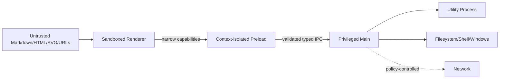

# MarkHere Security Design

**Document:** 06-security-design.md  
**Product:** MarkHere  
**Status:** Proposed security architecture and threat model  
**Date:** 2026-09-11

---

## 1. Purpose

MarkHere opens arbitrary local Markdown and renders user-controlled HTML-like content inside Electron. That makes security a core architecture concern rather than a post-release hardening step.

Electron's security documentation emphasizes that desktop JavaScript has far greater authority than ordinary browser JavaScript and recommends context isolation, sandboxing, restrictive CSP, validation of IPC senders, limited navigation/window creation, current Electron versions, custom protocols instead of `file://`, careful `shell.openExternal`, and not exposing Electron APIs to untrusted web content.

MarkHere adopts those controls as mandatory v1 design constraints.

---

# 2. Security objectives

MarkHere shall protect:

1. **user documents** from unauthorized read, overwrite, delete, or corruption;
2. **filesystem scope** from malicious Markdown escaping the user-selected document/workspace;
3. **operating-system authority** from renderer/XSS abuse;
4. **user privacy** from unexpected network transmission;
5. **update integrity** from tampered binaries;
6. **recovery snapshots** from accidental disclosure;
7. **application integrity** from dependency and supply-chain compromise;
8. **availability** from documents designed to freeze or exhaust resources.

Security does not mean MarkHere can protect a document from another process running as the same fully privileged Windows user. The primary threat is preventing untrusted content rendered by MarkHere from converting renderer compromise into broad OS authority.

---

# 3. Assets

| Asset | Sensitivity | Notes |
|---|---|---|
| Markdown document body | High | may contain private work/credentials |
| Local images/assets | High | may contain private information |
| Entire filesystem outside opened scope | Critical | must not become readable through XSS |
| Ability to write/delete files | Critical | privileged operation |
| Shell/external protocol launch | High | can trigger OS/application behaviors |
| Recovery snapshots | High | unsaved private document copies |
| Recent-file paths | Medium | reveal project names/usernames/locations |
| Settings/keybindings | Medium | integrity important |
| Update channel/signing | Critical | code execution supply chain |
| Logs/crash dumps | Medium/High | can leak paths/stack/environment |
| Export targets | High | overwrites must be controlled |

---

# 4. Threat actors/input sources

- malicious Markdown intentionally opened by the user;
- compromised Markdown received through a repository/download/email;
- malicious raw HTML embedded in a Markdown file;
- malicious SVG or data URL;
- malicious Mermaid diagram text;
- malicious remote image/server response;
- specially crafted local file paths;
- another local process modifying files while MarkHere has them open;
- compromised npm dependency;
- compromised update/release infrastructure;
- XSS caused by MarkHere/MarkText-derived rendering bug;
- accidental user actions such as overwriting the wrong file.

---

# 5. Trust boundaries



Assume renderer compromise is possible. The security question becomes: **what can a compromised renderer do through the bridge?**

---

# 6. Threat model using STRIDE

## 6.1 Spoofing

### Threats

- malicious renderer pretending to be a trusted settings/editor window;
- forged document/workspace IDs;
- forged resource capability IDs;
- update metadata pretending to be a legitimate release.

### Controls

- main maintains trusted `webContents` registry;
- validate sender frame/origin for privileged handlers;
- UUID capability IDs generated in main;
- capabilities scoped to owner window/document;
- update feed fixed by build configuration;
- signed release artifacts and HTTPS transport;
- no renderer-controlled update URL.

## 6.2 Tampering

### Threats

- file changes between open and save;
- recovery/settings JSON tampering/corruption;
- manipulated export paths;
- injected HTML altering privileged UI;
- update binary tampering.

### Controls

- disk fingerprints and save preconditions;
- atomic writes;
- schema validation/migration;
- save-dialog tokens/capability-bound target paths;
- sanitized preview isolated from privileged APIs;
- code signing/update verification;
- asar/integrity fuses where compatible with build pipeline.

## 6.3 Repudiation

Local-first MarkHere does not need non-repudiation/audit-grade logs. It does need enough local diagnostics to explain operations without storing document bodies.

Controls:

- correlation IDs;
- save/export lifecycle log events;
- app/version/build metadata;
- explicit user decisions for conflict/destructive operations where useful.

## 6.4 Information disclosure

### Threats

- raw HTML/XSS reading arbitrary files;
- `file://` origin exposing local filesystem;
- shell URL tricks;
- remote images exfiltrating document-derived data through URLs;
- logs containing Markdown/recovery content;
- diagnostic bundle including recovery snapshots.

### Controls

- custom app/resource protocols;
- no direct arbitrary file API;
- path capability model;
- URL/protocol allowlists;
- sanitized HTML/SVG;
- remote resources block/ask policy;
- do not rewrite remote image URLs with document content;
- log redaction;
- recovery excluded from diagnostics by default.

## 6.5 Denial of service

### Threats

- enormous Markdown;
- deeply nested lists/HTML;
- Mermaid "diagram bombs";
- huge base64 images;
- catastrophic regex in search;
- giant DOCX/PDF export;
- malformed parser input;
- repeated IPC flooding.

### Controls

- size/depth/time budgets;
- debounce;
- Utility Process isolation;
- export cancellation/timeouts;
- large-file fallback to Source mode;
- remote/local resource byte limits where appropriate;
- safe regex/search implementation or bundled ripgrep;
- progress event rate limiting;
- malformed block errors scoped to block rather than whole renderer.

## 6.6 Elevation of privilege

### Threats

- `nodeIntegration` accidentally enabled;
- raw `ipcRenderer` exposed;
- XSS calling generic `fs.writeFile` bridge;
- `shell.openExternal('file://...')` or dangerous scheme;
- arbitrary child process invocation;
- unsafe preload APIs.

### Controls

- node integration off;
- context isolation on;
- sandbox on;
- no generic IPC/filesystem/command APIs;
- fixed capability methods;
- external URL scheme allowlist;
- no renderer process spawning;
- production fuse hardening;
- contract test that enumerates exposed preload keys.

---

# 7. BrowserWindow hardening

All editor windows explicitly specify security settings even when they match Electron defaults:

```ts
new BrowserWindow({
  webPreferences: {
    preload: preloadPath,
    nodeIntegration: false,
    nodeIntegrationInWorker: false,
    nodeIntegrationInSubFrames: false,
    contextIsolation: true,
    sandbox: true,
    webviewTag: false,
    devTools: isDevelopment || allowProductionDevTools
  }
})
```

### Why explicit settings?

- documents communicate intent during dependency upgrades;
- tests can assert exact posture;
- avoids future defaults becoming architecture by accident;
- enables code review to detect weakening.

---

# 8. Context isolation and preload

Electron recommends `contextBridge` for securely exposing selected preload capabilities and warns that exposing `ipcRenderer.send` directly is unsafe because arbitrary channels become reachable.

MarkHere therefore exposes:

```ts
window.markhere.files.saveDocument(...)
window.markhere.shell.openExternal(...)
```

and **does not expose**:

```ts
window.markhere.ipc
window.electron
window.require
window.process
window.fs
window.shell
```

A preload listener does not forward the Electron `event` object to renderer callbacks.

---

# 9. Renderer sandbox

Electron's Chromium sandbox limits renderer OS access. Sandboxed renderers perform privileged work through IPC.

MarkHere must never disable sandbox merely to make a library convenient. If an inherited MarkText dependency expects Node in renderer, it must be adapted, moved to main/utility, replaced, or provided a narrow browser-safe shim that does not recreate Node authority.

The source editor, Muya-derived editor, KaTeX, Mermaid, and sanitizer should run as browser-compatible libraries.

---

# 10. Application origin and custom protocol

Electron's current security checklist recommends avoiding `file://` for app pages because it has special local privileges. MarkHere registers a custom secure scheme before app ready.

Conceptually:

```ts
protocol.registerSchemesAsPrivileged([
  {
    scheme: 'markhere',
    privileges: {
      standard: true,
      secure: true,
      supportFetchAPI: true,
      corsEnabled: false,
      bypassCSP: false
    }
  },
  {
    scheme: 'markhere-resource',
    privileges: {
      standard: true,
      secure: true,
      supportFetchAPI: true,
      corsEnabled: false,
      bypassCSP: false
    }
  }
])
```

Do **not** set `bypassCSP: true`.

`markhere://app/...` serves only packaged application files from a fixed mapping.

`markhere-resource://document/...` resolves only opaque capabilities created by main.

---

# 11. Content Security Policy

Baseline renderer CSP, adjusted only as dependencies require:

```text
default-src 'none';
script-src 'self';
style-src 'self' 'unsafe-inline';
img-src 'self' markhere-resource: data: https:;
font-src 'self' markhere-resource: data:;
connect-src 'self' https:;
media-src 'self' markhere-resource:;
object-src 'none';
frame-src 'none';
base-uri 'none';
form-action 'none';
```

Notes:

- prefer nonce/hash or compiled styles over broadening script policy;
- `'unsafe-eval'` is not allowed in production;
- `https:` in `img-src/connect-src` may be further constrained if remote resources are disabled globally;
- no arbitrary frames/webviews;
- preview raw HTML is still sanitized; CSP is defense in depth, not the sanitizer.

---

# 12. Navigation policy

The main app web contents should never navigate to arbitrary document links.

Controls:

- `will-navigate`: deny navigation unless target is the expected app origin;
- `setWindowOpenHandler`: deny by default;
- external links are translated into a semantic link intent and passed to the validated shell API;
- in-document anchors are handled internally;
- local Markdown links are resolved by MarkHere and opened as documents, not loaded as arbitrary pages in the editor renderer.

---

# 13. External URL policy

Default externally launchable schemes:

- `https:`
- `mailto:`

Optional `http:` support requires explicit product decision; if allowed, it should be opened in external browser, not fetched as privileged app content.

Always reject:

- `javascript:`;
- `vbscript:`;
- `data:` as external launches;
- `file:` as external arbitrary path launch from untrusted Markdown;
- `shell:`/custom dangerous application protocols unless explicitly reviewed;
- URLs with NUL/control characters;
- malformed percent encoding where parser behavior is ambiguous.

The URL is parsed and validated in main immediately before calling Electron shell functions.

---

# 14. Markdown raw HTML security

GFM explicitly notes that GitHub applies post-processing/sanitization after Markdown-to-HTML conversion. MarkHere must do the same class of defense for its own renderer.

Pipeline:

```text
Markdown
  -> parser
  -> generated HTML
  -> DOMPurify with MarkHere configuration
  -> URL attribute policy
  -> resource rewrite
  -> preview DOM
```

Sanitizer rules should remove or constrain:

- `<script>`;
- inline event handlers (`onclick`, `onerror`, etc.);
- unsafe URL schemes;
- `<iframe>`, `<object>`, `<embed>`;
- meta refresh;
- forms unless explicitly required (v1: remove);
- style constructs that can create dangerous resource loads or UI spoofing, according to policy;
- SVG active content.

Do not create a "Trusted Markdown" toggle that disables Electron sandbox/IPC controls. A workspace trust feature, if added, may relax cosmetic/content features but should not grant Node integration to document HTML.

---

# 15. `v-html` / DOM insertion policy

Vue components must not casually use `v-html` with parser output.

Allowed pattern:

- centralized `SafeHtml` component/service;
- accepts only branded `SanitizedHtml` produced by sanitizer;
- no ordinary string typed as safe HTML;
- sanitizer configuration unit-tested with malicious corpus.

Type-brand example:

```ts
type SanitizedHtml = string & { readonly __sanitized: unique symbol }
```

This does not create runtime safety by itself but makes unsafe call sites visible in review.

---

# 16. Mermaid security

Mermaid's current configuration defines `securityLevel: 'strict'` as the default; strict mode encodes HTML in labels and disables click functionality. MarkHere explicitly sets it rather than relying on default.

```ts
mermaid.initialize({
  startOnLoad: false,
  securityLevel: 'strict'
})
```

Further controls:

- no user diagram `click` callbacks executing app commands;
- no arbitrary external navigation from diagram nodes in v1;
- render errors contained within diagram component;
- complexity/time budget for very large diagrams;
- generated SVG sanitized/validated before export embedding where appropriate;
- PDF/DOCX export should use the same strict semantics.

---

# 17. KaTeX/math security

Math text is treated as data. MarkHere should use KaTeX with unsafe trust features disabled unless explicitly needed. Generated markup enters the same controlled DOM region and may be sanitized according to a tested allowlist compatible with KaTeX output.

Remote macros/extensions are not downloaded/executed.

---

# 18. SVG security

SVG can contain scripts, links, event handlers, foreign objects, external references, and complex resource behavior.

Policy:

- local SVG images are not automatically equivalent to passive PNG;
- when embedded as ``, browser execution behavior is more constrained but resource policy still applies;
- SVG generated by Mermaid for internal display uses strict Mermaid config;
- SVG inserted as raw HTML is sanitized;
- DOCX/PDF conversion may rasterize untrusted SVG when that produces a simpler threat surface;
- data-URI SVG from raw Markdown is blocked or sanitized according to explicit test coverage.

---

# 19. Local resource capability security

A document at:

```text
C:\Projects\Guide\README.md
```

may legitimately load:

```text
./images/diagram.png
```

but Markdown such as:

```md

```

must not automatically gain arbitrary file-read permission merely because the path is syntactically relative.

Recommended scope policy:

1. document-relative assets within document parent directory and descendants are allowed by default;
2. workspace-relative assets within an explicitly opened workspace root are allowed;
3. paths outside those scopes require a user-selected explicit capability;
4. symlinks/reparse points are resolved according to a policy that prevents containment checks from being bypassed;
5. custom resource handler checks MIME class and capability ownership on every request;
6. resource capabilities expire when the owner document/workspace closes.

---

# 20. Path traversal and Windows path threats

Validation must handle:

- `..` traversal;
- `.` segments;
- slash/backslash mixtures;
- drive-relative paths such as `C:foo`;
- absolute drive paths;
- UNC paths;
- device paths (`\\?\`, `\\.\`);
- alternate data stream syntax where relevant;
- reserved names;
- percent-encoded separators when URLs are involved;
- Unicode confusables for display;
- symlinks/junctions/reparse points;
- case-insensitive comparisons.

Perform path containment on normalized/canonical filesystem paths in main, not in JavaScript running inside preview DOM.

---

# 21. IPC security

For each privileged IPC request:

```text
receive
  -> verify trusted sender
  -> validate DTO schema
  -> validate capability ownership
  -> validate operation-specific preconditions
  -> perform operation
  -> return sanitized result
```

The fact that MarkText currently has a typed IPC contract is useful reference, but MarkHere should not inherit a generic IPC wrapper exposed to page code. A capability bridge reduces the blast radius of XSS.

---

# 22. Shell security

Never directly do:

```ts
shell.openExternal(rendererSuppliedString)
```

without parsing/allowlisting.

Similarly `shell.openPath`/reveal should operate on main-owned document/capability IDs rather than arbitrary renderer paths.

This specifically addresses Electron's security recommendation to avoid `shell.openExternal` with untrusted content.

---

# 23. Filesystem write security

Renderer cannot invoke a generic `writeFile(path, bytes)`.

Allowed writing patterns:

- Save existing document: main-owned document capability determines target;
- Save As: target comes from short-lived native save-dialog token;
- Export: target comes from export save dialog token;
- workspace create/rename: relative path constrained beneath approved workspace root;
- image import: destination derived from document/workspace policy and explicit user setting.

Every write is validated after path normalization immediately before filesystem operation (TOCTOU cannot be completely eliminated, but narrow capabilities reduce exposure).

---

# 24. Network policy

Core MarkHere works offline.

Network-using features are separated:

| Feature | Default | Authority |
|---|---|---|
| Update check | enabled/controlled preference | main updater only |
| Remote HTTPS image in Markdown | Ask or Block | resource/network service |
| External HTTPS link | user click -> external browser | shell service |
| Telemetry | Off / absent v1 | none |
| Crash upload | Off / absent v1 | none |
| Image upload provider | Out of scope unless explicitly added | separate service/ADR |

Renderer `fetch` should not become an arbitrary network proxy for privileged operations. CSP and session/webRequest policies may restrict unwanted requests.

---

# 25. Session permissions

For the main app session, define a permission request handler and deny capabilities MarkHere does not need:

- camera;
- microphone;
- geolocation;
- MIDI;
- serial;
- USB;
- notifications unless intentionally added;
- screen capture unless intentionally added and user-triggered.

A Markdown document should not cause a browser permission prompt.

---

# 26. Electron fuses

Electron's fuses can disable powerful behaviors at package time. Candidate production settings, verified against the final Electron version/tooling:

- disable `RunAsNode` if MarkHere does not depend on `ELECTRON_RUN_AS_NODE`;
- disable Node options environment-variable support where compatible;
- disable Node CLI inspect arguments in production;
- enable embedded ASAR integrity validation if supported by packaging/signing setup;
- enable only-load-app-from-ASAR if build layout allows it;
- disable extra `file://` privileges because app pages use custom protocols;
- consider cookie encryption if persistent cookies ever become necessary (v1 ideally has no auth cookies).

Fuse settings are release-tested and applied **before code signing**.

---

# 27. Dependency security

MarkHere inherits risk from Electron/Chromium/Node and npm dependencies.

Controls:

- stay on a supported/current Electron line;
- lock dependencies with pnpm lockfile;
- automated dependency update PRs;
- vulnerability scanning;
- license scanning;
- review install/postinstall scripts;
- minimize native dependencies;
- generate SBOM for stable releases where practical;
- pin GitHub Actions to trusted versions/commit SHAs for high-value release jobs;
- protect release secrets and signing credentials;
- no downloading executable dependencies at runtime unless separately verified and required.

---

# 28. MarkText-derived code security review

MIT licensing permits reuse, but copied code is not automatically secure merely because it is mature.

For every adopted subsystem:

1. record upstream commit/path;
2. run inherited tests;
3. identify Node/Electron assumptions;
4. remove renderer Node authority expectations;
5. pass MarkHere malicious Markdown/path/IPC tests;
6. document divergences that affect future upstream merges.

High-risk reused areas include link handling, local images, raw HTML, clipboard, exporter HTML, shell actions, and file paths.

---

# 29. Secrets

v1 should avoid storing secrets because no account/cloud provider is required.

If future features require tokens:

- store encrypted/token material in main-process-only storage;
- use Electron `safeStorage` asynchronous API when its platform semantics meet the use case;
- never expose raw secrets to renderer if an operation can be performed in main/utility;
- never log tokens;
- provide revocation/removal.

On Windows Electron `safeStorage` uses DPAPI, which generally ties decryption to the same logged-in user but does not protect against every application running under that same user. Threat modeling must reflect that limitation.

---

# 30. Recovery/privacy security

Recovery contains full unsaved Markdown.

Controls:

- local-only;
- predictable retention and cleanup;
- stored under application data, not next to document by default;
- not sent in telemetry;
- not included in normal diagnostics;
- recovery listing shows limited preview only if explicitly designed;
- delete obsolete snapshots after clean save/close;
- provide "Clear recovery data" action with careful UX.

---

# 31. Logging security

Forbidden by default:

- full Markdown bodies;
- selected text;
- clipboard contents;
- recovery bodies;
- auth secrets;
- environment dump;
- raw query strings that may contain data;
- raw external URLs if they may contain sensitive tokens (log origin/redacted form instead).

Paths are redacted/hardened according to logging policy; a support diagnostic may include paths only with explicit disclosure.

---

# 32. Update security

Stable release controls:

- HTTPS release/update host;
- Windows Authenticode code signing;
- installer/executable signing verification in CI/release smoke tests;
- no renderer-controlled feed URL;
- stable/beta channel separation;
- immutable release artifacts after publication where host supports it;
- checksums published/verified as an additional operational signal;
- release workflow requires protected environment/approval for signing secrets;
- auto-update code never executes arbitrary remote JavaScript.

Electron recommends code signing for distributed apps; MarkHere treats it as a stable-release requirement.

---

# 33. Denial-of-service/resource budgets

Suggested defensive budgets (exact values tuned by tests):

- warn/fallback for unusually large Markdown before WYSIWYG activation;
- maximum Mermaid source length and render timeout;
- maximum SVG/image dimensions decoded for thumbnail/preview where libraries expose safe controls;
- maximum IPC binary payload;
- bounded concurrent export jobs;
- export timeout checkpoints rather than one giant uninterruptible loop;
- search result cap and streaming batches;
- tree listing pagination/lazy loading for huge directories;
- avoid recursively following symlink loops.

A file may still be opened in Source mode when rich rendering is intentionally limited for safety/performance.

---

# 34. Security test corpus

Include Markdown fixtures for:

```text
<script>alert(1)</script>

<a href="javascript:...">x</a>
<iframe src=...>
<object data=...>
<svg onload=...>
<svg><foreignObject>...</foreignObject></svg>
[data](data:text/html,...)
[file](file:///C:/...)
malformed percent encodings
relative path traversal
Windows device/UNC path edge cases
Mermaid click directives / HTML labels
very deep nesting
very large tables/code blocks
huge base64 resources
```

Tests assert both **no execution** and **no privileged side effect**.

---

# 35. Security incident response baseline

If a security defect is found:

1. reproduce on supported stable version;
2. classify affected trust boundary;
3. determine whether renderer compromise reaches privileged operations;
4. fix in private branch if embargo is required;
5. update dependency/Electron if upstream issue;
6. create regression test;
7. build/sign patched release;
8. publish security advisory and upgrade guidance;
9. rotate signing/update credentials only if potentially exposed;
10. review equivalent APIs for same bug class.

A `SECURITY.md` file should define private reporting instructions before public release.

---

# 36. Security acceptance checklist

Stable release must verify:

- [ ] `nodeIntegration=false`
- [ ] `contextIsolation=true`
- [ ] `sandbox=true`
- [ ] `webviewTag=false`
- [ ] app loaded from approved custom origin
- [ ] no `file://` app UI
- [ ] restrictive CSP present
- [ ] no raw `ipcRenderer` exposed
- [ ] preload API snapshot matches allowlist
- [ ] IPC sender validation tested
- [ ] capability ownership tested
- [ ] path traversal corpus passes
- [ ] external URL policy corpus passes
- [ ] raw HTML/SVG sanitizer corpus passes
- [ ] Mermaid strict mode asserted
- [ ] remote HTTP blocked
- [ ] permission request handler denies unneeded permissions
- [ ] production fuses inspected
- [ ] dependency/security scan passes policy
- [ ] artifacts are code-signed
- [ ] update staging verifies signed upgrade
- [ ] logs exclude document bodies and secrets
- [ ] recovery excluded from default diagnostics

---

# 37. References

- Electron Security: https://www.electronjs.org/docs/latest/tutorial/security
- Electron Context Isolation: https://www.electronjs.org/docs/latest/tutorial/context-isolation
- Electron Process Sandboxing: https://www.electronjs.org/docs/latest/tutorial/sandbox
- Electron BrowserWindow web preferences: https://www.electronjs.org/docs/latest/api/browser-window
- Electron IPC: https://www.electronjs.org/docs/latest/tutorial/ipc
- Electron `contextBridge`: https://www.electronjs.org/docs/latest/api/context-bridge
- Electron custom protocol: https://www.electronjs.org/docs/latest/api/protocol
- Electron fuses: https://www.electronjs.org/docs/latest/tutorial/fuses
- Electron safeStorage: https://www.electronjs.org/docs/latest/api/safe-storage
- Mermaid security levels: https://mermaid.js.org/config/schema-docs/config-properties-securitylevel.html
- GFM note on post-render sanitization: https://github.github.com/gfm/
- MarkText source/security-relevant implementation reference: https://github.com/marktext/marktext

---

# 38. Related documents

- `05-api-design.md` defines the narrow capability bridge.
- `07-storage-and-sync-strategy.md` defines filesystem containment/conflicts.
- `08-error-handling-and-logging.md` defines safe diagnostics/redaction.
- `09-deployment-strategy.md` defines signing, updater, and fuse application.
- `10-testing-strategy.md` defines security gates and malicious fixtures.
