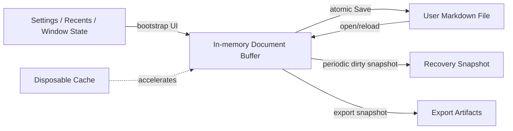
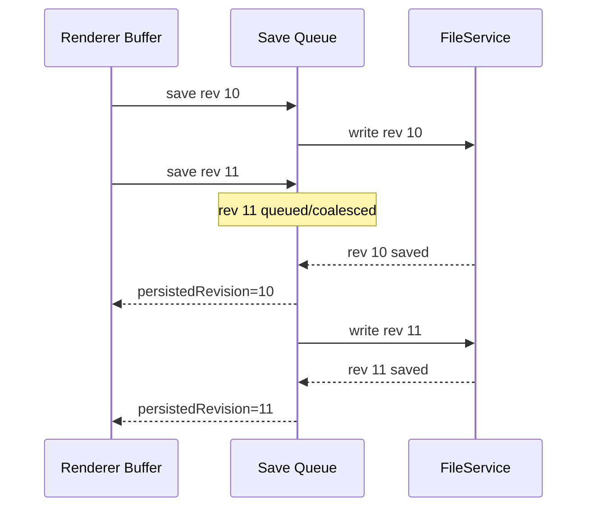
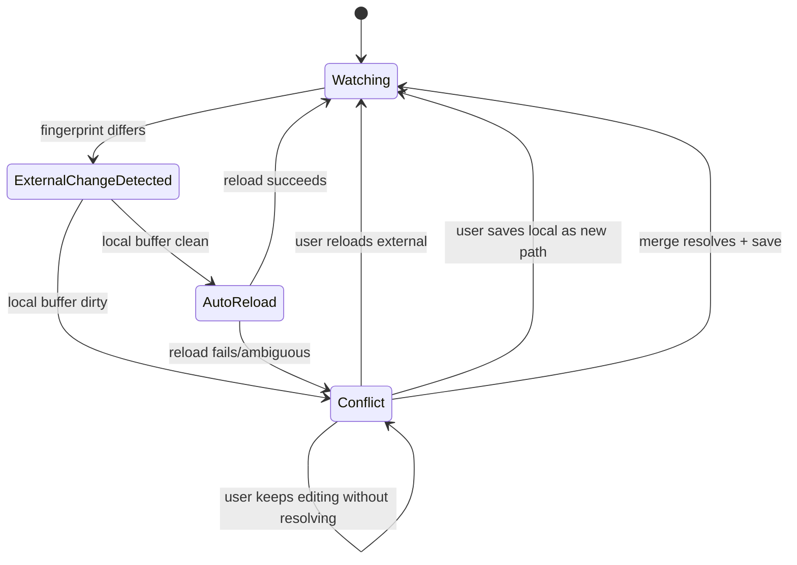

# MarkHere Storage and Sync Strategy

**Document:** 07-storage-and-sync-strategy.md  
**Product:** MarkHere  
**Status:** Proposed local persistence, file-watching, and synchronization strategy  
**Date:** 2026-09-11

---

## 1. Purpose

MarkHere is local-first. "Storage and sync" therefore has two meanings:

1. **primary v1 meaning:** keep the in-memory editing session, recovery state, and user's filesystem copy synchronized without silent overwrite or corruption;
2. **future meaning:** optionally cooperate with third-party/cloud synchronization without making MarkHere itself dependent on a cloud database.

The user-selected Markdown file is the durable document of record. OneDrive, Dropbox, Git, NAS software, backup tools, and other editors may modify that file concurrently. MarkHere must behave safely in that environment.

---

# 2. Storage principles

1. **User documents stay in user locations.** MarkHere does not copy every opened file into a private database.
2. **Markdown is canonical.** Proprietary state is metadata only.
3. **Writes are atomic where practical.** Never intentionally stream-save directly over the only good copy.
4. **Dirty and persisted revisions are separate.** A save completion for an older revision does not mark newer edits clean.
5. **Disk changes are treated as concurrency.** File watcher events are not mere UI refresh notifications.
6. **Recovery is not Save.** Recovery snapshots preserve unsaved work but do not overwrite the original file.
7. **Paths are capabilities.** Renderer cannot write arbitrary paths just because it can construct a string.
8. **Caches are disposable.** Settings/recovery are not mixed with large Chromium caches.
9. **Cloud sync is external in v1.** MarkHere remains robust when files live in cloud-synced folders.

---

# 3. Storage domains



---

# 4. Electron storage locations

Electron documents `userData` as the conventional per-user configuration location and notes that large cache-like files should not unnecessarily pollute it. MarkHere therefore separates logical application data from Chromium session/cache data.

Conceptual Windows layout:

```text
%APPDATA%\MarkHere\
├─ app\
│  ├─ settings.json
│  ├─ recents.json
│  ├─ keybindings.json
│  └─ schema.json
├─ sessions\
│  ├─ windows.json
│  ├─ recovery-index.json
│  └─ recovery\
│     ├─ <snapshot-id>.json
│     └─ ...
├─ dictionaries\
└─ diagnostics\

<app.getPath('logs')>\
├─ main.log
├─ renderer.log
└─ worker.log

<sessionData>\
└─ Chromium-managed cache/network/session files

%TEMP%\MarkHere\
├─ exports\<job-id>\
└─ resources\<session-id>\
```

Exact physical paths are resolved through Electron APIs rather than hard-coded.

---

# 5. User document open algorithm

```text
1. Receive user-authorized file activation/selection.
2. Canonicalize and validate path in main.
3. Stat the file.
4. Read bytes asynchronously.
5. Detect BOM/encoding according to supported policy.
6. Decode into Unicode Markdown string.
7. Detect predominant line ending and final newline.
8. Calculate fast fingerprint; strong hash if policy requires.
9. Create main-owned file capability.
10. Return OpenDocumentDTO to renderer.
11. Renderer creates canonical buffer revision 1 / persisted revision 1.
12. Register watcher for the canonical path.
13. Schedule resource scope for relative images/links.
```

A zero-byte file is valid Markdown and must not be confused with read failure.

---

# 6. Encoding strategy

## 6.1 New files

Default:

- UTF-8;
- no BOM unless user preference/target workflow requires one;
- platform/user line-ending preference (configurable; Windows profile may default CRLF, but repository-aware users often prefer LF).

## 6.2 Existing files

Preferred detection order:

1. explicit BOM (UTF-8/UTF-16);
2. strict UTF-8 validation;
3. trusted compact encoding detector for legacy input;
4. if confidence is low, prompt or open with warning instead of silently producing replacement-character damage.

MarkText includes compact encoding detection dependencies in its current desktop package; MarkHere may reuse the same concept while putting encoding policy behind `FileService`.

## 6.3 Save conversion

If a file was decoded from a legacy encoding that MarkHere cannot reliably write back:

- do not silently label replacement output as original encoding;
- offer UTF-8 conversion;
- show a one-time explicit warning;
- Save As can be used to avoid overwriting original.

---

# 7. Line-ending strategy

On open, detect:

- CRLF;
- LF;
- CR;
- mixed.

For mixed files, record dominant style and optionally warn/source-status indicator.

Save rules:

- preserve established line-ending policy unless user changes it;
- do not normalize merely by entering Preview;
- source editor shows status (`LF`/`CRLF`);
- changing line-ending setting is an explicit content-format operation and may create a large diff.

Final newline is tracked separately.

---

# 8. Atomic write strategy

A normal save uses a temp-file-and-replace sequence rather than truncating the original and writing incrementally.

Conceptual algorithm:

```text
validate save preconditions
encode current save snapshot
create temp file in same target directory where practical
write complete bytes
flush/close temp file
preserve applicable permissions/metadata policy
replace/rename target atomically where filesystem supports it
stat/hash new target
return resulting fingerprint
cleanup temp on failure
```

Using a same-directory temp file improves the chance rename/replace is atomic because it remains on the same volume.

`write-file-atomic` or an equivalent well-tested wrapper can implement the primitive, but MarkHere still owns conflict checks and state semantics.

---

# 9. Save serialization

Per-document saves are serialized.



Optional coalescing may skip obsolete queued saves as long as it cannot cause user-visible data loss or violate an explicit Save command's completion semantics.

---

# 10. Disk fingerprint strategy

A file fingerprint has fast and strong forms.

### Fast comparison

```text
size + mtimeMs (+ optional ctime/file identity)
```

Used for routine watcher filtering.

### Strong comparison

```text
SHA-256(bytes)
```

Used when potential overwrite conflict exists or timestamps are ambiguous.

### Save precondition

Renderer sends the fingerprint associated with its persisted base. Main compares it against current disk state immediately before final write.

If different and the change is not recognized as MarkHere's own just-completed save, return a conflict error instead of overwriting.

---

# 11. File watcher strategy

MarkHere uses chokidar or an equivalent cross-platform abstraction in main.

Watchers produce noisy low-level events, so `WatchService` converts them into semantic events.

Responsibilities:

- debounce bursts;
- normalize paths;
- pair rename-like unlink/add where feasible;
- ignore temporary files generated by MarkHere;
- suppress/identify self-write events using expected fingerprints/job tokens;
- stat after event settles;
- avoid following symlink loops;
- observe file and workspace roots separately;
- detach watchers when document/workspace closes.

---

# 12. Self-write suppression

A save naturally triggers filesystem watcher events. MarkHere must avoid treating its own save as an external conflict.

After a successful save:

```ts
interface ExpectedWriteRecord {
  documentId: string
  targetCanonicalPath: string
  fingerprint: FileFingerprint
  expiresAt: number
}
```

When watcher event arrives:

1. compute/obtain new fingerprint;
2. compare against expected write record;
3. if it matches, update watcher baseline and suppress external-conflict UI;
4. if it differs, treat as potentially external even if timing is close.

Time-window-only suppression is unsafe because another program could modify the file during that window.

---

# 13. External modification state machine



---

# 14. Clean-document external changes

If local buffer is clean and disk changes:

Preferred default:

- automatically reload if safe;
- preserve approximate cursor/structural scroll location;
- show a subtle "Reloaded after external change" notification if change is noticeable;
- assign a new internal revision representing the reload;
- set that revision as persisted.

A preference may require confirmation, but automatic reload is consistent with many developer editors for clean files.

---

# 15. Dirty-document conflict behavior

If disk changes while local edits are dirty:

**Do not auto-reload. Do not auto-save.**

Show persistent conflict status with actions:

- **Compare** local vs disk;
- **Reload disk** (requires confirmation because local changes would be discarded, unless recovery snapshot retained);
- **Keep editing local** (does not claim conflict resolved);
- **Save As...** to another file;
- **Merge** when merge UI exists;
- **Overwrite external** only as an explicit advanced action after revalidation.

Before destructive reload/overwrite, write a recovery snapshot of local content.

---

# 16. External deletion

If an open file is deleted:

### Local buffer clean

Mark document as "deleted on disk" but keep buffer open. User may:

- recreate by Save;
- Save As;
- close.

### Local buffer dirty

Keep content and mark conflict/deleted state. Autosave must not blindly recreate a deliberately deleted file without a documented policy.

---

# 17. External rename/move

File watchers cannot always reliably distinguish rename from delete+create across filesystems.

Possible evidence:

- same platform file ID/inode;
- same strong hash;
- paired watcher events within workspace;
- user performed rename through MarkHere (known transaction).

Only automatic rebinding when evidence is strong. Otherwise treat old file as missing and new file as a separate workspace change.

---

# 18. OneDrive/Dropbox/network share behavior

Cloud-synced folders can generate:

- temporary files;
- delayed writes;
- atomic replace patterns;
- repeated metadata changes;
- placeholder/offline files;
- conflicts created by the sync provider.

MarkHere should:

- wait for file events to settle before reading;
- retry transient sharing violations with bounded backoff;
- not assume one watcher event equals one user edit;
- use strong hash when conflict ambiguity matters;
- surface provider-generated conflict files normally in workspace tree;
- never attempt to implement provider-specific conflict resolution in v1.

---

# 19. Recovery snapshot strategy

Recovery protects edits when:

- renderer crashes;
- main crashes;
- OS/application is killed;
- power loss occurs after last snapshot;
- user accidentally closes and recovery policy retains a grace copy.

Trigger policy:

- document becomes dirty -> schedule snapshot after debounce;
- update periodically while edits continue;
- snapshot immediately before risky mode migration or destructive conflict decision when practical;
- write recovery atomically.

Suggested default recovery debounce: 2-5 seconds for ordinary text changes, tuned for disk overhead.

Recovery must not fire on every keystroke as a synchronous write.

---

# 20. Recovery file format

```json
{
  "schemaVersion": 1,
  "snapshotId": "uuid",
  "documentId": "uuid",
  "windowId": "uuid",
  "createdAt": "2026-09-11T12:00:00.000Z",
  "revision": 43,
  "markdown": "# unsaved content...",
  "originalFile": {
    "displayPath": "C:\\Projects\\README.md"
  },
  "baseDiskFingerprint": {
    "size": 1234,
    "mtimeMs": 1780000000000
  },
  "textFormat": {
    "encoding": "utf8",
    "lineEnding": "LF",
    "finalNewline": true,
    "bom": false
  },
  "appVersion": "1.0.0"
}
```

Because this contains full document content, it is sensitive and excluded from normal logs/diagnostics.

---

# 21. Recovery cleanup

A snapshot becomes obsolete when:

- the represented revision is known to have been safely persisted and no newer dirty revision exists;
- document is cleanly discarded/closed after explicit user action;
- user explicitly discards recovery.

Cleanup uses an index plus startup reconciliation so orphaned temp files do not grow forever.

Retention suggestion:

- unresolved latest crash snapshots: preserve until user resolves;
- superseded snapshots: remove quickly;
- orphaned stale snapshots with no unresolved session: bounded age retention (e.g. 7-30 days) with conservative behavior;
- hard storage cap with oldest non-critical cleanup.

Exact retention is a product setting/ADR if it changes user expectations.

---

# 22. Settings persistence

Settings use versioned JSON with runtime schema validation.

Write policy:

- update in main;
- serialize settings mutations;
- debounce cosmetic high-frequency changes such as pane width;
- atomic write;
- retain last-known-good backup for migration/corruption recovery where useful;
- unknown/corrupt data is quarantined rather than causing app boot failure.

Security-critical defaults cannot be overridden by editing settings JSON to disable sandbox/Node isolation because those are build/window policies, not ordinary user settings.

---

# 23. Recent items

Recents store display paths and timestamps only. They are not filesystem capabilities and do not prove the user still has access.

On reopen:

- canonicalize again;
- check existence;
- read again;
- create a new runtime capability;
- remove/stale-mark missing recent items gracefully.

---

# 24. Image storage strategies

When pasting/dropping an image into Markdown, MarkHere can offer:

### Option A - copy beside document

```text
README.md
assets/
  pasted-20260911-182300.png
```

Markdown:

```md

```

Recommended general default because Markdown remains portable.

### Option B - custom configured image directory

Allowed when directory is within workspace or explicitly selected.

### Option C - data URI

Not default because it makes Markdown huge and can stress renderers/exporters.

### Option D - upload provider

Out of scope for baseline v1 unless a separate network/security design is approved.

---

# 25. Relative-link preservation

When MarkHere does **Save As** to a new directory, relative asset links may become invalid.

v1 safe behavior:

- do not silently rewrite every relative link;
- warn if document contains relative local assets and Save As changes base directory;
- optional "copy referenced assets" is a future deliberate feature;
- resource resolver updates immediately to new document base after successful Save As.

---

# 26. Workspace storage behavior

Opening a folder does not create `.markhere` automatically.

Main persists user-specific workspace UI state under MarkHere app data keyed by a path identity hash/record:

- last open time;
- expanded tree nodes;
- sidebar/search settings;
- open tabs if session restore enabled.

This avoids polluting Git repositories.

---

# 27. Search/index storage

v1 prefers on-demand recursive search (e.g. ripgrep-style) over maintaining a persistent full-text index database.

Reasons:

- Markdown workspaces change externally;
- persistent index adds invalidation/privacy/storage complexity;
- repository-scale search is already fast with mature text-search tools.

A future persistent index would require a new ADR and privacy/storage limits.

---

# 28. Export temporary storage

Each export gets an isolated temp directory:

```text
%TEMP%\MarkHere\exports\<job-id>\
├─ input-snapshot.json (only if required; prefer memory)
├─ assets\
├─ render.html
└─ result.tmp
```

Rules:

- use memory where practical;
- if Markdown snapshot is written, treat it as sensitive;
- clean directory after completion/failure;
- startup cleans stale directories from crashed jobs;
- final user target is not touched until output is complete enough for atomic replacement.

---

# 29. Future cloud sync architecture

MarkHere v1 contains **no proprietary cloud sync**. If future sync is added, it should use an adapter boundary:

```ts
interface DocumentSyncProvider {
  getRemoteState(document: SyncDocumentRef): Promise<RemoteState>
  push(snapshot: SyncSnapshot, precondition: RemoteVersion): Promise<PushResult>
  pull(ref: SyncDocumentRef): Promise<SyncSnapshot>
}
```

Requirements before implementation:

- separate account/auth threat model;
- encrypted token storage;
- conflict/merge semantics;
- offline queue;
- remote version preconditions;
- privacy disclosure;
- never make cloud IDs replace local Markdown without explicit product design.

---

# 30. Sync with Git

Git is deliberately not integrated as a privileged Git client in v1. MarkHere simply edits files in a worktree.

Git-friendly behavior includes:

- minimal normalization;
- line-ending visibility;
- no hidden project files by default;
- atomic saves;
- external-change handling after checkout/rebase/branch switch;
- workspace watcher resilience to mass file changes.

A future Git status/commit feature requires its own scope.

---

# 31. Backup strategy

MarkHere recovery is **not** a full backup system. Documentation should make the distinction clear.

MarkHere protects recent unsaved edits. Long-term backups remain the user's filesystem/backup/cloud/Git responsibility.

MarkHere should never advertise recovery snapshots as guaranteed archival storage.

---

# 32. Storage failure behavior

### Disk full

- save returns explicit error;
- document stays dirty;
- old file remains intact if atomic write strategy works;
- recovery attempts continue to a safe location if possible, but failure is surfaced.

### Permission denied/read-only

- open can continue read-only;
- save offers Save As;
- do not repeatedly spam autosave errors.

### Sharing violation/temporary lock

- bounded retry with jitter/backoff for known transient Windows errors;
- then actionable error.

### Path disappeared

- keep buffer;
- mark missing-on-disk;
- allow Save As/recreate.

---

# 33. Storage verification matrix

Test at least:

- NTFS local drive;
- Windows OneDrive-synced directory where CI/manual environment permits;
- UNC/network share manual test;
- read-only file;
- read-only directory;
- disk-full simulation/mocked failure;
- path with Unicode/space/#/%/? where legal;
- long path;
- file deleted/renamed externally;
- two MarkHere windows attempting same file;
- MarkHere + Notepad/VS Code external edit;
- rapid save loop;
- save while export running;
- crash during recovery write;
- crash during atomic save stages.

---

# 34. References

- Electron app data paths: https://www.electronjs.org/docs/latest/api/app
- MarkText current filesystem/watcher/recovery code reference: https://github.com/marktext/marktext/tree/develop/packages/desktop/src/main
- MarkText architecture: https://marktext.me/docs/dev/architecture
- Electron UtilityProcess for isolated work: https://www.electronjs.org/docs/latest/api/utility-process

---

# 35. Related documents

- `04-data-model.md` defines revisions/fingerprints/recovery types.
- `05-api-design.md` defines save/workspace capabilities.
- `06-security-design.md` defines path/resource trust boundaries.
- `08-error-handling-and-logging.md` defines filesystem/conflict errors.
- `10-testing-strategy.md` defines durability/fault-injection tests.
