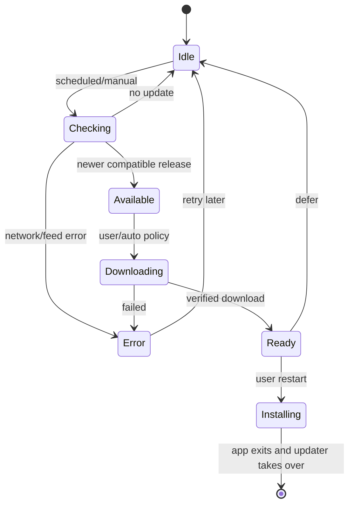

# MarkHere Deployment Strategy

**Document:** 09-deployment-strategy.md  
**Product:** MarkHere  
**Status:** Proposed build, packaging, signing, release, update, and Windows integration strategy  
**Date:** 2026-09-11

---

## 1. Purpose

This document defines how MarkHere moves from source code to a trustworthy Windows desktop installation. It covers reproducible dependency installation, build variants, Electron packaging, installer behavior, file-handler registration, code signing, CI, releases, auto-update, rollback, portable builds, and future platform expansion.

MarkText currently uses electron-builder, NSIS, Windows x64/ARM64 targets, file association configuration, and a custom NSIS include. MarkHere reuses that packaging knowledge while intentionally improving default-app registration semantics for current Windows 11.

---

# 2. Deployment goals

1. One command/release workflow produces traceable artifacts from a Git tag.
2. Stable artifacts are signed.
3. x64 and ARM64 are independently identified and tested.
4. Installer does not silently steal `.md` default association.
5. Installed MarkHere appears as a valid Markdown handler in Windows.
6. Update channel cannot be redirected by renderer content.
7. Upgrade preserves settings and user documents.
8. Uninstall does not delete user Markdown/export files.
9. Portable ZIP is available with clearly documented reduced OS integration.
10. Build carries third-party notices and MarkText MIT attribution for reused code.

---

# 3. Build baseline

Proposed root requirements:

```text
Node.js >= 20.19 (aligned with reviewed MarkText baseline; revisit with Electron requirements)
pnpm 10.x
TypeScript 6.x baseline
Electron 42.x baseline
Vue 3.x
Windows 11 build/test runner for Windows artifacts
```

Exact versions are pinned by `package.json`/`pnpm-lock.yaml`; architecture docs do not authorize automatic major upgrades.

---

# 4. Build configurations

```ts
type BuildChannel = 'dev' | 'alpha' | 'beta' | 'stable'
type BuildArch = 'x64' | 'arm64'
```

### Development

- source maps;
- DevTools enabled;
- verbose logs;
- no production updater;
- no production signing requirement for local runs;
- Electron security warnings enabled.

### Alpha/Beta

- production compilation/hardening;
- signed when distributed externally;
- prerelease update channel;
- diagnostics may be more verbose than stable;
- separate app update metadata.

### Stable

- optimized build;
- production fuses;
- no development URLs;
- restrictive CSP;
- code signed;
- stable updater feed;
- license/SBOM/notices included;
- release gates mandatory.

---

# 5. Package scripts

Example:

```json
{
  "scripts": {
    "dev": "pnpm --filter @markhere/desktop dev",
    "lint": "eslint .",
    "typecheck": "pnpm -r typecheck",
    "test": "pnpm -r test",
    "test:e2e": "pnpm --filter @markhere/desktop test:e2e",
    "build": "pnpm -r build",
    "build:win:x64": "pnpm --filter @markhere/desktop build:win:x64",
    "build:win:arm64": "pnpm --filter @markhere/desktop build:win:arm64",
    "licenses": "node scripts/generate-third-party-notices.mjs"
  }
}
```

Release builds run from clean checkout with frozen lockfile.

---

# 6. electron-builder choice

Electron officially recommends Electron Forge as its supported integrated packaging tooling, but also documents electron-builder as a widely used third-party alternative. MarkHere chooses **electron-builder** initially because:

- MarkText's current packaging is already a strong reference;
- NSIS configuration and Windows artifacts are well understood;
- electron-updater integrates with it;
- selective reuse reduces migration effort.

This is a deliberate ADR, not an assumption that builder is inherently more secure than Forge.

---

# 7. Proposed electron-builder configuration

Conceptual configuration:

```yaml
appId: com.markhere.desktop
productName: MarkHere

directories:
  buildResources: build
  output: ../../dist

asar: true

win:
  executableName: markhere
  icon: build/icon.ico
  target:
    - target: nsis
    - target: zip
  artifactName: MarkHere-win-${arch}-${version}.${ext}

nsis:
  oneClick: false
  perMachine: false
  allowToChangeInstallationDirectory: true
  createDesktopShortcut: true
  createStartMenuShortcut: true
  shortcutName: MarkHere
  uninstallDisplayName: MarkHere
  include: build/windows/installer.nsh
```

`appId` is provisional until the project's final publisher/domain namespace is selected. It must become stable before public release because changing identity can affect shortcuts, updater behavior, and OS settings.

---

# 8. Artifacts

Desired release outputs:

```text
MarkHere-win-x64-1.0.0-setup.exe
MarkHere-win-arm64-1.0.0-setup.exe
MarkHere-win-x64-1.0.0.zip
MarkHere-win-arm64-1.0.0.zip
checksums.txt
THIRD_PARTY_NOTICES.md
SBOM artifacts (recommended)
```

Portable ZIP builds are not assumed to have file associations, auto-update, or Start menu integration.

---

# 9. Windows file association strategy

The product's original problem makes this release-critical.

## 9.1 What MarkHere should register

MarkHere registers itself as an available handler for:

```text
.md
.markdown
.mmd
.mdown
.mdtext
.mdtxt
```

`.mdx` is optional and should only be registered if source-only behavior meets user expectation.

Proposed ProgID:

```text
MarkHere.MarkdownDocument
```

Open command:

```text
"C:\Program Files-or-UserInstall\MarkHere\markhere.exe" "%1"
```

## 9.2 Do not force the default

Current Windows default-app guidance states that user default choices must be made through Windows system UI and should not be programmatically overwritten. Windows 11 provides `ms-settings:defaultapps` to direct the user to default-app settings.

Therefore:

- installer registers MarkHere as a candidate handler/Open With application;
- installer/app does not write protected `UserChoice` data;
- onboarding offers "Make MarkHere your default Markdown app" which opens Windows default-app settings/instructions;
- app does not repeatedly nag if user chooses another default.

## 9.3 Why not blindly copy MarkText installer behavior

The reviewed MarkText `installer.nsh` currently offers to associate extensions and writes per-user `Software\Classes` values directly. That is useful reference code, but current Windows guidance protects default choices. MarkHere should register correctly and defer actual default selection to Windows UI rather than claim it can guarantee a default by direct registry mapping.

## 9.4 electron-builder caveat

Current electron-builder documentation notes that its built-in Windows NSIS `fileAssociations` support has constraints including `perMachine`. MarkHere wants a normal per-user installer by default, so the installer may need a carefully tested custom NSIS registration section instead of assuming the built-in block is sufficient.

The exact registry registration is validated on current Windows 11 clean VMs as part of release testing.

---

# 10. File activation

When Windows launches:

```text
markhere.exe "C:\Projects\README.md"
```

main startup:

1. acquire single-instance lock;
2. parse command line without shell re-evaluation;
3. classify arguments as files/folders/options;
4. canonicalize path;
5. forward open request to existing instance if second instance;
6. existing instance focuses suitable window and opens file;
7. security/path handling follows normal FileService path, not a special less-validated launch path.

Arguments are data; MarkHere never builds a shell command string from them.

---

# 11. Installer modes

### Per-user installed build - default

Advantages:

- no administrator prompt for normal install;
- update simpler for normal user;
- appropriate for personal desktop tool.

Requires custom-tested handler registration rather than assuming machine-wide file association.

### Per-machine build - optional enterprise artifact

May be offered later for managed environments. Requires admin installation and enterprise default-app policy coordination; it does not authorize MarkHere to override per-user Windows default choices.

### Portable ZIP

- unpack and run;
- no auto association by default;
- no automatic updater by default;
- settings still live in userData unless a deliberate portable-settings mode is added;
- clearly labeled portable.

---

# 12. Code signing

Electron's distribution documentation strongly recommends code signing, and Windows will warn users more aggressively about unsigned downloads.

Stable MarkHere requirements:

- sign installer executable;
- sign primary executable/binaries as packaging tool supports/requires;
- timestamp signature through trusted timestamp service;
- verify signature after packaging and before upload;
- do not expose signing key/certificate password in repository/logs;
- use protected CI secrets or a managed signing service;
- signing happens after Electron fuse mutation and final packaging steps that affect binaries.

Certificate/provider choice is operational and can change without architecture changes if identity continuity is preserved.

---

# 13. Electron fuses in packaging

Production build pipeline applies and verifies selected fuses before code signing.

Candidate policy:

```text
RunAsNode = disabled
NodeOptions environment variable = disabled
Node CLI inspect = disabled
OnlyLoadAppFromAsar = enabled if compatible
EmbeddedAsarIntegrityValidation = enabled if compatible
GrantFileProtocolExtraPrivileges = disabled because app uses custom schemes
```

The release job runs `@electron/fuses` inspection against the packaged app and stores the result as build evidence.

---

# 14. Native dependencies

Current MarkText uses some native dependencies and rebuild tooling. MarkHere should minimize native modules, especially for ARM64 reliability.

Rules:

- every native dependency must support x64 and ARM64 target;
- rebuild with Electron ABI as part of packaging;
- no runtime download of native binary without verified supply chain;
- CI tests installed packaged build, not only dev `electron` run;
- optional native feature can be disabled on unsupported architecture rather than breaking app startup where reasonable.

---

# 15. ASAR strategy

Package application code in `app.asar` for normal production distribution.

Unpack only resources/native files that require real filesystem paths.

Avoid placing user-editable configuration inside ASAR; it belongs in userData.

If enabling ASAR integrity/only-load-from-ASAR fuses, test updater and native modules after packaging.

---

# 16. Static resources

Bundled assets:

- app icons;
- Markdown document icon;
- themes;
- KaTeX fonts/assets;
- Mermaid/runtime bundles;
- syntax themes;
- default export CSS;
- licenses/notices;
- optional dictionaries if distribution permits.

No runtime CDN should be required for core UI/editor rendering.

---

# 17. Auto-update strategy

Because packaging uses electron-builder, initial implementation uses `electron-updater` rather than mixing builder packaging with an unrelated updater stack.

Principles:

- main process only;
- fixed release provider/channel configuration;
- HTTPS;
- signed artifacts;
- no update when running portable ZIP unless specifically supported;
- manual "Check for updates";
- configurable automatic checks;
- auto-download preference separate from auto-check;
- install occurs on explicit restart decision unless security hotfix policy says otherwise.

---

# 18. Update channels

```text
stable -> production releases only
beta   -> public prereleases
alpha  -> early testers
```

A stable installation does not silently move to beta.

Channel is part of signed/build configuration or tightly controlled setting; document content cannot select it.

---

# 19. Update lifecycle



Editing remains available after check/download errors.

---

# 20. Release source and metadata

Recommended open-source distribution path:

- GitHub Releases for installers/ZIP/checksums/release notes;
- updater metadata generated by electron-builder/provider;
- immutable tags;
- protected stable release environment;
- website/download link points to stable latest release.

If update hosting moves later, the change requires TLS/signature/staging validation but does not change editor architecture.

---

# 21. CI pipeline

```mermaid
flowchart LR
    PR[Pull Request]
    Q[Quality: format/lint/typecheck]
    U[Unit + component]
    SEC[Security/license scan]
    E2E[Electron E2E]
    MERGE[Merge]
    TAG[Release tag]
    B[Build Windows matrix]
    F[Fuse hardening]
    S[Code signing]
    I[Install/upgrade smoke]
    R[Publish release]
    UPD[Update staging verification]

    PR --> Q --> U --> SEC --> E2E --> MERGE
    MERGE --> TAG --> B --> F --> S --> I --> R --> UPD
```



---

# 22. Pull-request CI

Every PR:

- frozen lockfile install;
- formatting/lint;
- TypeScript typecheck;
- unit tests;
- package boundary checks;
- CommonMark/GFM regression subset;
- sanitizer/security corpus;
- license validation;
- dependency vulnerability policy;
- build renderer/main/preload;
- selected Electron E2E on Windows for high-risk changes.

Full expensive suites may run nightly/release candidate.

---

# 23. Release build matrix

| OS runner | Target | Mandatory |
|---|---|---:|
| Windows | x64 installer + ZIP | Yes |
| Windows | ARM64 installer + ZIP | Before claiming ARM64 support |
| Linux/macOS | lint/unit cross-platform packages | Desirable |
| macOS | future app | No for Windows v1 |
| Linux | future packages | No for Windows v1 |

Cross-building an artifact is not equivalent to testing it on target hardware.

---

# 24. Versioning

Use Semantic Versioning for MarkHere product releases:

```text
0.x - architecture/preview development
1.0.0 - first stable contract
1.1.0 - backwards-compatible feature additions
1.1.1 - fixes/security patches
2.0.0 - major product/persistence/API migration where necessary
```

Pre-release examples:

```text
1.0.0-alpha.3
1.0.0-beta.2
1.0.0-rc.1
```

Persistent schemas have separate integer schema versions and migration tests.

---

# 25. Reproducibility and provenance

Release manifest records:

```json
{
  "version": "1.0.0",
  "gitCommit": "...",
  "electron": "42.x",
  "node": "...",
  "pnpmLockHash": "...",
  "markTextReuseBaseline": "upstream commit/tag",
  "buildTime": "...",
  "channel": "stable"
}
```

Source archive/tag and third-party notices are published with release where practical.

---

# 26. MarkText license compliance in deployment

MarkText's MIT license requires its copyright and permission notice to be included in copies or substantial portions of reused software.

Stable package therefore includes:

- MarkText MIT notice in third-party notices;
- upstream provenance for Muya-derived/editor-core code;
- npm dependency license notices;
- MarkHere license;
- accessible About -> Licenses UI or local notice file.

Rebranding must not remove required upstream legal notices.

---

# 27. Upgrades and migrations

Before installing new version:

- normal updater/installer replaces application binaries;
- user documents remain untouched;
- userData retained;
- startup performs settings/recovery schema migrations;
- migration failure quarantines app metadata and starts safe defaults where possible;
- never delete recovery content merely because new version cannot parse one optional setting.

Downgrade support is not guaranteed. If a new schema is incompatible with older app, backup/migration policy is documented.

---

# 28. Uninstall

Uninstaller removes:

- application binaries;
- shortcuts;
- MarkHere handler registration created by installer;
- updater integration.

User settings/logs may be optionally removed with explicit user choice.

Uninstaller must **never recursively delete arbitrary user workspaces/documents**.

Any cleanup path is hard-coded/resolved under MarkHere-owned app data, not derived from a workspace path.

---

# 29. Rollback

If a new release is bad:

Operational rollback:

1. stop promoting bad version in update feed;
2. publish fixed version with higher semantic version;
3. retain previous installer download for manual fallback where appropriate;
4. migrations should avoid irreversible document changes;
5. settings migrations should back up old state when destructive;
6. no updater action should rewrite Markdown documents.

Because auto-updaters typically move forward, "rollback" is usually a rapid forward fix, not silently installing a lower version.

---

# 30. Installer test matrix

Clean Windows 11 VMs test:

- no previous MarkHere;
- upgrade from previous stable;
- upgrade from beta to stable where policy supports;
- uninstall/reinstall;
- non-admin user per-user install;
- custom installation directory;
- path containing spaces/non-ASCII;
- Explorer Open With;
- Default Apps registration;
- `.md` activation after user selects MarkHere;
- two file activations into existing instance;
- desktop/Start menu shortcuts;
- ARM64 native machine/VM when supported;
- signature verification;
- installer cancellation;
- app running during update;
- settings/recovery preservation.

---

# 31. Future macOS/Linux

Cross-platform editor core means future work focuses on deployment/OS integration:

### macOS

- DMG/ZIP;
- code signing + notarization;
- document types;
- keychain/safeStorage behavior;
- Apple Silicon/x64;
- app menu conventions.

### Linux

- AppImage/deb/rpm/tar as chosen;
- desktop entry/MIME registration;
- varied secret-store semantics;
- Wayland/X11 testing;
- distro-specific sandbox/native dependency behavior.

No Windows-specific registry logic leaks into process-neutral packages.

---

# 32. Deployment release checklist

- [ ] version/tag finalized
- [ ] frozen lockfile clean install
- [ ] tests/release gates pass
- [ ] third-party notice generated
- [ ] SBOM generated if enabled
- [ ] x64 build produced
- [ ] ARM64 build produced if supported
- [ ] production CSP verified
- [ ] Electron fuses inspected
- [ ] code signatures verified
- [ ] clean-install smoke passed
- [ ] upgrade smoke passed
- [ ] Open With/default-app registration passed
- [ ] no forced Windows default association
- [ ] updater staging passed
- [ ] checksums produced
- [ ] release notes include security/migration notes
- [ ] artifacts uploaded only from protected release job

---

# 33. References

- Electron distribution overview: https://www.electronjs.org/docs/latest/tutorial/distribution-overview
- Electron application packaging: https://www.electronjs.org/docs/latest/tutorial/application-distribution
- Electron code signing: https://www.electronjs.org/docs/latest/tutorial/code-signing
- Electron updating applications: https://www.electronjs.org/docs/latest/tutorial/updates
- Electron fuses: https://www.electronjs.org/docs/latest/tutorial/fuses
- electron-builder Windows: https://www.electron.build/docs/win/
- electron-builder NSIS: https://www.electron.build/nsis/
- electron-builder file associations: https://www.electron.build/docs/api/app-builder-lib.interface.fileassociation/
- Microsoft Windows app defaults platform: https://learn.microsoft.com/en-us/windows/apps/develop/windows-integration/default-apps-platform
- Microsoft file association compatibility guidance: https://learn.microsoft.com/en-us/windows/compatibility/file-type-and-protocol-associations-model
- MarkText electron-builder configuration and installer reference: https://github.com/marktext/marktext/tree/develop/packages/desktop
- MarkText MIT license: https://github.com/marktext/marktext/blob/develop/LICENSE

---

# 34. Related documents

- `06-security-design.md` - signing/fuses/update trust model
- `07-storage-and-sync-strategy.md` - upgrade-safe user data
- `10-testing-strategy.md` - clean VM/install/update gates
- `11-architecture-decision-record.md` - electron-builder/Windows-first decisions
