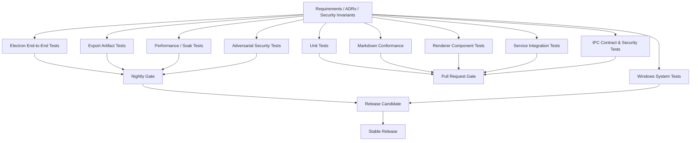
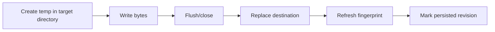

# MarkHere Testing Strategy

**Document:** 10-testing-strategy.md  
**Product:** MarkHere  
**Status:** Proposed verification and release-quality strategy  
**Date:** 2026-09-11

---

## 1. Purpose

This document defines how MarkHere proves that a Markdown file can be opened, viewed, edited, saved, recovered, exported, and reopened without corruption while preserving the security boundaries expected of a modern Electron application.

Testing is not limited to UI correctness. MarkHere combines a plain-text document format, two editing surfaces, a live renderer, filesystem access, custom local-resource handling, export engines, crash recovery, OS integration, and an auto-update pipeline. A defect in any one of those areas can produce a result that looks correct on screen while silently losing user data or creating an unsafe privilege path. The strategy therefore treats **content preservation, file safety, process isolation, and deterministic export** as first-class test subjects.

The baseline Markdown behavior follows CommonMark 0.31.2 plus GitHub Flavored Markdown where MarkHere explicitly enables those extensions. Selective MarkText/Muya-derived behavior is tested both against its upstream tests and against MarkHere-specific contracts.

---

# 2. Quality goals

MarkHere testing is organized around ten product promises:

1. **No silent data loss.** An edit that the UI reports as saved must be recoverable from disk.
2. **No silent overwrite.** A file changed externally must not be overwritten without conflict handling when the MarkHere buffer is dirty.
3. **Mode consistency.** Preview, WYSIWYG, Source, and Split represent the same Markdown document, subject only to documented rendering differences.
4. **Round-trip fidelity.** Switching modes must not gratuitously rewrite valid Markdown.
5. **Standards consistency.** CommonMark/GFM behavior must be testable against published examples and explicit MarkHere extension rules.
6. **Export fidelity.** HTML, PDF, and DOCX exports must preserve the supported document semantics, not merely produce a file with the correct extension.
7. **Security isolation.** Markdown content must not obtain Node, Electron, arbitrary filesystem, shell, or unrestricted network capabilities.
8. **Windows reliability.** Opening a `.md` file from Explorer, installing, upgrading, uninstalling, and handling paths must work on supported Windows 11 architectures.
9. **Performance predictability.** Large or pathological Markdown must degrade gracefully rather than freeze indefinitely or truncate data.
10. **Diagnosability without content leakage.** Failures should produce useful local logs and correlation identifiers while excluding document text by default.

---

# 3. Testing principles

## 3.1 Test behavior at the lowest reliable layer

A pure path policy should be tested without launching Electron. A renderer component should be tested without a real installer. A Windows file-association workflow, however, must eventually be tested on Windows because registry and shell behavior cannot be proven by a TypeScript unit test.

This keeps the suite fast while preserving realistic release gates.

## 3.2 Risk-based depth, not a vanity coverage percentage

A single repository-wide line-coverage target is not sufficient. Coverage requirements vary by risk:

| Area | Required rigor |
|---|---|
| Document revision/save state | Very high branch and state-transition coverage |
| Atomic-save/conflict detection | Very high unit + integration + fault-injection coverage |
| IPC/preload authorization | Very high negative/security coverage |
| Resource path policy | Very high adversarial coverage |
| Markdown parser/serializer adapters | Conformance + regression corpus |
| Export mapping | Structural + visual/semantic regression coverage |
| UI cosmetics | Component + focused visual coverage |
| Installer/updater | Release-candidate system tests |

Suggested initial coverage gates are **90% branch coverage for security-sensitive pure modules and document/save state machines**, **80% branch coverage for reusable domain packages**, and no global percentage requirement that can be gamed by excluding difficult behavior. These numbers are quality gates, not substitutes for scenario tests.

## 3.3 Every production bug becomes a regression test

A fixed defect is not considered complete until the narrowest reliable regression test exists. If the failure only manifests in a packaged Windows build, the regression may belong to the release smoke suite rather than unit tests.

## 3.4 Test public contracts, not incidental implementation

Tests should prefer:

- Markdown in → Markdown/state out;
- API request → typed result;
- file state + event → state transition;
- export snapshot → output artifact;
- user action → visible result.

Avoid asserting private Vue component method names, exact DOM nesting that is not an accessibility contract, or internal temporary paths unless that behavior itself is part of the contract.

## 3.5 Determinism is a feature

Fixtures must avoid uncontrolled current dates, random IDs, locale, timezone, installed fonts, or network calls. Where nondeterminism is required, seed it and record the seed on failure.

---

# 4. Test architecture



---

# 5. Test layers

## 5.1 Layer A — pure unit tests

Target modules that do not need Electron or a DOM.

Examples:

- `DocumentBuffer` revision increments;
- dirty/persisted revision calculation;
- external-change state transition reducer;
- path normalization and containment;
- URL scheme allow/deny logic;
- Markdown extension detection;
- file fingerprint comparison;
- save queue serialization;
- recent-file deduplication;
- export option normalization;
- settings migration;
- log redaction;
- diagnostics allowlist;
- Markdown dialect feature registry;
- heading slug generation;
- source/preview scroll anchor mapping;
- IPC payload schema validation.

Pure unit tests should be the majority of tests by count because they provide the fastest feedback and the most precise failure localization.

---

## 5.2 Layer B — Markdown conformance and transformation tests

These test parser/serializer/editor adapters against Markdown text rather than UI pixels.

### CommonMark baseline

MarkHere will import or adapt the official CommonMark example corpus for the pinned specification version. Each example is classified as:

- supported exactly;
- deliberately extended by GFM;
- deliberately modified by a documented MarkHere extension;
- unsupported, with a tracked reason.

The conformance runner records the specification version so a future spec update is an explicit dependency/ADR decision rather than a silent behavior change.

### GFM baseline

Add fixtures for:

- tables;
- task-list items;
- strikethrough;
- autolink extensions;
- interactions between these extensions and CommonMark blocks/inlines.

### MarkHere extensions

Separate fixture namespaces cover:

- YAML/TOML-style front matter if enabled;
- KaTeX math delimiters;
- Mermaid/diagram fenced blocks;
- emoji syntax if retained;
- custom image/path handling.

An extension test must never change the interpretation of unrelated CommonMark input without an explicit architecture decision.

---

# 6. Canonical Markdown corpus

Create the following fixture families:

```text
test/fixtures/markdown/
├── commonmark/
├── gfm/
├── markhere-extensions/
├── roundtrip/
├── malicious/
├── unicode/
├── huge/
├── windows-paths/
├── export/
└── regressions/
```

The central human-readable fixture should be:

```text
test/fixtures/markdown/markdown-everything.md
```

It includes, at minimum:

- ATX and Setext headings;
- paragraphs and soft/hard line breaks;
- emphasis, strong emphasis, nesting, strikethrough;
- inline code and fenced/indented code blocks;
- ordered/unordered/nested lists;
- task lists;
- blockquotes and nested blockquotes;
- links, reference links, autolinks, anchors;
- local, absolute, remote, data-like, and broken image references;
- tables with alignment and escaped pipes;
- thematic breaks;
- raw HTML;
- front matter;
- inline/block math;
- Mermaid diagrams;
- Unicode from multiple scripts;
- combining marks and emoji;
- RTL samples;
- paths containing spaces, `#`, `%`, `?`, Unicode, and long names;
- CRLF and LF variants;
- BOM and no-BOM variants;
- very long paragraphs;
- extremely wide tables;
- nested constructs near parser boundaries.

The fixture is version controlled. Changes require review because it acts as a visible compatibility contract.

---

# 7. Document state-machine tests

The `DocumentBuffer` is a high-risk core and receives table-driven tests.

Assume:

```ts
interface DocumentBuffer {
  markdown: string
  revision: number
  persistedRevision: number
}
```

Required cases include:

| Initial state | Operation | Expected state |
|---|---|---|
| rev 1 / persisted 1 | edit | rev 2 / persisted 1 / dirty |
| rev 2 / persisted 1 | save rev 2 completes | rev 2 / persisted 2 / clean |
| rev 2 / persisted 1 | start save; edit to rev 3; save rev 2 completes | rev 3 / persisted 2 / still dirty |
| rev 3 / persisted 2 | failed save | revision unchanged / dirty remains |
| clean buffer | clean external disk change | reload to new revision/fingerprint |
| dirty buffer | external disk change | conflict; no overwrite |
| export rev 4 | user edits to rev 5 while export runs | output represents rev 4 exactly |

Property tests are useful for randomly generated sequences of edit/save/save-failure/external-change events. Invariants include:

```text
persistedRevision <= revision
clean <=> persistedRevision == revision and no unresolved external conflict
save completion can never mark a newer unsaved revision as persisted
```

---

# 8. Mode-transition matrix

Every pair of modes is explicitly tested.

| From | To | Essential assertion |
|---|---|---|
| Preview | WYSIWYG | same canonical Markdown |
| Preview | Source | source matches current buffer |
| Preview | Split | source and preview use same revision |
| WYSIWYG | Preview | pending editor operations flushed first |
| WYSIWYG | Source | no lost same-frame edits |
| WYSIWYG | Split | source initialized from flushed Markdown |
| Source | Preview | source committed before render |
| Source | WYSIWYG | parsing produces equivalent semantic document |
| Source | Split | source instance preserved where possible |
| Split | Preview | latest source revision shown |
| Split | WYSIWYG | pending source changes committed |
| Split | Source | no second divergent source buffer |

Special regression tests cover rapid transitions such as:

```text
WYSIWYG edit → immediately Ctrl+3 → immediately Ctrl+1 → save
```

The expected result is that the character typed before the transitions exists on disk.

---

# 9. WYSIWYG/Muya-derived test strategy

MarkHere may reuse or adapt MarkText's Muya/MuyaJS code under the MIT license. Reuse means reusing the accompanying relevant tests where possible, not just production code.

Testing has three layers:

1. **Upstream-compatible tests** retained close to their original form and attribution.
2. **Adapter contract tests** proving MarkHere's `WysiwygEditorAdapter` converts between Muya state and canonical Markdown correctly.
3. **MarkHere regressions** for changes made after the code is imported.

When MarkHere intentionally changes upstream behavior, the upstream test is not silently deleted. It is either updated with a comment that references the MarkHere ADR/issue, or moved into a compatibility-difference manifest.

### Differential testing

For a curated compatibility corpus, automated tools may run the same Markdown through the pinned MarkText/Muya baseline and MarkHere engine, then compare normalized semantic output. Differences are reviewed, not automatically considered bugs, because MarkHere may modernize behaviors such as Source mode or security sanitization.

---

# 10. Source editor tests

MarkHere proposes CodeMirror 6 for Source mode. Tests cover behavior MarkText users would expect while avoiding implementation lock-in:

- initial source exactly reflects `DocumentBuffer.markdown`;
- edits update canonical buffer with monotonically increasing revision;
- undo/redo is editor-local but cannot bypass save state;
- selection survives non-destructive view transitions where feasible;
- line/column status updates correctly;
- CRLF display/editing does not create mixed endings unintentionally;
- very large documents do not cause source truncation;
- syntax highlighting does not mutate text;
- search/replace handles Unicode;
- paste preserves plain text unless the user invokes a rich Markdown conversion command;
- IME composition does not generate duplicate commits.

---

# 11. Preview renderer tests

Preview tests have two levels.

### Structural tests

Given Markdown, assert normalized DOM semantics:

```text
# Title        -> h1
**bold**       -> strong
- item         -> ul > li
table          -> table/thead/tbody
fenced code block -> pre > code
```

Avoid brittle tests for automatically generated Vue class names unless style behavior depends on them.

### Visual regression tests

Golden screenshots cover representative pages in:

- light mode;
- dark mode;
- narrow window;
- wide window;
- 100%, 125%, and 150% display scaling where practical;
- long tables;
- code blocks;
- math;
- diagrams;
- mixed RTL/LTR content.

Visual diffs run with pinned Chromium/Electron, fonts, viewport, and OS image. A visual threshold is configured narrowly; unexplained baseline updates are not accepted as routine maintenance.

---

# 12. Split-view tests

Split view is a concurrency-sensitive surface, not merely a two-column component.

Required cases:

- source edit schedules preview of revision N;
- source advances to N+1 before N finishes;
- N result is discarded if N+1 is current;
- the source buffer is never overwritten by an older preview result;
- scroll synchronization uses structural anchors, not only percentage offsets;
- clicking a preview heading can map to the corresponding source position where supported;
- divider size survives reopen if persisted;
- collapsed/narrow window behavior is deterministic;
- renderer exceptions do not destroy source text.

A synthetic delayed renderer is used to force out-of-order completions reliably.

---

# 13. Renderer component tests

Vue components are tested with a DOM-capable component runner for:

- tab strip and dirty markers;
- mode selector;
- sidebar/workspace tree;
- conflict dialog;
- export dialog;
- settings panels;
- recovery dialog;
- notification/toast behavior;
- update UI;
- accessibility semantics.

Mocks are capability-level APIs (`files`, `dialogs`, `exports`), not a fake raw `ipcRenderer`. This makes tests enforce the intended architecture.

---

# 14. Preload API surface tests

A security-sensitive snapshot test enumerates the keys exposed under:

```ts
window.markhere
```

The test fails if a developer accidentally exposes new powers without review.

Explicit assertions include:

```text
window.require                 absent
window.process                 absent
window.electron                absent
window.markhere.ipcRenderer    absent
window.markhere.send           absent
window.markhere.invoke         absent
```

Capability functions must match the API types in `05-api-design.md`.

A new preload capability requires:

1. schema/type definition;
2. main-process handler;
3. authorization/sender validation;
4. positive test;
5. malformed-payload test;
6. unauthorized-context test where applicable;
7. update to the API surface snapshot;
8. security review if it adds filesystem, shell, network, credential, or update power.

---

# 15. IPC contract tests

All IPC routes are driven through a typed schema registry.

For each invoke route test:

- valid payload accepted;
- invalid primitive rejected;
- missing required field rejected;
- unexpected enum rejected;
- oversized string/array rejected if bounded;
- path capability checked;
- sender/window identity checked;
- underlying service result mapped to `ApiResult`;
- raw stack trace not returned to renderer;
- cancellation respected if supported.

The test environment calls handlers directly for speed and also exercises representative routes through a real Electron preload/renderer pair.

---

# 16. Main-process service integration tests

Run against isolated temporary directories.

Services include:

- file open/read;
- encoding detection;
- atomic write;
- Save As;
- rename/move;
- trash/delete where implemented;
- workspace enumeration;
- file watching;
- recovery snapshots;
- settings store;
- recent documents;
- resource broker;
- export coordinator;
- update state machine with fake provider.

Tests must never use the developer's actual Documents/Desktop directories.

Each test gets a unique sandbox such as:

```text
<temp>/markhere-test/<run-id>/<test-id>/
```

and removes it after success. Failed CI jobs may archive the sandbox if it contains only synthetic fixture data.

---

# 17. Filesystem compatibility tests

Paths are a major Windows risk. Required fixture names include:

```text
simple.md
with spaces.md
C# notes.md
100% coverage.md
what?.md                # where the host filesystem permits it; '?' is not a legal Windows filename
中文标题.md
العربية.md
emoji-📝.md
very-long-path/.../document.md
trailing-dot-like-input
UPPER.MD
mixed.Case.MarkDown
```

Because Windows disallows characters such as `?` in filenames, equivalent URL/path-parser tests must still verify that a `?` in a URL fragment/query cannot corrupt a local resource path.

Also test:

- drive roots (`C:\`);
- UNC paths;
- mapped/network drives where available;
- OneDrive-backed test folders where practical;
- readonly files;
- directories without write permission;
- symlinks/junctions according to supported policy;
- case-insensitive path equivalence;
- path traversal attempts;
- alternate separators;
- files removed between stat/read/write operations.

---

# 18. Atomic save and fault-injection tests

The save implementation is tested with injected failures at each stage:



Inject:

- ENOSPC while writing;
- permission denied;
- target becomes readonly;
- temp creation failure;
- replace failure;
- process crash after temp write but before replace;
- process crash after replace but before state acknowledgement;
- antivirus/file-lock interference simulation;
- target modified externally between preflight fingerprint and replace.

After every injected failure assert:

- original document is not silently truncated;
- buffer remains dirty unless exact persisted revision is known;
- recovery snapshot is retained as appropriate;
- temporary files are cleaned opportunistically but never at the cost of deleting the only complete copy;
- user receives an actionable error.

---

# 19. External-change and watcher tests

The watcher suite explicitly distinguishes self-writes from external writes.

### Clean document

1. Open file.
2. External process changes disk content.
3. Watcher event arrives.
4. MarkHere verifies fingerprint/content state.
5. File reloads without showing a false conflict.

### Dirty document

1. Open file.
2. Edit in MarkHere.
3. External process changes disk file.
4. MarkHere enters `conflict` state.
5. Disk version and MarkHere buffer remain available.
6. User chooses reload, overwrite, compare/copy, or Save As according to supported UI.

### Self-write suppression

A save-generated watcher event is matched against the expected post-save fingerprint. Timing alone is not sufficient because delayed OneDrive/network events can occur outside an arbitrary suppression window.

---

# 20. Crash recovery tests

Automated recovery scenarios:

- unsaved new document;
- existing file with unsaved changes;
- multiple dirty tabs;
- dirty buffer plus external conflict;
- application kill during edit;
- renderer crash while main survives;
- main process crash;
- machine-like abrupt termination where test infrastructure permits;
- recovery snapshot corrupt/truncated;
- recovery schema from previous supported version;
- stale recovery for a file that has since changed on disk.

The recovery UI must never automatically overwrite the current disk file. Restoration first recreates an in-memory document; Save remains an explicit persistence action unless autosave policy can prove safe.

---

# 21. HTML export tests

HTML export is validated semantically.

Tests assert:

- HTML document structure;
- heading hierarchy;
- list nesting;
- links and anchor IDs;
- image `src` policy;
- table structure;
- code language classes where specified;
- math/diagram output according to export mode;
- correct escaping of user text;
- sanitized raw HTML;
- absence of executable injected scripts/event handlers;
- UTF-8 output;
- expected stylesheet embedding/link behavior;
- deterministic metadata where possible.

The exported file is parsed back into a DOM for structural assertions. String snapshots are reserved for small deterministic fragments.

---

# 22. PDF export tests

PDF correctness cannot be established solely by checking for `%PDF` magic bytes.

Automated tests should verify:

- file exists and opens in a parser;
- nonzero page count;
- expected page dimensions for A4/Letter/landscape;
- title/metadata when configured;
- extractable expected text for representative fixtures;
- hyperlinks exist where supported;
- no unexpected blank first/last page;
- representative images are present/rendered;
- large tables and code blocks do not crash export;
- page-header/footer options are respected;
- export cancellation leaves no misleading final output.

For visual regression, render selected PDF pages to images with a deterministic PDF renderer and compare against reviewed baselines. OCR is not used as the primary verification mechanism; structural/text extraction and rendered-image comparisons are more deterministic.

At least one release-candidate smoke pass opens exported PDFs in a normal Windows PDF viewer.

---

# 23. DOCX export tests

A `.docx` is an Open Packaging Conventions ZIP. MarkHere therefore tests the artifact directly rather than requiring Microsoft Word for every CI run.

### Package-level assertions

Unzip and verify, as applicable:

```text
[Content_Types].xml
_rels/.rels
word/document.xml
word/styles.xml
word/numbering.xml
word/_rels/document.xml.rels
word/media/*
```

### Semantic assertions

Map Markdown fixtures to OOXML expectations:

| Markdown | DOCX assertion |
|---|---|
| H1-H6 | paragraph style / outline level |
| bold/italic | run properties |
| ordered/unordered lists | numbering definitions + paragraph numbering |
| nested lists | levels represented correctly |
| table | native `w:tbl` structure |
| hyperlink | relationship + hyperlink element |
| local image | media part + relationship + drawing |
| code block | preserved line breaks + code style/shading policy |
| blockquote | configured paragraph style/indentation |
| page break | native break where requested |

### Application interoperability

Release candidates are manually or automatically smoke-tested with current supported versions of:

- Microsoft Word on Windows;
- LibreOffice Writer as a secondary compatibility signal, not as the canonical implementation target.

Opening without a repair dialog is mandatory. A document that Word says is corrupted is a release blocker even if the ZIP/XML unit tests pass.

---

# 24. Export snapshot consistency tests

For every exporter:

1. Buffer is at revision 10.
2. Start export.
3. Artificially delay converter.
4. User edits to revision 11.
5. Export completes.
6. Output is proven to contain revision 10, not a nondeterministic mixture.
7. UI remains on revision 11 and dirty state is unchanged by export.

This test guards against exporters reading mutable editor DOM/state after job creation.

---

# 25. Resource broker tests

`markhere-resource://` is tested as a security boundary.

Positive cases:

- relative image within document directory;
- image within explicitly opened workspace;
- percent-encoded Unicode path;
- spaces and `#` handled as path data, not URL fragments;
- supported MIME type returned correctly.

Negative cases:

- `../` traversal;
- encoded traversal (`%2e%2e` variants);
- absolute path injection;
- UNC/network path outside capability;
- symlink/junction escape where policy disallows it;
- unsupported MIME type;
- executable file requested as image;
- stale/revoked capability;
- resource request from unauthorized webContents;
- malformed URL;
- NUL/control characters;
- excessively large resource where limits apply.

Successful tests assert both response and absence of path disclosure in user-facing errors.

---

# 26. Security regression corpus

Create `test/fixtures/markdown/malicious/` containing synthetic attacks:

- `<script>` blocks;
- ``;
- `<svg onload=...>`;
- `javascript:` links in varied casing/encoding;
- `data:text/html` navigation;
- `file://` links;
- `shell:`/`powershell:`-like strings;
- HTML with event attributes;
- iframe/object/embed attempts;
- CSS URL exfiltration attempts where custom CSS is supported;
- Mermaid labels containing HTML/script-like content;
- malicious SVG files;
- path traversal image URLs;
- huge data URIs;
- malformed Unicode URLs;
- nested parser edge cases attempting sanitizer differential behavior.

Tests assert that displaying the Markdown never results in:

- Node/Electron API access;
- arbitrary file read;
- arbitrary command execution;
- unapproved navigation;
- unapproved external application launch;
- renderer-created popup privilege escalation;
- unexpected network request.

---

# 27. BrowserWindow security configuration test

At startup in automated Electron tests, inspect the effective webPreferences of every MarkHere-owned renderer class.

Required application renderer expectations:

```text
nodeIntegration = false
contextIsolation = true
sandbox = true
webSecurity = true
```

Also assert:

- restrictive Content Security Policy exists;
- navigation handlers block unexpected destinations;
- `setWindowOpenHandler` has an explicit policy;
- remote HTTP application code is never loaded;
- renderer cannot bypass the custom resource broker using `file://`;
- production DevTools policy matches release decision;
- permission request handler denies anything not explicitly used.

This test operationalizes Electron's security checklist rather than relying on developer memory.

---

# 28. Electron fuse tests

For packaged release artifacts, inspect configured fuses and compare to a checked-in expected manifest.

Candidate expectations include, subject to final build compatibility:

- RunAsNode disabled;
- NODE_OPTIONS support disabled;
- CLI inspect arguments disabled;
- unnecessary file-protocol privileges disabled;
- ASAR integrity enabled;
- only-load-app-from-ASAR enabled where compatible.

A build pipeline change that alters the fuse manifest requires review.

---

# 29. Network tests

Core MarkHere must work offline.

Offline suite:

- launch with network blocked;
- open/edit/save local Markdown;
- preview local images;
- export HTML/PDF/DOCX;
- reopen document;
- recover after simulated crash.

Only explicit features such as update checks or remote image fetches may require networking.

A test proxy records all outbound attempts during normal local editing. Unexpected hosts fail the test.

---

# 30. Accessibility testing

Automated checks supplement manual keyboard/screen-reader testing.

Required flows must work without a mouse:

- open file/folder;
- move between tabs;
- switch modes;
- focus editor/source/preview/sidebar;
- save/save-as;
- find/replace;
- open export dialog and perform export;
- resolve external-file conflict;
- restore recovery item;
- open settings and change theme.

UI controls require programmatic names and visible focus. Color is not the only indicator for dirty/error/selected state.

Manual release testing should include Windows Narrator or another supported screen reader for major dialogs and navigation.

---

# 31. Localization and Unicode testing

Even if English is the first complete UI locale, the implementation must be Unicode-safe.

Tests cover:

- Unicode filenames;
- CJK headings and anchors;
- emoji and variation selectors;
- combining characters;
- RTL paragraphs;
- mixed-direction Markdown/code;
- localized Windows paths;
- non-English document export;
- font fallback;
- settings migration independent of translated labels.

No persisted enum or API contract uses a translated display string as its identity.

---

# 32. Performance test classes

Define deterministic fixture classes rather than the vague phrase "large file".

Suggested initial classes:

| Class | Approximate size | Purpose |
|---|---:|---|
| P0 | 10 KB | ordinary README/notes |
| P1 | 100 KB | long article/specification |
| P2 | 1 MB | large generated documentation |
| P3 | 5 MB | stress document |
| P4 | 20+ MB | protective/degradation behavior, not necessarily full WYSIWYG target |

Separate structural stress fixtures include:

- 10,000 short list items;
- 2,000 headings;
- a very wide table;
- deeply nested blockquotes/lists up to safe parser limits;
- hundreds of code blocks;
- many local images;
- many Mermaid blocks;
- pathological delimiter-heavy inline text.

---

# 33. Performance metrics and provisional budgets

Budgets are recorded with hardware/OS metadata and tuned after baseline measurement. Initial product targets on a representative supported Windows 11 x64 machine:

- app warm start to usable shell: target <= 2 seconds;
- P0/P1 file open to interactive source: target <= 500 ms after bytes available;
- ordinary Source typing commit: no perceptible blocking, target p95 <= 16 ms for synchronous handler work;
- split preview debounce: about 100–200 ms by design, with render cancellation/staleness handling;
- save of ordinary local file: dominated by filesystem, UI remains responsive;
- export progress UI remains responsive during long export;
- no unbounded memory growth through repeated open/close/mode-switch cycles.

These are provisional engineering budgets, not public contractual SLAs. Release dashboards track regressions relative to a pinned baseline in addition to absolute thresholds.

---

# 34. Memory and soak tests

Automated soak scenarios include:

- open/close the same fixture hundreds of times;
- switch among four modes repeatedly;
- open 30+ tabs, close all, repeat;
- edit continuously for an extended scripted session;
- repeatedly generate/cancel preview renders;
- repeatedly export synthetic documents;
- cycle workspace searches;
- trigger file watcher updates repeatedly.

Capture:

- renderer heap trend;
- main-process RSS trend;
- utility-process lifecycle count;
- BrowserWindow/webContents leaks;
- watcher handle count;
- temp-file accumulation.

A one-time increase due to caches is acceptable; monotonic growth tied to closed sessions is investigated.

---

# 35. Electron end-to-end tests

Playwright's Electron support is currently documented as experimental, so MarkHere uses it pragmatically rather than assuming it is the sole release proof.

Representative E2E cases:

1. launch app;
2. open fixture by command line;
3. verify first window/title;
4. switch Preview/WYSIWYG/Source/Split;
5. edit and save;
6. verify on-disk bytes;
7. close/reopen;
8. exercise unsaved-close prompt;
9. export representative document;
10. crash/recovery scenario where feasible;
11. verify external link approval/launch interception without actually navigating to dangerous schemes.

Helpers should target accessible roles/test IDs, not pixel coordinates.

---

# 36. Windows system tests

Some release-critical behaviors must run on clean Windows 11 VMs or equivalent isolated runners.

### Installer

- install as standard user;
- upgrade from previous stable;
- cancel install;
- uninstall;
- optional settings deletion path;
- no user Markdown deleted;
- shortcuts valid;
- executable signature valid.

### File handlers

- MarkHere appears in **Open with** for registered Markdown extensions;
- user can choose MarkHere through Windows supported default-app UI;
- installer does not mutate protected `UserChoice` to steal defaults;
- double-click opens the selected file when MarkHere is the chosen handler;
- second-file activation routes correctly to running instance/window policy;
- filenames with spaces/Unicode are quoted and delivered correctly.

### Architecture

- x64 native Windows 11 gate mandatory for first stable;
- ARM64 becomes mandatory before an ARM64 artifact is declared stable;
- emulation results do not substitute for native ARM64 validation.

---

# 37. Installer/updater tests

Updater test environment uses a private/staging feed and disposable versions.

Cases:

- no update available;
- update available;
- download progress;
- checksum/signature failure;
- interrupted network;
- update download cancelled/failed;
- downloaded update applied on restart;
- settings preserved;
- recovery data preserved;
- app can still open existing Markdown after upgrade;
- update from N-1 stable to N stable;
- prerelease channel does not leak into stable;
- downgrade/rollback policy behaves as documented.

Renderer content cannot change update feed URL or trigger arbitrary package execution.

---

# 38. CLI tests

If the CLI ships, validate:

```text
markhere README.md
markhere .
markhere README.md --mode=preview
markhere README.md --export=pdf
markhere README.md --export=docx
```

Tests cover:

- quoting/Unicode paths;
- invalid option exit code;
- file not found;
- unsupported extension;
- export output collision;
- permission errors;
- already-running GUI behavior;
- noninteractive export failure reporting;
- no UI-only dialogs blocking headless/CLI operations unexpectedly.

CLI exit codes are documented and stable once released.

---

# 39. Compatibility and preservation testing

MarkHere does not promise byte-for-byte preservation after every WYSIWYG edit because a structured editor may normalize syntax. It does promise that **merely opening/previewing/switching without editing must not rewrite the file**.

Tests therefore distinguish:

### No-edit preservation

```text
Open → Preview → Source → close
```

Disk bytes remain untouched.

### Source edit preservation

Only the user's intended textual edit should change, subject to explicit EOL/encoding save settings.

### WYSIWYG semantic preservation

A WYSIWYG operation may normalize the edited region/document according to documented serializer behavior, but unsupported/unknown syntax must be protected wherever feasible or the editor must warn/fallback to Source mode instead of silently deleting it.

Golden diffs make normalization visible to reviewers.

---

# 40. Unknown syntax tests

Fixtures include constructs MarkHere does not fully understand:

- custom fenced block languages;
- unusual HTML;
- unknown front-matter keys;
- custom directives;
- MDX-like syntax if MDX is not supported;
- footnote syntaxes before native support;
- custom GitHub/admonition extensions.

Expected behavior is classified per construct:

```ts
type UnknownSyntaxPolicy =
  | 'preserve-opaque'
  | 'source-only'
  | 'render-as-text'
  | 'explicitly-unsupported'
```

Silent deletion is never the default policy.

---

# 41. Property/fuzz testing

Apply property-based or grammar-based fuzzing to boundaries with high input diversity:

- Markdown parser/serializer round trips;
- URL parser/policy;
- path normalization/capability checks;
- front matter parsing;
- IPC schema validation;
- settings migrations;
- HTML sanitizer;
- Mermaid input wrapper;
- DOCX string/XML escaping.

Useful invariants:

- parser does not crash the process;
- serializer output is valid Unicode text;
- path capability never returns a path outside allowed root;
- sanitizer output has no forbidden active-content attributes/elements according to policy;
- an invalid IPC payload never reaches service implementation;
- generated OOXML remains well-formed.

Crashing fuzz seeds are committed as minimized regression fixtures.

---

# 42. Dependency and supply-chain tests

CI performs:

- frozen-lockfile install;
- dependency vulnerability scanning appropriate to the project policy;
- license inventory generation;
- third-party notice verification;
- detection of unexpected lockfile changes;
- build from clean checkout;
- package-content inspection to ensure development secrets/files are absent;
- Electron version policy check;
- native dependency rebuild verification per architecture.

A dependency update that changes Markdown parsing, sanitizer behavior, Electron major version, DOCX generation, or packaging receives targeted regression testing beyond routine automated dependency updates.

---

# 43. License/provenance tests

Because MarkHere can reuse MarkText code:

- `THIRD_PARTY_NOTICES` generation is tested;
- MarkText MIT notice is required when reused code is present;
- imported source files retain attribution headers when applicable;
- provenance manifest records upstream file/commit mapping;
- release package contains license material;
- CI fails if required notice files are absent.

This is a release-quality test, not merely repository documentation.

---

# 44. Test data privacy

All committed fixtures are synthetic or explicitly licensed public test data.

CI must not upload:

- developer/user Markdown;
- actual recovery snapshots;
- personal filesystem paths;
- production logs containing user data;
- tokens/signing secrets.

Failure artifacts are scrubbed or generated only from synthetic test workspaces.

---

# 45. CI execution tiers

## Pull request gate

Fast enough to run on every change:

- install/frozen lockfile;
- lint;
- typecheck;
- unit tests;
- CommonMark/GFM conformance subset/full set if fast;
- component tests;
- IPC/schema/security unit tests;
- export unit/structural smoke tests;
- license/provenance checks.

## Nightly gate

Broader and slower:

- full Electron E2E;
- full Markdown corpus;
- full DOCX/PDF fixture exports;
- visual regression;
- fuzz/property suite with larger run count;
- performance baseline;
- memory/soak subset;
- dependency/security scan.

## Release-candidate gate

Runs on packaged signed candidate:

- Windows clean install;
- Open With/file handling;
- upgrade from previous stable;
- stable-like updater staging;
- full export smoke;
- crash/recovery smoke;
- fuse inspection;
- signature verification;
- package-content/license inspection;
- manual accessibility and interoperability checks.

## Stable publication gate

Stable release is published only from the exact candidate commit/artifacts that passed release gates, or the changed artifact is requalified.

---

# 46. Test ownership

Suggested ownership mapping:

| Suite | Primary owner |
|---|---|
| Document domain/state | Core/editor maintainers |
| Muya-derived adapter | Editor maintainers |
| Preload/IPC/resource policy | Desktop/security maintainers |
| Filesystem/recovery | Desktop core maintainers |
| Exporters | Export subsystem maintainers |
| Windows installer/updater | Release engineering |
| Visual/UI/accessibility | Renderer/UI maintainers |
| Security corpus | Security reviewer + owning subsystem |

Ownership does not prevent cross-review. Security-sensitive changes require at least one reviewer familiar with the boundary being modified.

---

# 47. Flaky-test policy

Flaky tests are defects.

Rules:

1. Never add an unconditional retry to hide a race without investigation.
2. Record test timing/logs when failure is concurrency-related.
3. Use event/state waiting rather than fixed sleeps.
4. Quarantine only when the failure is understood enough to have an owner and issue.
5. A quarantined test cannot satisfy a release requirement.
6. Release-blocking tests must be green without unexplained retries.

---

# 48. Test observability

On failure, test infrastructure records only synthetic/non-sensitive diagnostics:

- test ID;
- MarkHere version/commit;
- Electron/Chromium/Node versions;
- OS build/architecture;
- viewport/DPI where relevant;
- correlation ID;
- process logs;
- screenshot/video for E2E fixture data;
- produced export artifact for synthetic fixtures;
- temp workspace archive for synthetic fixtures;
- performance samples.

This enables reproduction without weakening production privacy rules.

---

# 49. Requirement traceability

Requirements in `02-requirements-and-scope.md` receive test IDs.

Example convention:

```text
REQ: FR-SAVE-003
TEST: UT-SAVE-014
TEST: IT-SAVE-008
TEST: E2E-WIN-SAVE-003
```

A machine-readable file can later express this mapping:

```yaml
FR-SAVE-003:
  - UT-SAVE-014
  - IT-SAVE-008
  - E2E-WIN-SAVE-003
```

Release tooling reports any P0/P1 requirement without at least one active validating test or documented manual gate.

---

# 50. Definition of done for a feature

A feature is not complete until, as applicable:

- [ ] requirement/acceptance criteria exist;
- [ ] architecture/API/data model updated if contract changes;
- [ ] unit tests cover core behavior and edge conditions;
- [ ] negative/security cases exist for added privileges/input surfaces;
- [ ] integration tests cover OS/service interaction;
- [ ] E2E test covers the critical user path;
- [ ] accessibility path reviewed;
- [ ] telemetry/logging remains content-free by default;
- [ ] failure behavior is tested, not only success;
- [ ] docs/ADR updated for architectural decisions;
- [ ] relevant upstream MarkText/Muya tests retained or differences documented.

---

# 51. Release blockers

The following block stable release:

- reproducible data loss;
- save reports success but bytes are not durably persisted as designed;
- dirty external conflict is silently overwritten;
- renderer can reach Node/Electron/raw IPC unexpectedly;
- path traversal escapes resource/file capability;
- executable Markdown content can trigger shell/native code without explicit safe user action;
- CommonMark/GFM regression outside documented compatibility difference;
- WYSIWYG/source mode transition loses user text;
- DOCX causes Microsoft Word repair/corruption prompt on baseline fixtures;
- PDF exporter repeatedly hangs or crashes app on ordinary fixture;
- signed installer fails clean Windows install;
- updater accepts untrusted/tampered artifact;
- required license notices missing from distribution;
- recovery destroys or overwrites newer disk content.

---

# 52. Initial implementation test order

Build the testing capability in the same order as system risk:

### Milestone T0 — harness

- Vitest/unit runner;
- temp filesystem helpers;
- synthetic Markdown fixtures;
- Playwright Electron smoke harness;
- CI lint/typecheck/test jobs.

### Milestone T1 — document safety

- DocumentBuffer state machine;
- atomic save;
- fingerprint/conflict tests;
- recovery tests.

### Milestone T2 — Markdown/editor

- CommonMark/GFM corpus;
- Muya-derived upstream tests;
- editor adapter tests;
- mode transition suite;
- Source editor suite.

### Milestone T3 — security

- preload API snapshot;
- IPC validation;
- resource broker adversarial suite;
- sanitizer/Mermaid/link tests;
- BrowserWindow/fuse checks.

### Milestone T4 — export

- HTML structural tests;
- PDF structural/visual tests;
- DOCX OOXML/interoperability tests;
- export snapshot/cancellation tests.

### Milestone T5 — packaged Windows

- installer;
- file handler;
- upgrade;
- signing;
- updater;
- clean-VM release suite.

---

# 53. References

- CommonMark 0.31.2 specification: https://spec.commonmark.org/0.31.2/
- GitHub Flavored Markdown specification: https://github.github.com/gfm/
- Electron security recommendations: https://www.electronjs.org/docs/latest/tutorial/security
- Electron context isolation: https://www.electronjs.org/docs/latest/tutorial/context-isolation
- Electron process sandboxing: https://www.electronjs.org/docs/latest/tutorial/sandbox
- Playwright Electron automation: https://playwright.dev/docs/api/class-electron
- MarkText repository and test reference: https://github.com/marktext/marktext
- MarkText development architecture: https://marktext.me/docs/dev/architecture
- Microsoft Windows default-app platform: https://learn.microsoft.com/en-us/windows/apps/develop/windows-integration/default-apps-platform

---

# 54. Related documents

- `01-system-overview.md` - architecture and quality goals
- `02-requirements-and-scope.md` - traceable requirements and release scope
- `04-data-model.md` - state invariants under test
- `05-api-design.md` - IPC/capability contract tests
- `06-security-design.md` - adversarial/security gates
- `07-storage-and-sync-strategy.md` - save/conflict/recovery fault cases
- `08-error-handling-and-logging.md` - test diagnostics and privacy
- `09-deployment-strategy.md` - packaged Windows release gates
- `11-architecture-decision-record.md` - decisions that define expected behavior
