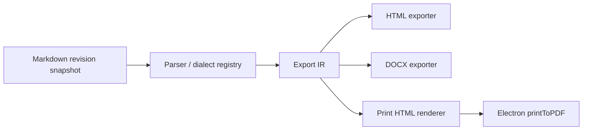
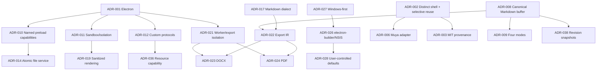
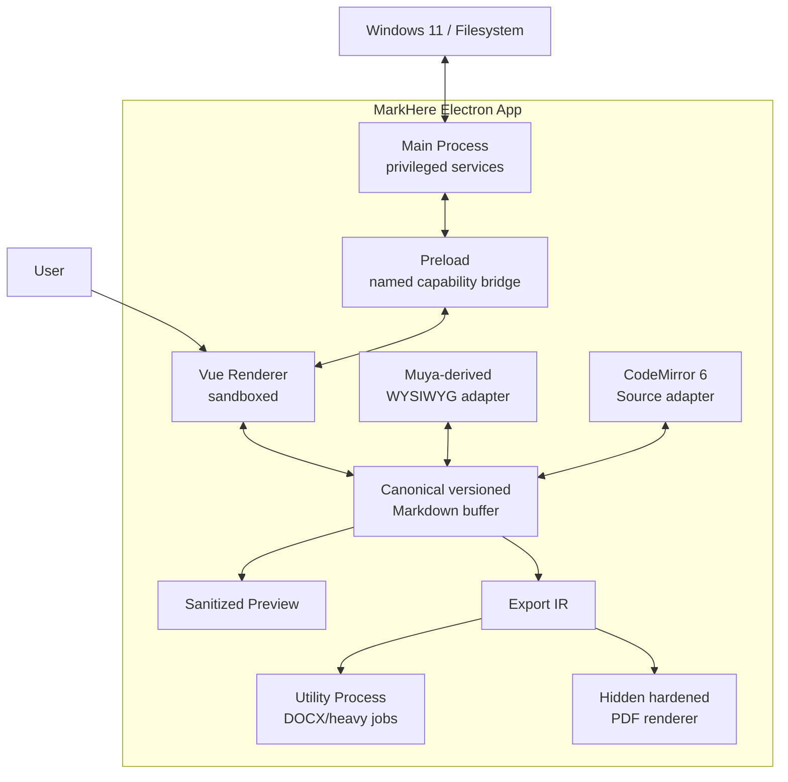

# MarkHere Architecture Decision Record

**Document:** 11-architecture-decision-record.md  
**Product:** MarkHere  
**Status:** Initial ADR compendium for implementation baseline  
**Date:** 2026-09-11

---

## 1. Purpose

This document records the architecture decisions that define MarkHere's first implementation baseline. It is intentionally a **compendium of ADRs** rather than one decision, because the project is being prepared before substantial implementation begins and several choices are tightly coupled: Electron process isolation affects API design; Markdown canonical-state policy affects every editor; exporter isolation affects deployment; Windows default-app rules affect the installer; and selective reuse of MarkText code affects provenance and testing.

An ADR exists to answer four questions later:

1. What did we decide?
2. Why was that decision reasonable with the information available at the time?
3. What alternatives did we reject?
4. Under what conditions should we reconsider it?

The decisions below are not immutable. A superseding ADR must explicitly name the old ADR and explain the changed evidence or constraints.

---

# 2. ADR lifecycle and format

Each ADR uses:

```text
Status      Proposed | Accepted | Superseded | Deprecated
Context     Forces and constraints
Decision    What MarkHere will do
Options     Alternatives considered
Rationale   Why the chosen option fits
Consequences Positive and negative effects
Guardrails  Rules required to keep the decision safe
Revisit     Objective triggers for reconsideration
```

### Status interpretation

- **Accepted** means it is part of the initial implementation contract.
- **Proposed** means implementation may prototype it but should not create broad coupling until validated.
- **Superseded** points to the replacement ADR.
- **Deprecated** means retained for historical understanding but no new work should depend on it.

---

# ADR-001 — Use Electron as the desktop runtime

**Status:** Accepted  
**Decision scope:** Application runtime and OS integration

## Context

MarkHere is a desktop Markdown reader/editor intended first for Windows 11. It needs filesystem access, native dialogs, windowing, file-open activation, clipboard access, local preview, printing/PDF generation, updater support, installer integration, and eventually cross-platform builds. The desired editing experience is web-technology-heavy and MarkText, the reference implementation, already demonstrates that Electron is a workable environment for Muya, Vue, CodeMirror, Mermaid, KaTeX, filesystem watching, export, and desktop packaging.

## Decision

MarkHere will use a current supported Electron release, pinned in the lockfile and upgraded deliberately. The initial baseline is aligned with the current MarkText 0.20-era stack where practical, not because MarkText controls MarkHere, but because compatibility reduces the cost of selectively reusing proven editor code.

The Electron process model is treated as a security architecture, not merely a packaging wrapper.

## Options considered

### A. Electron — chosen

Advantages:

- direct reuse/adaptation of MarkText/Muya web code;
- Chromium rendering consistency;
- mature Windows packaging/update ecosystem;
- `webContents.printToPDF()` path for PDF;
- Vue/TypeScript ecosystem;
- single UI implementation for future macOS/Linux.

Costs:

- comparatively large binary/memory footprint;
- Chromium/Electron update responsibility;
- desktop privilege makes renderer security mistakes high impact.

### B. Tauri

Potentially smaller distribution and tighter Rust/native boundary, but would increase porting cost for MarkText-derived Electron assumptions and require a different plugin/runtime/export architecture.

### C. Native Windows (WinUI/WPF)

Excellent Windows integration but would discard most reusable web editor code and make future cross-platform support expensive.

### D. Browser/PWA

Insufficient for the intended native file association, filesystem, updater, and fully local desktop workflow without compromising UX.

## Consequences

Positive:

- faster path to feature parity;
- one rendering engine for app preview and PDF preparation;
- familiar TypeScript tooling.

Negative:

- release team must follow Chromium/Electron security cadence;
- memory/performance must be measured rather than assumed;
- security hardening is mandatory.

## Guardrails

- `nodeIntegration: false`;
- `contextIsolation: true`;
- renderer sandbox enabled;
- restrictive CSP;
- no arbitrary remote application code;
- named preload capabilities only;
- sender validation on privileged IPC;
- current Electron version policy and fuse review.

## Revisit when

- Electron prevents a required Windows capability;
- resource footprint fails measured product targets despite optimization;
- editor core becomes sufficiently platform-neutral that a smaller shell has clear lifecycle value;
- Electron support/security cadence becomes unsustainable for the project.

---

# ADR-002 — Build a distinct MarkHere application shell; selectively reuse MarkText code

**Status:** Accepted  
**Decision scope:** Relationship to MarkText

## Context

The user wants a new Electron Markdown renderer/editor named MarkHere, built as its own product, while taking advantage of features and code that already exist in MarkText. A literal rename/fork of the whole application would inherit years of assumptions, UI decisions, technical debt, IPC contracts, storage behavior, updater identity, and directory layout. Rewriting every editor primitive would waste mature open-source work.

## Decision

MarkHere will be a **new application repository and architecture**. It may selectively copy, adapt, or package compatible MarkText components—especially Muya/MuyaJS behavior and useful algorithms—under the MIT license, but the MarkHere desktop shell, IPC API, domain model, storage contracts, export service design, security policy, product identity, and installer are designed explicitly for MarkHere.

Imported code receives provenance records.

## Options considered

### A. Rename the MarkText fork

Fastest initial visual result, but produces hidden architectural ownership of MarkHere by upstream internals and makes later divergence harder.

### B. Clean-room everything

Maximum conceptual independence, but unnecessarily reimplements sophisticated Markdown editing behavior already available under a permissive license.

### C. New shell + selective reuse — chosen

Balances independence and leverage.

## Rationale

MarkText's current repository already demonstrates useful separations (`main`, `preload`, `renderer`, shared IPC types, Muya packages), but MarkHere can improve boundaries at inception, notably by not exposing generic IPC to the renderer and by designing exporters as independent services.

## Consequences

- upstream patches cannot always be cherry-picked directly;
- imported Muya changes may require an adapter/rebase process;
- MarkHere owns integration tests for every reused behavior;
- architecture remains understandable without reading all of MarkText.

## Guardrails

- no blind copy of the entire `packages/desktop` tree;
- imported code mapped to upstream commit/path/license;
- adapters isolate upstream-specific APIs;
- MarkHere naming/config/app IDs do not masquerade as MarkText;
- compatibility differences documented.

## Revisit when

- maintenance cost of an independent shell significantly exceeds its architectural benefit;
- a future MarkText package becomes a stable standalone dependency with suitable public APIs.

---

# ADR-003 — Preserve MarkText MIT attribution and provenance for reused code

**Status:** Accepted  
**Decision scope:** Licensing and source provenance

## Context

MarkText is MIT licensed. The license permits use, modification, distribution, sublicensing, and sale, provided the copyright and permission notice are included in copies or substantial portions of the software.

MarkHere's product name does not remove those obligations.

## Decision

When MarkText code is reused, MarkHere will:

- retain the MarkText MIT license text in third-party notices;
- retain applicable copyright notices;
- preserve meaningful source attribution headers/comments where appropriate;
- maintain a provenance manifest that records imported upstream paths and commit/tag;
- generate a distributable third-party notices file;
- separately license original MarkHere code under the project's chosen license.

## Options considered

- remove attribution after renaming — rejected and license-incompatible;
- include only a web link — insufficient as the sole notice mechanism;
- preserve required notices + provenance — chosen.

## Consequences

The About/licenses UI and distribution contain upstream acknowledgements. This is expected and does not mean MarkHere is branded as MarkText.

## Guardrails

CI verifies the notice file is present in release artifacts whenever MarkText-derived modules are included.

## Revisit when

Never while MIT-covered reused code remains distributed; only the exact mechanics may evolve.

---

# ADR-004 — Use a pnpm TypeScript monorepo with explicit package boundaries

**Status:** Accepted  
**Decision scope:** Repository/toolchain organization

## Context

MarkHere contains runtime-specific and runtime-neutral code: Electron main/preload/renderer, document domain types, Markdown compatibility logic, editor adapters, export IR/exporters, and shared schemas. Keeping everything inside a renderer `src/` folder makes security ownership and dependency direction difficult to enforce.

MarkText's current codebase is also a pnpm monorepo, providing compatible dependency/build ergonomics for reused code.

## Decision

Use pnpm workspaces and TypeScript packages. A proposed layout is:

```text
apps/
└── desktop/
    ├── src/main/
    ├── src/preload/
    └── src/renderer/
packages/
├── document-domain/
├── markdown-core/
├── editor-wysiwyg/
├── editor-source/
├── preview-renderer/
├── export-core/
├── exporter-html/
├── exporter-docx/
├── shared-contracts/
└── test-fixtures/
```

Exact package count may be reduced initially, but dependency direction must remain explicit.

## Options considered

- npm/yarn single package;
- pnpm monorepo — chosen;
- Nx/Turborepo from day one — rejected initially as unnecessary orchestration complexity.

## Consequences

Positive: clearer boundaries, isolated tests, reuse of process-neutral code. Negative: more package configuration and workspace discipline.

## Guardrails

- renderer packages cannot depend on Electron main modules;
- domain/export-core packages cannot import Electron;
- preload imports only Electron plus minimal safe/shared code supported by sandbox constraints;
- dependency cycles fail CI.

## Revisit when

Build times/repository scale justify stronger monorepo orchestration.

---

# ADR-005 — Use Vue 3 and Pinia for the desktop renderer shell

**Status:** Accepted  
**Decision scope:** UI framework/state management

## Context

MarkText 0.20-era code uses Vue 3 and Pinia, so keeping that ecosystem lowers friction when reusing UI-independent or editor integration concepts. MarkHere needs reactive tab/workspace/settings/mode state, but the canonical document text must not become implicitly owned by arbitrary UI components.

## Decision

Use Vue 3 for the renderer application shell and Pinia for application/view state. Document content itself is accessed through explicit document-domain/session services so UI stores do not become the persistence architecture.

## Options considered

- React + Zustand/Redux;
- Svelte;
- Vue 3 + Pinia — chosen.

## Consequences

MarkText-derived Vue components may be adapted selectively, but MarkHere avoids a goal of component-level visual cloning. UI can evolve independently.

## Guardrails

- no direct filesystem calls from Vue components;
- no raw IPC from stores;
- stores use typed services/capabilities;
- business transitions are testable outside Vue where practical.

## Revisit when

Only if framework constraints materially impede editor integration or maintainability; framework fashion alone is insufficient reason.

---

# ADR-006 — Reuse/adapt Muya for WYSIWYG behind a MarkHere adapter

**Status:** Accepted  
**Decision scope:** WYSIWYG editing

## Context

A high-quality block-based Markdown WYSIWYG editor is one of the most expensive parts of a MarkText-like application. MarkText's Muya/MuyaJS code already supports substantial Markdown editing behavior and is compatible with the Electron/Vue ecosystem.

Directly allowing Muya state to define the whole application would couple saving, mode switching, export, and recovery to editor internals.

## Decision

Use a forked/adapted Muya-derived engine as the WYSIWYG implementation, accessed only through a MarkHere adapter contract such as:

```ts
interface WysiwygEditorAdapter {
  mount(target: HTMLElement, markdown: string): Promise<void>
  getMarkdown(): Promise<string>
  replaceMarkdown(markdown: string, revision: number): Promise<void>
  flush(): Promise<string>
  focus(): void
  destroy(): Promise<void>
  onChange(listener: (change: EditorChange) => void): Unsubscribe
}
```

The adapter is the ownership boundary. MarkHere domain code does not import Muya internals.

## Options considered

- write WYSIWYG editor from scratch — excessive risk/scope;
- use a generic rich-text editor and translate to Markdown — likely poor syntax fidelity;
- embed Muya deeply throughout renderer — fast but high coupling;
- Muya-derived engine behind adapter — chosen.

## Consequences

- upstream Muya patches require integration work;
- adapter conformance tests become critical;
- MarkHere can eventually replace WYSIWYG engine without rewriting storage/export contracts.

## Guardrails

- always flush pending editor operations before mode switch/save/export snapshot;
- unknown syntax policy is explicit;
- preserve upstream tests where reused;
- parser/serializer normalization differences documented.

## Revisit when

A maintained standalone editor library offers superior Markdown fidelity, performance, accessibility, and migration economics.

---

# ADR-007 — Use CodeMirror 6 for Source mode

**Status:** Accepted  
**Decision scope:** Raw Markdown editing

## Context

MarkText's current desktop dependency list still includes CodeMirror 5, while MarkHere starts a new shell and does not need to preserve that implementation detail. Source mode should be a first-class editor for developers and users working with syntax not safely round-trippable through WYSIWYG.

## Decision

Use CodeMirror 6 for MarkHere's Source editor behind a `SourceEditorAdapter`.

## Options considered

- reuse MarkText's CodeMirror 5 code wholesale;
- plain `<textarea>`;
- Monaco;
- CodeMirror 6 — chosen.

## Rationale

CodeMirror 6 provides a modern modular editor architecture, strong extension model, incremental state, and appropriate footprint for Markdown source editing without adopting a full IDE surface like Monaco.

## Consequences

- MarkText Source-mode implementation is a behavioral reference, not copy-paste code;
- some shortcuts/themes require reimplementation/adaptation;
- one modernization cost is paid early rather than carrying an older editor dependency.

## Guardrails

Source editor must never normalize text merely by viewing it. EOL/encoding transformations occur only through explicit save policy.

## Revisit when

CodeMirror 6 cannot meet measured large-file, accessibility, or IME requirements.

---

# ADR-008 — Canonical open-session document state is versioned Markdown text

**Status:** Accepted  
**Decision scope:** Core document model

## Context

Four views/editors can otherwise create four competing sources of truth. WYSIWYG needs structured state; Source needs exact text; Preview needs rendered DOM; exporters need semantic structure. Treating rendered HTML or editor DOM as canonical creates loss and synchronization ambiguity.

## Decision

The canonical application-level representation of an open document is a versioned Markdown text buffer:

```ts
interface DocumentBuffer {
  markdown: string
  revision: number
  persistedRevision: number
}
```

Structured editor trees, preview DOM, export IR, and syntax trees are **derived representations tagged with the source revision**.

## Options considered

- WYSIWYG DOM canonical;
- AST canonical;
- Markdown text canonical — chosen;
- separate canonical representation per mode — rejected.

## Rationale

Markdown files are the user's durable format. Source mode must expose exactly that text, and unknown syntax is easier to preserve when text remains primary.

## Consequences

- transformations from WYSIWYG may normalize Markdown on actual edits;
- every asynchronous derivation must carry/check revision;
- `persistedRevision` is separate from `revision` to handle save races correctly.

## Guardrails

- preview/export never writes canonical Markdown;
- stale derivations cannot overwrite newer buffer revisions;
- save completion marks only the exact saved revision persisted;
- WYSIWYG flush occurs before canonical snapshot where needed.

## Revisit when

MarkHere evolves into a non-Markdown-native authoring system. That would be a product redefinition, not a routine refactor.

---

# ADR-009 — Provide four first-class document modes

**Status:** Accepted  
**Decision scope:** User interaction model

## Context

MarkHere's originating use case is a Windows user double-clicking a Markdown file and wanting readable content rather than raw Notepad syntax, while also needing editing. MarkText emphasizes WYSIWYG plus Source mode; MarkHere additionally wants a dedicated read-only Preview and classic split Source/Preview workflow.

## Decision

Every compatible Markdown document supports:

1. **Preview** — read-only rendered document;
2. **WYSIWYG** — Muya-derived visual editing;
3. **Source** — exact Markdown editing;
4. **Split** — Source + live Preview.

The active mode is view/session state, not document content.

## Options considered

- WYSIWYG only;
- Source + Preview only;
- WYSIWYG + Source as MarkText-like baseline;
- four modes — chosen.

## Consequences

Mode transitions become a major correctness surface. Split view also introduces asynchronous preview staleness and scroll synchronization concerns.

## Guardrails

- mode transitions flush the outgoing editable surface;
- one canonical buffer;
- preview is never editable;
- Split reuses canonical Source buffer, not a duplicate document;
- all transition pairs have automated tests.

## Revisit when

Usage evidence shows a mode can be simplified without compromising product intent.

---

# ADR-010 — Expose named capabilities through preload; never expose raw IPC

**Status:** Accepted  
**Decision scope:** Electron privilege boundary/API

## Context

Electron recommends context isolation and warns that exposing a generic `ipcRenderer.send` through `contextBridge` allows untrusted renderer code to send arbitrary IPC messages. MarkText's current migration uses typed IPC internally and a sandboxed preload, which is a strong reference, but MarkHere can start with an even narrower public renderer contract.

## Decision

The renderer receives a frozen/narrow object such as:

```ts
window.markhere = {
  app,
  window,
  dialogs,
  files,
  workspace,
  resources,
  settings,
  recovery,
  exports,
  shell,
  clipboard,
  updates,
  events
}
```

Every method corresponds to one user-facing capability. No renderer API exposes:

```text
ipcRenderer
send(channel, ...)
invoke(channel, ...)
require
Node fs/path/process
Electron shell object
```

Internal channel names remain implementation details shared only by main/preload contract code.

## Options considered

- expose Electron objects — rejected;
- expose generic typed IPC wrapper — safer than untyped but still grants channel selection;
- one method per capability — chosen.

## Consequences

More preload boilerplate exists, but privilege review becomes straightforward and renderer tests can mock meaningful APIs.

## Guardrails

- payload validation in main even when TypeScript types exist;
- sender/window validation;
- preload API surface snapshot test;
- no capability added without negative tests.

## Revisit when

Only if Electron introduces a stronger first-class capability RPC model that reduces code without increasing privilege.

---

# ADR-011 — Keep renderer sandboxing, context isolation, and Node isolation enabled

**Status:** Accepted  
**Decision scope:** Electron renderer security

## Context

Markdown is user-controlled input and may contain raw HTML, links, SVG, diagrams, images, and malformed syntax. Even local files can be malicious. The renderer therefore handles untrusted content while the application as a whole possesses filesystem and shell privileges.

## Decision

Application windows use, at minimum:

```ts
webPreferences: {
  nodeIntegration: false,
  contextIsolation: true,
  sandbox: true,
  webSecurity: true,
  preload: /* packaged local preload */
}
```

No application feature may disable these globally merely to simplify a library integration.

## Options considered

- unsandboxed renderer for convenience — rejected;
- sandbox with isolated preload — chosen.

## Consequences

Node-dependent libraries must live in main/utility processes or be replaced with browser-safe versions.

## Guardrails

CI inspects effective BrowserWindow settings and production Electron fuses.

## Revisit when

Only for an isolated window/process with a documented threat model and no untrusted content; never as a general app setting.

---

# ADR-012 — Use custom application/resource protocols instead of broad `file://` rendering

**Status:** Accepted  
**Decision scope:** Application and local-resource loading

## Context

Electron's security guidance recommends avoiding `file://` where possible because it has special privileges. Markdown preview needs local images and other approved resources, but a rendered document should not turn arbitrary paths into filesystem reads.

## Decision

Use custom schemes registered before app readiness:

```text
markhere://app/...
markhere-resource://document/<opaque-resource-id>
```

The resource scheme resolves only through main-process capability checks. Renderer-provided path text is not treated as authorization.

## Options considered

- load renderer and all resources from `file://`;
- temporary local HTTP server;
- custom privileged/standard secure schemes — chosen.

## Consequences

Resource handling is more explicit and testable, but requires URL mapping and MIME handling.

## Guardrails

- no CSP bypass privilege;
- normalize/decode exactly once according to protocol parser contract;
- reject traversal and scope escape;
- bind resource capability to owning document/workspace/webContents;
- revoke on close.

## Revisit when

Electron provides an equally constrained native local-resource mechanism with simpler maintenance.

---

# ADR-013 — Make MarkHere local-first with no required account or cloud service in v1

**Status:** Accepted  
**Decision scope:** Product/data architecture

## Context

The primary use case is local `.md` files on Windows. Cloud accounts introduce authentication, backend infrastructure, conflict resolution across devices, privacy policy, and operational dependencies unrelated to the first problem MarkHere solves.

## Decision

Opening, viewing, editing, saving, recovery, local workspace search, PDF export, HTML export, and DOCX export work without login or network connectivity.

No MarkHere cloud database is required in v1.

## Options considered

- account-first cloud editor;
- optional cloud sync from v1;
- local-first, future adapters — chosen.

## Consequences

Simpler trust model and strong offline behavior. Cross-device sync is deferred.

## Guardrails

Future synchronization must sit behind a storage/sync provider interface and cannot silently replace local filesystem semantics.

## Revisit when

Cross-device collaboration/sync becomes a validated product requirement with dedicated conflict/security design.

---

# ADR-014 — Use explicit filesystem capabilities and atomic save semantics

**Status:** Accepted  
**Decision scope:** File safety

## Context

The renderer should not receive arbitrary filesystem power. Saves can fail midway; files can change outside MarkHere; cloud/network filesystems can delay events; a naive `writeFile(path, markdown)` can produce race conditions or overwrite changes.

## Decision

Main process owns file handles/paths and grants document-scoped capabilities to renderer sessions. Save uses a same-directory temporary file and replace strategy where supported, serialized per target file, with a pre/post fingerprint check.

A `FileFingerprint` uses metadata for fast change detection and SHA-256 content hashing when ambiguity/conflict resolution requires stronger identity.

## Options considered

- renderer `fs` access — rejected;
- direct overwrite — rejected;
- atomic temp/replace + conflict fingerprint — chosen.

## Consequences

Save implementation is more complex but testable under fault injection.

## Guardrails

- never report success before correct revision persistence state is updated;
- never silently overwrite dirty external changes;
- Save As reauthorizes target destination;
- save queue serialized per path;
- failed temp cleanup never deletes the only complete user copy.

## Revisit when

Platform APIs offer stronger transactional file semantics usable cross-platform.

---

# ADR-015 — Treat external file changes as an explicit state machine

**Status:** Accepted  
**Decision scope:** File watcher/conflict behavior

## Context

Markdown files are frequently edited by Git operations, IDEs, generators, sync clients, or other applications. Chokidar/OS events alone cannot tell MarkHere whether a change is its own recent save or an external conflicting edit.

## Decision

Each bound document records its last known/expected disk fingerprint. Watcher events trigger verification.

Policy:

```text
clean buffer + confirmed external change -> reload/update

dirty buffer + confirmed external change -> conflict state

expected self-save fingerprint -> consume as self-write
```

Timing windows are hints, not authority.

## Alternatives

- ignore watcher changes while file open;
- auto-reload always;
- suppress all events for N milliseconds after save;
- fingerprinted state machine — chosen.

## Consequences

Conflict UI is required early, but user edits are protected.

## Revisit when

A platform-provided versioned file API supplies stronger change identity.

---

# ADR-016 — Recovery snapshots are private local state, separate from Save

**Status:** Accepted  
**Decision scope:** Crash recovery

## Context

Users can lose unsaved Markdown through crashes/power loss, but recovery data contains the complete private document and must not be confused with authoritative disk content.

## Decision

MarkHere writes local recovery snapshots for dirty buffers according to a debounce/interval policy. Snapshots live under MarkHere's user-data/recovery area, are versioned, and are never uploaded by default.

Restoring recovery reconstructs an in-memory unsaved/dirty session first; it does not blindly overwrite disk.

## Alternatives

- no recovery;
- autosave directly to user file after every edit;
- local recovery snapshots separate from Save — chosen.

## Consequences

Disk usage/retention and secure diagnostics exclusion are required.

## Guardrails

- recovery excluded from normal logs/diagnostic bundles;
- stale recovery compared against current file fingerprint;
- schema migrations conservative;
- retention cleanup never deletes user files.

## Revisit when

Recovery can be made stronger through OS transactional/session facilities without changing privacy expectations.

---

# ADR-017 — Keep Markdown dialect explicit: CommonMark + GFM + registered extensions

**Status:** Accepted  
**Decision scope:** Markdown language definition

## Context

"Markdown" is not one universal grammar. MarkText supports CommonMark, GitHub Flavored Markdown, and selected extensions such as math, front matter, emoji, and diagrams. MarkHere needs compatibility but must know exactly what behavior it promises.

## Decision

The baseline dialect is:

```text
CommonMark 0.31.2
+ GitHub Flavored Markdown extensions
+ explicit MarkHere extension registry
```

Initial extension candidates:

- front matter;
- KaTeX math;
- Mermaid diagrams;
- emoji if retained from MarkText compatibility.

Every extension has parsing, preview, editability, serialization, and export capability declarations.

## Options considered

- "whatever the parser supports" — rejected;
- Pandoc Markdown as universal baseline — too broad for v1;
- explicit standard + extension registry — chosen.

## Consequences

Compatibility can be tested precisely. Some MarkText/Pandoc behaviors may initially be source-only or unsupported.

## Guardrails

Pin spec/parser versions. Dialect changes require changelog and compatibility tests.

## Revisit when

A new CommonMark/GFM release or validated feature demand justifies an explicit migration.

---

# ADR-018 — Preserve unknown syntax rather than silently normalize/delete it

**Status:** Accepted  
**Decision scope:** Markdown fidelity

## Context

Users may open Markdown containing directives, custom fences, footnotes, MDX-like syntax, application-specific front matter, or future extensions. A WYSIWYG parser that does not understand a construct can accidentally delete it when serializing the document.

## Decision

Unknown syntax follows one of four declared policies:

```ts
type UnknownSyntaxPolicy =
  | 'preserve-opaque'
  | 'source-only'
  | 'render-as-text'
  | 'explicitly-unsupported'
```

If WYSIWYG cannot safely preserve a construct, MarkHere prefers Source mode/fallback/warning over silent loss.

Merely opening or previewing a file never rewrites it.

## Options considered

- normalize entire document through known AST on open — rejected;
- silently drop unsupported nodes — rejected;
- preserve/fallback — chosen.

## Consequences

WYSIWYG may be unavailable or partially restricted for some files, which is preferable to corruption.

## Guardrails

Unknown-syntax fixture corpus and golden source diffs are release tests.

## Revisit when

The parser/editor can prove lossless opaque-node support for broader syntax.

---

# ADR-019 — Sanitize raw HTML and use strict diagram rendering

**Status:** Accepted  
**Decision scope:** Untrusted Markdown rendering

## Context

CommonMark permits raw HTML. Markdown can also include links, images, SVG, and Mermaid text. Rendering user-provided HTML directly with Vue `v-html` or equivalent can create script/event-handler/navigation attack surfaces inside a privileged desktop application.

Mermaid provides security levels; its strict mode encodes HTML in text and disables click functionality by default.

## Decision

- raw HTML passes through a centrally configured DOMPurify policy before insertion;
- URL attributes pass through MarkHere's scheme policy;
- Mermaid is initialized with `securityLevel: 'strict'` unless a future ADR provides equivalent isolation;
- SVG is treated as active/untrusted content and sanitized/isolated according to the resource policy;
- no event-handler attributes or script elements survive preview sanitization;
- exported HTML has a separate but equally explicit sanitization policy.

## Options considered

- disable raw HTML completely;
- render raw HTML unsanitized for perfect compatibility;
- sanitize with centrally tested policy — chosen.

## Consequences

Some raw HTML loses unsafe capabilities compared with a web browser/GitHub input, intentionally.

## Guardrails

Security regression fixtures and sanitizer dependency updates receive targeted review.

## Revisit when

Rendering is moved into a stronger isolated unprivileged process with a documented safe compatibility mode.

---

# ADR-020 — External navigation is an explicit main-process policy decision

**Status:** Accepted  
**Decision scope:** Link and shell behavior

## Context

Electron warns against invoking `shell.openExternal` on untrusted content without validation. Markdown links are untrusted by definition.

## Decision

Renderer sends a semantic request such as:

```ts
shell.openExternal({ url, source: 'markdown-link' })
```

Main validates the parsed URL and permits only configured schemes such as `https:` and optionally `mailto:` after policy checks. Local-document links are handled by MarkHere's file/navigation service, not shell execution.

Dangerous or unknown schemes are rejected.

## Options considered

- browser default navigation;
- raw `shell.openExternal(url)` exposed to renderer;
- central allowlist/prompt policy — chosen.

## Consequences

Some niche schemes require explicit future support.

## Guardrails

Never build a shell command string from the URL. Test case/percent-encoding/schema confusion attacks.

## Revisit when

User-configurable protocol handlers become a validated requirement, with security design.

---

# ADR-021 — Isolate heavy/crash-prone work from the interactive renderer

**Status:** Accepted  
**Decision scope:** Performance and fault isolation

## Context

Markdown export, large transformations, indexing/search, image conversion, and DOCX generation can perform CPU/IO-heavy work. Running them on the renderer can freeze typing and create large memory spikes. Electron provides `utilityProcess` for child processes with Node.js integration and MessagePort communication.

PDF generation is a special case because Electron's `webContents.printToPDF()` is naturally tied to a webContents/BrowserWindow rendering context.

## Decision

- DOCX and heavy process-neutral conversion work run in a utility process when workload justifies isolation;
- large search/index operations may use utility process or native child strategy;
- PDF rendering uses a hardened hidden BrowserWindow/webContents owned by main, fed only a trusted locally generated export document;
- interactive editor renderer never performs long blocking export work.

## Options considered

- all export in renderer — rejected;
- Node worker_threads in renderer — still couples to renderer lifecycle;
- utility processes + dedicated PDF renderer — chosen.

## Consequences

Job messaging/cancellation and process cleanup become architecture concerns.

## Guardrails

- exact document revision snapshot sent at job creation;
- utility process receives minimum inputs;
- malformed worker response validated;
- cancellation/timeout supported;
- temporary artifacts scoped and cleaned;
- hidden PDF renderer uses the same security hardening principles and no remote content.

## Revisit when

Benchmarks show a particular exporter is trivial enough to remain in main without responsiveness risk, or Electron provides a better isolated print service.

---

# ADR-022 — Use a shared export intermediate representation (IR)

**Status:** Accepted  
**Decision scope:** Export architecture

## Context

HTML, PDF, and DOCX can easily drift if each exporter reparses Markdown independently and implements its own extension semantics. WYSIWYG DOM should not be the export source because export must work in Source mode and should produce deterministic results from a revision snapshot.

## Decision

A versioned Markdown snapshot is parsed into an export-neutral document IR containing semantic blocks/inlines plus resolved resource references. Exporters map that IR to their target format.



## Options considered

- exporter-specific parsing;
- export current WYSIWYG DOM;
- shared IR — chosen.

## Consequences

IR design is additional code, but provides format consistency and testability.

## Guardrails

- IR schema versioned internally;
- unsupported target feature produces explicit fallback/warning;
- exporters do not mutate canonical document state;
- IR generated from exact revision snapshot.

## Revisit when

A proven external unified document AST can replace MarkHere's IR without weakening compatibility.

---

# ADR-023 — Generate DOCX natively with a JavaScript/TypeScript DOCX library

**Status:** Accepted for v1  
**Decision scope:** Microsoft Word export

## Context

MarkText currently advertises HTML and PDF export, while MarkHere requires Word `.docx` export. Requiring Microsoft Word, LibreOffice, or Pandoc as an external executable complicates installation, security, portability, and error handling.

The `docx` JavaScript/TypeScript library can generate OOXML documents and supports paragraphs, text runs, tables, images, headers/footers, styles, and packaging in Node/browser environments.

## Decision

Use the maintained `docx` library as the initial DOCX generation backend, wrapped behind `DocxExporter` so it can be replaced later.

Semantic mappings should use native Word structures rather than screenshots where practical:

- headings → heading paragraph styles;
- lists → numbering;
- tables → Word tables;
- links → hyperlinks/relationships;
- images → embedded media;
- code → styled paragraphs/runs;
- Mermaid/math → rendered image fallback initially when no safe native equivalent is implemented.

## Options considered

### Pandoc subprocess

Powerful conversion quality but creates a large external runtime/dependency and command-execution surface.

### LibreOffice/Word automation

Not acceptable as a required dependency and creates headless automation/version complexity.

### Build OOXML manually

Maximum control but unnecessarily reinvents packaging/relationships/styles.

### `docx` library behind adapter — chosen

Appropriate initial balance.

## Consequences

Not every Markdown/Word semantic has a one-to-one mapping. Export contract must document approximations. Microsoft Word interoperability testing is mandatory.

## Guardrails

- dependency pinned/reviewed;
- generated OOXML structurally tested;
- no arbitrary XML injection from user content;
- exporter runs outside interactive renderer;
- fallback behavior is explicit.

## Revisit when

Advanced academic publishing requirements demand higher-fidelity native equations, references, footnotes, captions, or template inheritance beyond the library's economical support.

---

# ADR-024 — Build PDF through a hardened print-rendering surface

**Status:** Accepted  
**Decision scope:** PDF export

## Context

Electron provides Chromium-quality print/PDF rendering. Reusing browser layout keeps CSS, fonts, math, diagrams, and document preview closer to exported output. A normal interactive BrowserWindow should not be repurposed during export because it could freeze/change user state.

## Decision

Generate sanitized/export-specific HTML from the export IR, load it into a hidden hardened print window/webContents, wait for local resources/fonts/diagrams, then call Electron PDF printing API with validated page options.

## Alternatives

- pure PDF drawing library — high layout reimplementation cost;
- print current visible editor DOM — nondeterministic/user-state dependent;
- headless external browser — duplicate Chromium runtime;
- hidden hardened Electron print surface — chosen.

## Consequences

PDF export retains a BrowserWindow lifecycle and must guard against hangs/timeouts.

## Guardrails

- no remote application code;
- no raw user scripts;
- revision snapshot immutable;
- exporter has timeout/cancellation;
- print window destroyed after job;
- output written atomically where possible.

## Revisit when

A dedicated document-layout engine is required for publishing features Chromium cannot provide reliably.

---

# ADR-025 — Keep exports as files; do not make DOCX/PDF editable document formats

**Status:** Accepted  
**Decision scope:** Product scope/data ownership

## Context

MarkHere is Markdown-native. Importing/editing DOCX or PDF would require reverse conversion, proprietary/complex layout semantics, and a second document model.

## Decision

In v1:

- Markdown/text-compatible files are editable;
- HTML/PDF/DOCX are export targets;
- exported artifacts do not become the canonical session state;
- reopening a DOCX/PDF for editing is out of scope.

## Consequences

Keeps architecture centered on Markdown and avoids pretending to be Microsoft Word.

## Revisit when

Import is separately justified as a product feature with explicit fidelity expectations.

---

# ADR-026 — Use electron-builder + NSIS for initial Windows packaging

**Status:** Accepted  
**Decision scope:** Build/package distribution

## Context

Electron officially recommends Forge as integrated tooling, but electron-builder is a mature third-party packaging option and MarkText currently uses it for NSIS/ZIP builds, file associations, updater metadata, and Windows x64/ARM64 artifacts. Selective configuration reuse lowers release engineering risk.

## Decision

Use electron-builder for the initial MarkHere desktop packaging and NSIS for installed Windows builds. Also publish a ZIP/portable-style artifact where its reduced integration behavior is clearly documented.

## Options considered

- Electron Forge;
- electron-builder — chosen;
- custom NSIS scripts from scratch;
- MSIX first.

## Consequences

MarkHere depends on third-party builder conventions and must test upgrades/associations itself. The choice is not permanent.

## Guardrails

- pin builder version;
- package contents inspected;
- production signing integrated;
- no assumption that builder's association defaults meet current Windows policy;
- release artifact behavior tested on clean Windows.

## Revisit when

MSIX/Store becomes a primary channel, electron-builder maintenance degrades, or Forge provides materially simpler secure Windows lifecycle management.

---

# ADR-027 — Windows 11 x64 is the first release-blocking platform

**Status:** Accepted  
**Decision scope:** Platform rollout

## Context

The originating problem exists on Windows 11 and the first product value is replacing Notepad-like raw display for Markdown. Trying to certify Windows, macOS, and multiple Linux distributions simultaneously would dilute quality work in file handling, installer integration, and export.

## Decision

First stable release is gated on Windows 11 x64. The code remains cross-platform by design. Windows ARM64 follows when native test coverage and dependencies are verified. macOS/Linux are subsequent platform projects.

## Consequences

Cross-platform build code may exist before official support, but unsupported artifacts are not labeled stable.

## Guardrails

No Windows registry/path API leaks into document-domain/editor/export-core packages.

## Revisit when

A strong contributor/testing environment makes another platform inexpensive to certify earlier.

---

# ADR-028 — Register as a Markdown handler but never silently force Windows defaults

**Status:** Accepted  
**Decision scope:** Windows shell/default-app integration

## Context

Windows 11 protects user default-app choices. Applications should register their capability and let users choose through supported Windows UI. MarkText's current custom NSIS script can ask to associate extensions and writes class/extension registry values, but MarkHere should not depend on forcibly replacing user defaults or protected `UserChoice` state.

## Decision

Installer registers MarkHere as a handler for selected Markdown extensions and presents clear onboarding. If the user wants MarkHere to become default, the app opens the appropriate Windows Default Apps settings flow (`ms-settings:defaultapps` / supported platform mechanism) and explains the choice.

No code edits protected default selection to steal associations.

## Options considered

- force `.md` default in installer — rejected;
- no file registration — poor UX;
- register handler + user-controlled default — chosen.

## Consequences

One additional Windows user action may be needed to make MarkHere default, but behavior respects current OS policy and user control.

## Guardrails

Clean-VM tests verify Open With/default app behavior. Association/uninstall logic must not delete unrelated user/application registrations.

## Revisit when

Microsoft changes the supported Windows defaults platform.

---

# ADR-029 — Sign production installers and updates; treat update metadata as privileged

**Status:** Accepted  
**Decision scope:** Release trust

## Context

A desktop updater replaces executable code. If renderer input can redirect update endpoints or unsigned artifacts are accepted, an otherwise strong sandbox is irrelevant.

## Decision

Stable publicly distributed Windows builds are code signed. Update feed/configuration is packaged/trusted main-process configuration and cannot be modified by Markdown/renderer content. Release pipeline verifies signatures/checksums according to updater mechanism before installation.

## Consequences

Signing certificate/secrets and CI release permissions require operational management and cost.

## Guardrails

- signing key unavailable to untrusted PR jobs;
- protected release workflow;
- release produced from tagged reviewed commit;
- updater staging tests;
- channel separation;
- no renderer-specified package URL.

## Revisit when

Distribution channel (e.g. Microsoft Store/MSIX) changes trust mechanism; equivalent signing remains mandatory.

---

# ADR-030 — Apply production Electron fuses after compatibility verification

**Status:** Accepted  
**Decision scope:** Runtime hardening

## Context

Electron fuses can disable runtime behaviors that production MarkHere does not need, reducing abuse surface. Some fuse combinations affect packaging/ASAR expectations and therefore must be tested against actual packaged builds.

## Decision

Production builds will evaluate and normally enable a restrictive fuse set, including disabling RunAsNode, NODE_OPTIONS, and CLI inspection, and enabling ASAR integrity/only-load-from-ASAR where compatible with the final packaging layout.

Exact fuse manifest is checked into build configuration and verified in CI.

## Consequences

Debugging production binaries becomes intentionally less flexible. Development builds remain developer-friendly.

## Guardrails

No fuse is enabled blindly. Packaged smoke tests run after fuse changes.

## Revisit when

Electron adds/removes fuse controls or packaging architecture changes.

---

# ADR-031 — Do not implement a plugin execution API in v1

**Status:** Accepted  
**Decision scope:** Extensibility/security scope

## Context

Plugins can be valuable for Markdown extensions and export workflows, but an Electron plugin system immediately raises code-signing, permission, sandbox, API stability, dependency, update, and malicious-extension questions.

MarkHere's first job is safe local Markdown editing and export.

## Decision

No third-party executable plugin API in v1.

Internal features use normal package/module boundaries. Themes/custom CSS, if provided, are not equivalent to arbitrary JavaScript plugins and receive their own security restrictions.

## Consequences

Users cannot install community JavaScript extensions initially. Architecture avoids freezing an unsafe extension API prematurely.

## Revisit when

Core APIs stabilize and plugin demand justifies a separately designed permission/sandbox/signing model.

---

# ADR-032 — No telemetry or automatic crash/document upload by default

**Status:** Accepted  
**Decision scope:** Privacy/observability

## Context

Markdown files can contain proprietary source documentation, credentials accidentally pasted into notes, personal writing, or other sensitive information. A local-first editor does not need user-content telemetry to function.

## Decision

MarkHere collects no document-content telemetry and performs no automatic crash dump/log upload by default. Operational logs remain local. A diagnostics bundle is generated only by explicit user action and excludes documents/recovery content unless a future dedicated consent flow says otherwise.

## Options considered

- always-on analytics;
- anonymous usage analytics enabled by default;
- local-only diagnostics — chosen.

## Consequences

Product usage metrics are limited. Debugging relies on reproducible issues and user-provided opt-in diagnostics.

## Guardrails

Logs redact paths/content; networking tests catch unintended calls.

## Revisit when

The project proposes opt-in telemetry with a specific privacy design and demonstrable value; default behavior changes would require explicit user-facing policy decision.

---

# ADR-033 — Use structured, content-free local logging with correlation IDs

**Status:** Accepted  
**Decision scope:** Diagnostics

## Context

Multi-process Electron failures are difficult to debug without logs, especially export jobs and IPC operations. Logging raw Markdown, clipboard data, or absolute paths creates privacy risk.

## Decision

Use structured local logs with:

- timestamp;
- level;
- process/subsystem;
- event code;
- correlation/job/session ID;
- duration/size categories where useful;
- sanitized error code;
- redacted/hashed path identifiers when path correlation is needed.

Document text and recovery snapshots are never normal log fields.

## Consequences

Some bugs require user-provided reproduction rather than reading exact content from logs.

## Guardrails

Central logging facade and redaction tests; direct `console.log(document)` prohibited in production code review/linting where enforceable.

## Revisit when

Never for raw-content logging by default; diagnostic verbosity mechanisms may evolve.

---

# ADR-034 — Store application settings in app-specific userData; separate caches and recovery by concern

**Status:** Accepted  
**Decision scope:** Local application storage

## Context

Electron exposes app-specific paths such as `userData`, logs, crash dumps, and session data. Mixing settings, recovery, export temp files, and Chromium cache complicates backup, cleanup, migration, and diagnostics.

## Decision

Use distinct logical stores beneath app-specific storage:

```text
userData/
├── settings/
├── state/
├── recovery/
├── recent/
└── migrations/
cache/sessionData/
logs/
temp/ or OS temp for ephemeral export jobs
```

Large Chromium cache/session data is not intentionally placed in settings backup data.

## Consequences

Migration/cleanup routines must know multiple paths but privacy/retention is clearer.

## Guardrails

Never place user-authored Markdown in userData merely because it is open; only recovery copies and app state belong there.

## Revisit when

Platform-specific conventions or store sandboxing require different physical locations.

---

# ADR-035 — Do not introduce a proprietary `.markhere` project database for normal folders

**Status:** Accepted  
**Decision scope:** Workspace model

## Context

MarkHere should open existing Markdown repositories/folders without converting them into an application-specific workspace. A hidden project database risks lock-in and noisy Git changes.

## Decision

A normal folder is a workspace as-is. MarkHere may keep app-local metadata (recent folders, UI layout, search caches) in `userData`, keyed by a privacy-conscious workspace identifier. It does not require writing `.markhere/` into the user's folder.

If project-specific configuration is later added, it must be optional and human-readable.

## Consequences

Portable per-project settings are deferred, but opening a repo remains zero-touch.

## Revisit when

Users explicitly need shareable project configuration or plugins, with a clear schema and opt-in creation flow.

---

# ADR-036 — Use workspace/document-scoped resource capabilities for local images

**Status:** Accepted  
**Decision scope:** Local resource authorization

## Context

Markdown routinely references `./images/foo.png`. Preview needs access to those images, but translating arbitrary renderer strings into filesystem reads would bypass sandboxing.

## Decision

When a document/workspace is opened, main creates a capability scope identifying permitted resource roots. Renderer requests a logical resource; main resolves canonical path, verifies containment/type/size policy, and serves it through `markhere-resource://` using opaque identifiers or equivalent non-authoritative path mapping.

## Consequences

Images outside the document/workspace may require explicit user authorization and some existing Markdown may display a blocked-resource indicator instead of silently reading elsewhere.

## Guardrails

- canonicalize before authorization;
- handle symlinks/junctions according to policy;
- capability bound to authorized webContents/document;
- path not inferred from URL text alone;
- revoke when document/workspace closes.

## Revisit when

A future sandboxed renderer filesystem API provides equally narrow, revocable handles suitable for desktop Electron.

---

# ADR-037 — Treat settings schemas and stored state as versioned data

**Status:** Accepted  
**Decision scope:** Upgrade compatibility

## Context

Desktop users keep applications installed across versions. Renaming settings keys or changing stored session structure without migrations can break launch or silently reset preferences.

## Decision

Persistent MarkHere state has schema versions and forward migrations. Migrations are deterministic, idempotent where practical, backed up before destructive changes, and tested from supported prior versions.

Unknown future fields are preserved where safe or ignored without crashing.

## Consequences

Schema maintenance becomes part of release engineering.

## Guardrails

Never perform migration by importing arbitrary executable code from user data. Recovery schema is treated more conservatively than cosmetic UI state.

## Revisit when

Storage layer itself is replaced; migration responsibility remains.

---

# ADR-038 — Use deterministic revision snapshots for all long-running operations

**Status:** Accepted  
**Decision scope:** Concurrency

## Context

Users can continue typing while preview rendering, export, search, save, or background analysis is underway. A background task reading live mutable DOM/state can combine different revisions.

## Decision

Long-running operations take explicit immutable input snapshots with:

```ts
interface RevisionSnapshot {
  documentId: string
  revision: number
  markdown: string
}
```

Results include source revision. A result affecting visible derived state is applied only if it is still relevant; export results remain valid as historical snapshot artifacts and display the exported revision/job metadata internally.

## Consequences

Memory temporarily duplicates Markdown for jobs, but behavior becomes deterministic.

## Guardrails

Large-file jobs may pass data via efficient transfer/temp mechanisms when needed, but semantic immutability remains.

## Revisit when

A persistent immutable rope/document structure can provide cheaper snapshots without changing semantics.

---

# ADR-039 — Use asynchronous APIs by default; permit synchronous IPC only for proven startup-critical cases

**Status:** Accepted  
**Decision scope:** IPC/performance

## Context

Synchronous renderer-main IPC blocks the renderer and can amplify deadlock/performance problems. MarkText's current preload still has a small synchronous startup handshake/path equivalence path for compatibility. MarkHere starts fresh and can avoid most of that legacy need.

## Decision

Renderer-facing MarkHere APIs are asynchronous by default. Startup information is passed through window boot payload/preload bootstrap data when possible rather than ad hoc sync calls. Synchronous IPC requires a dedicated ADR or documented exception with benchmark and deadlock analysis.

## Consequences

UI code must correctly model asynchronous operations, but responsiveness and architecture are cleaner.

## Guardrails

No generic `sendSync` bridge exists.

## Revisit when

A specific operation cannot meet UX correctness asynchronously and measured evidence supports a narrow exception.

---

# ADR-040 — Use cancellation and bounded work for rendering/search/export

**Status:** Accepted  
**Decision scope:** Resource control

## Context

A malformed or enormous Markdown file can create expensive parsing, diagram rendering, regex/search, image decoding, or export work. Even without a security exploit this can cause denial of service.

## Decision

Long jobs are cancellable when technically possible and have explicit size/time/resource policies. Newer revisions cancel or supersede obsolete preview jobs. Export jobs expose progress where meaningful and have bounded failure behavior.

For extreme files, MarkHere may fall back to Source-first mode rather than truncating the document or freezing indefinitely.

## Consequences

Some features degrade on extreme input, but source data remains accessible.

## Guardrails

Never silently truncate source content to meet UI performance. Degradation mode is visible to user.

## Revisit when

Editor/parser architecture supports incremental virtualization sufficient to raise limits.

---

# ADR-041 — Test release artifacts, not only source builds

**Status:** Accepted  
**Decision scope:** Quality/release

## Context

Electron behavior can change after packaging due to ASAR, fuses, native modules, protocol paths, signing, installer registry, updater metadata, or resource inclusion. A development E2E pass does not prove the installed product works.

## Decision

Stable release gates include tests against the packaged/signed Windows candidate: clean install, launch, file handler, save, export, recovery smoke, signature/fuse inspection, upgrade, and update staging.

## Consequences

CI/release is slower and needs Windows VM infrastructure.

## Guardrails

Stable artifact must be the same bytes qualified by release gate or be requalified after any rebuild.

## Revisit when

Never remove packaged testing; exact automation infrastructure may change.

---

# ADR-042 — Use Playwright Electron for automated desktop E2E, with system tests as complementary evidence

**Status:** Accepted  
**Decision scope:** End-to-end automation

## Context

Playwright documents experimental Electron automation support that can launch Electron, interact with windows, and evaluate main-process state. It is valuable for repeatable UI tests but should not be treated as proof of Windows installer/default-app behavior.

## Decision

Use Playwright's Electron API for development/nightly app E2E. Pair it with packaged Windows VM/system tests for installer, file association, update, native dialogs, architecture, and signing scenarios.

## Alternatives

- Spectron — obsolete;
- only renderer browser tests — insufficient;
- only manual QA — too slow/inconsistent;
- Playwright + OS-level release tests — chosen.

## Consequences

Some Playwright API churn may require maintenance because Electron support is experimental.

## Guardrails

E2E selectors use accessibility/test IDs and events, not sleeps/pixel coordinates.

## Revisit when

Playwright Electron support is removed or a more stable first-class Electron test harness becomes available.

---

# ADR-043 — Security and data-loss regressions are release blockers

**Status:** Accepted  
**Decision scope:** Quality priority

## Context

A Markdown editor may appear usable despite rare save races or renderer privilege leaks. Those classes of defects can cause disproportionate harm.

## Decision

Known reproducible silent data loss, silent dirty-file overwrite, capability escape, raw privileged IPC exposure, untrusted shell execution, or tampered update acceptance blocks stable release regardless of schedule.

## Consequences

Release may be delayed for low-frequency but severe defects.

## Guardrails

`10-testing-strategy.md` defines concrete release blockers and regression requirements.

## Revisit when

Severity definitions may be refined, but silent data loss and privilege escape remain blockers.

---

# ADR-044 — MarkHere uses no database in v1 core

**Status:** Accepted  
**Decision scope:** Persistence technology

## Context

Core persistent data consists of user Markdown files, small settings, window/session metadata, recent items, recovery snapshots, and optional search cache. Introducing SQLite or another database solely because the app has state adds schema/concurrency/native-module complexity.

## Decision

Use files/key-value JSON-like app storage with atomic writes for v1 application state; user documents remain normal files. Search is performed using filesystem traversal/ripgrep-like mechanisms and ephemeral indexes as needed.

## Options considered

- SQLite for all state;
- embedded document DB;
- small versioned stores/files — chosen.

## Consequences

Complex querying is limited but unnecessary for initial feature set.

## Guardrails

Storage writes are atomic and schema-versioned. If an index/cache is corrupt it must be rebuildable from user files.

## Revisit when

A future feature requires durable relational indexing at a scale where files/key-value storage is measurably inadequate.

---

# ADR-045 — Separate application state, document state, and derived state

**Status:** Accepted  
**Decision scope:** State ownership

## Context

Desktop editors commonly accumulate hidden coupling when settings, tabs, file contents, preview DOM, and recovery all live in one global store.

## Decision

State classes are separated:

```text
Application state
  settings, window layout, update state, recent files

Document authoritative state
  Markdown buffer, revision, binding, dirty/conflict status

Editor/view state
  selection, scroll, active mode, split ratio

Derived state
  preview DOM/model, TOC, search results, export IR

Durable recovery state
  selected snapshot of dirty document/session metadata
```

No derived state becomes authority for saving unless explicitly converted through the document service.

## Consequences

More interfaces exist, but save/recovery bugs become easier to reason about.

## Revisit when

Never collapse these categories casually; implementation objects may be refactored while ownership semantics remain.

---

# ADR-046 — Keep a single security-reviewed URL policy

**Status:** Accepted  
**Decision scope:** URL handling

## Context

URLs appear in Markdown links, images, HTML attributes, Mermaid labels, updater endpoints, export HTML, clipboard transformations, and resource protocols. Independent ad hoc regular expressions will disagree and create bypasses.

## Decision

Create a central URL policy library that parses URLs with standard URL APIs and classifies intent:

```ts
type UrlIntent =
  | 'external-navigation'
  | 'remote-image'
  | 'local-document-link'
  | 'local-resource'
  | 'application-route'
```

Each intent has explicit allowed schemes and behavior. Security-sensitive callers cannot bypass the parser by checking strings themselves.

## Consequences

New scheme support requires central policy change and tests.

## Guardrails

Canonical parsing, Unicode/percent-encoding fuzz tests, no command-string concatenation.

## Revisit when

Policy implementation may evolve; central ownership remains.

---

# ADR-047 — Do not automatically fetch arbitrary remote resources in privacy-sensitive rendering

**Status:** Accepted with product-setting detail to validate  
**Decision scope:** Network/privacy

## Context

A Markdown image such as `https://tracker.example/pixel?...` can reveal that a document was opened, including user IP/time. Conversely, blocking all remote images reduces compatibility with README files.

## Decision

MarkHere distinguishes remote resources from local resources. The initial safe default is to **avoid uncontrolled remote active content** and make remote-image behavior explicit in settings/UI. If remote images are enabled, only HTTPS is allowed by default, fetch/render occurs without Node privileges, redirects/content types/size are constrained, and no cookies/app credentials are attached unless explicitly designed.

This ADR intentionally leaves final UX (block-by-default vs prompt vs privacy mode) as a pre-release usability/security decision while fixing the technical rule that renderer HTML never receives unrestricted network privilege.

## Options considered

- always load all remote resources;
- never load remote images;
- controlled policy with safe default and user choice — chosen.

## Consequences

Some web-authored Markdown may show placeholders until remote images are permitted.

## Revisit when

Privacy UX research and telemetry-free user feedback justify refining the default.

---

# ADR-048 — Keep Windows shell integration out of document core

**Status:** Accepted  
**Decision scope:** Platform abstraction

## Context

Windows 11 is first target, but editor/export/document logic should remain portable. Registry and `ms-settings:` calls embedded into domain code would make future macOS/Linux ports harder and tests less isolated.

## Decision

Windows-specific behavior is isolated behind desktop platform services:

```ts
interface PlatformIntegration {
  revealInFileManager(path: string): Promise<void>
  openDefaultAppsSettings?(): Promise<void>
  getPlatformCapabilities(): PlatformCapabilities
}
```

Installer-specific registration stays in build/installer code.

## Consequences

Slight abstraction overhead, easier future platform expansion.

## Revisit when

Never move platform-specific operations into process-neutral packages without a superseding architecture decision.

---

# ADR-049 — Avoid proprietary cloud-based AI features in core architecture

**Status:** Accepted for v1  
**Decision scope:** Product scope/security

## Context

AI writing/rewriting is unrelated to the core local Markdown problem and would require document transmission, provider credentials, cost, privacy controls, prompt injection considerations, and network dependency.

## Decision

No AI service is part of MarkHere v1 core. Architecture does not reserve renderer privileges or network exceptions for AI.

## Consequences

Smaller product scope and clearer privacy story.

## Revisit when

AI becomes an explicit separately consented requirement with provider/privacy/security ADRs.

---

# ADR-050 — Prefer explicit compatibility manifests over claiming blanket MarkText parity

**Status:** Accepted  
**Decision scope:** Product compatibility

## Context

MarkHere reuses MarkText ideas/code but will intentionally differ in Source editor, Preview/Split modes, security boundaries, Windows default behavior, and exporters. Claiming "100% MarkText compatible" would be difficult to test and could create inaccurate expectations.

## Decision

Maintain a capability compatibility matrix in `02-requirements-and-scope.md` and machine-testable fixtures. Features are labeled:

```text
Equivalent
Adapted
Improved
Deferred
Not supported
```

MarkText is a reference implementation/upstream source for selected components, not MarkHere's normative specification.

## Consequences

Documentation has more nuance but architecture remains honest.

## Revisit when

A future release deliberately targets a specific externally defined compatibility standard.

---

# 51. Decision dependency map



---

# 52. Decisions intentionally deferred

The following topics should receive new ADRs when their requirement becomes concrete rather than being accidentally decided through implementation:

- exact remote-image default UX;
- custom CSS/theme sandbox model;
- native spellchecker vs dictionary packaging strategy;
- image uploader integrations;
- optional Pandoc interoperability;
- plugin/extensibility architecture;
- cloud synchronization;
- Git-aware conflict UI;
- project-local settings format;
- macOS notarization/distribution;
- Linux packaging matrix;
- Windows Store/MSIX distribution;
- native Word equation (OMML) generation;
- DOCX template/reference-document inheritance;
- large-document virtualization thresholds;
- optional encrypted recovery/settings beyond OS protections;
- opt-in telemetry, if ever proposed.

A developer should not introduce one of these as a side effect of a feature PR without recording the architecture decision.

---

# 53. ADR review checklist

Before accepting a new/superseding ADR:

- [ ] problem is stated without assuming the chosen technology;
- [ ] affected requirements are linked;
- [ ] security/privacy impact considered;
- [ ] data migration impact considered;
- [ ] Windows/platform impact considered;
- [ ] offline behavior considered;
- [ ] failure behavior considered;
- [ ] at least credible alternatives documented;
- [ ] consequences include costs, not just benefits;
- [ ] test strategy changes identified;
- [ ] licensing/provenance impact considered for third-party/upstream code;
- [ ] objective revisit triggers documented;
- [ ] superseded ADRs linked rather than erased.

---

# 54. Initial implementation constraints derived from these ADRs

An initial code review can reject a change if it violates any of these baseline constraints without a superseding ADR:

1. renderer imports Node `fs`/Electron to read files directly;
2. preload exposes generic `ipcRenderer.send/invoke`;
3. BrowserWindow disables context isolation/sandbox/web security for the main editor;
4. Markdown preview inserts unsanitized raw HTML;
5. external Markdown link is passed directly to shell without parsed allowlist policy;
6. preview/export becomes canonical save state;
7. WYSIWYG and Source maintain independent persistent documents;
8. exporter reads live editor DOM after job start;
9. save blindly overwrites a dirty externally changed file;
10. installer writes protected/default choice to force MarkHere as `.md` default;
11. release omits required MarkText MIT notices for reused code;
12. cloud/network becomes necessary for local open/edit/save/export;
13. plugin JavaScript gains native power in v1 without a new security ADR;
14. unknown syntax is silently deleted;
15. Windows-specific registry APIs appear in document/export core;
16. crash diagnostics automatically upload private Markdown;
17. a database becomes mandatory without demonstrated query/storage need.

---

# 55. How to supersede an ADR

Example:

```markdown
# ADR-061 — Replace electron-builder with MSIX packaging

**Status:** Accepted
**Supersedes:** ADR-026

## Changed context
...
```

Do not edit ADR-026 to pretend the original decision never existed. Historical reasoning is useful when debugging migrations and explaining why code has particular seams.

---

# 56. Architecture baseline summary

The ADR set produces this core architecture:



The most important invariant is simple:

> **The Markdown file is the product's native durable format; every powerful desktop operation is mediated by a narrow privileged service, and every rendered/exported representation is derived from an explicit Markdown revision.**

---

# 57. References

- MarkText repository: https://github.com/marktext/marktext
- MarkText current architecture documentation: https://marktext.me/docs/dev/architecture
- MarkText MIT license: https://github.com/marktext/marktext/blob/develop/LICENSE
- Electron process model: https://www.electronjs.org/docs/latest/tutorial/process-model
- Electron security checklist: https://www.electronjs.org/docs/latest/tutorial/security
- Electron context isolation: https://www.electronjs.org/docs/latest/tutorial/context-isolation
- Electron process sandboxing: https://www.electronjs.org/docs/latest/tutorial/sandbox
- Electron protocol API: https://www.electronjs.org/docs/latest/api/protocol
- Electron utility process API: https://www.electronjs.org/docs/latest/api/utility-process
- Electron fuses: https://www.electronjs.org/docs/latest/tutorial/fuses
- Electron distribution overview: https://www.electronjs.org/docs/latest/tutorial/distribution-overview
- CommonMark 0.31.2: https://spec.commonmark.org/0.31.2/
- GitHub Flavored Markdown specification: https://github.github.com/gfm/
- Mermaid securityLevel configuration: https://mermaid.js.org/config/schema-docs/config-properties-securitylevel.html
- `docx` library: https://github.com/dolanmiu/docx
- electron-builder: https://www.electron.build/
- Microsoft Windows default-app platform: https://learn.microsoft.com/en-us/windows/apps/develop/windows-integration/default-apps-platform
- Playwright Electron API: https://playwright.dev/docs/api/class-electron

---

# 58. Related documents

- `01-system-overview.md` - complete runtime/component overview
- `02-requirements-and-scope.md` - scope and traceable requirements
- `03-c4-diagrams.md` - structural and runtime diagrams
- `04-data-model.md` - canonical document/session/storage entities
- `05-api-design.md` - named preload capabilities and internal contracts
- `06-security-design.md` - threat model and security controls
- `07-storage-and-sync-strategy.md` - persistence, watcher, conflict, recovery
- `08-error-handling-and-logging.md` - error semantics and local diagnostics
- `09-deployment-strategy.md` - packaging, signing, updating, Windows integration
- `10-testing-strategy.md` - proof and release gates for these decisions
