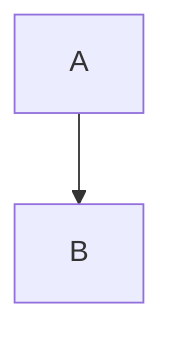

# Export Heading

Paragraph with **bold**, *italic*, ~~strike~~ and [link](https://example.com).

1. ordered
2. list

- unordered
- list

> blockquote

| A | B |
| - | - |
| 1 | 2 |

```ts
const answer = 42
```


$$x^2$$


