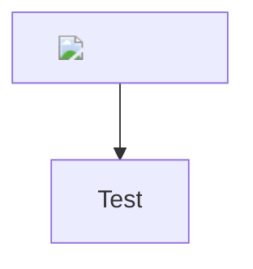

# Malicious Preview Corpus

<a href="javascript:alert(1)">javascript URL</a>

<iframe src="https://attacker.invalid/"></iframe>

```mermaid
flowchart TD
  A["<img src=x onerror=alert(1)>"] --> B[Test]
```

$\href{javascript:alert(1)}{unsafe}$
